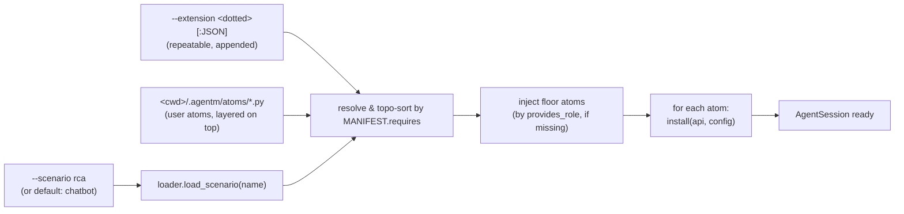

# AgentM

A pluggable agent framework in Python. The SDK is a **mechanism**; every policy
is a port; every port has a default; every default is a replaceable extension.

See `.claude/designs/pluggable-architecture.md` for the boundary contract.

## Two concepts

Everything in AgentM is built out of two things:

**Extension** (also called **atom**). One Python file that registers behavior
on the substrate — a tool, a policy, an LLM provider, a compaction strategy,
an observability subscriber, ... Each file exports a `MANIFEST` (name, version,
deps) and an `install(api, config)` function. The §11 contract requires it to
be *one file* — no atom-to-atom imports, no reach into the runtime substrate.
This is the atomic unit of policy.

**Scenario**. A YAML file naming which extensions to install, in what order,
with what config. A scenario is just a *composition*; it has no Python code
of its own (apart from optional scenario-private `local:` atoms next to the
manifest). Switching scenarios switches the entire policy stack without
changing the substrate.

The substrate (in `agentm.core`) is the only unreplaceable part. Extensions
reach stateful subsystems only through `ExtensionAPI` services (`api.bus`,
`api.get_operations()`, `api.skills`, `api.catalog`, ...). A mechanical
validator rejects any extension that imports `core.runtime.*` or
`core._internal.*` directly.



## Extension: one file

```python
# src/agentm/extensions/builtin/my_atom.py
from agentm.core.abi.extension import ExtensionAPI, ExtensionManifest

MANIFEST = ExtensionManifest(
    name="my_atom",                 # must equal the filename stem
    version="0.1.0",
    requires=("operations",),       # by atom NAME; topo-sorted
    provides_role=(),               # optional capability advertisement
)

def install(api: ExtensionAPI, config: dict) -> None:
    api.bus.subscribe(SomeEvent, handler)
    # `config` came straight from the manifest's per-atom block
```

Extensions live in three places, all on the same auto-discovery path:

| Location | Who owns it | Mounted by |
|---|---|---|
| `src/agentm/extensions/builtin/<name>.py` | SDK | scenario manifest, `-e`, or auto-discovery |
| `contrib/extensions/<name>.py` (flat) | repo contributors | scenario manifest, `-e`, or auto-discovery |
| `contrib/extensions/<pkg>/...` (nested) | third-party packages | scenario manifest or `-e` only (no auto-discovery) |
| `<cwd>/.agentm/atoms/*.py` | the running agent itself | auto-layered on top of any scenario |

The `extensions.validate` checker enforces the §11 contract: allowlist is
`core.abi` + `core.lib` + the public `extensions` surface. Stateful
subsystems are reached only via `ExtensionAPI` services.

## Scenario: a YAML composition of extensions

```yaml
# contrib/scenarios/local/manifest.yaml
name: local
extensions:
  - module: agentm.extensions.builtin.operations
    config:
      backend: local
  - module: agentm.extensions.builtin.file_tools
  - module: agentm.extensions.builtin.tool_bash
  - module: agentm.extensions.builtin.observability
```

Each entry is `module:` (fully-qualified dotted path) or `local:`
(scenario-private `.py` next to the manifest). The optional `config:` block
is passed verbatim into that extension's `install(api, config)` call.

Variants live in the same directory as `manifest.<variant>.yaml` and must
declare `name: <scenario>:<variant>` (e.g. `name: rca:harness.sync`). Two
scenarios that share most of their stack typically ship one base manifest +
several variant files differing only in a few extensions or configs.

**Order matters.** Extensions are installed in the `extensions:` declaration
order, then re-ordered only as much as `MANIFEST.requires` forces (a
dependency must install before its dependent — otherwise position is
preserved). Two practical consequences:

- For axes where **last registration wins** (notably the LLM provider, and
  any `api.register_*` hook called more than once), an override must appear
  *after* the default in the list.
- For event-bus subscribers, earlier-installed extensions register their
  handlers first, so they see events ahead of later ones. This is how
  interceptors / filters slot in.

Two extensions **cannot** both claim the same `provides_role` — that is a
hard load-time error, not a silent override. Use `requires` to express
"install B after A"; use `provides_role` to claim a floor capability
(`command_parser`, `system_prompt_provider`, ...) so the substrate skips
its default injection.

**Extension vs Scenario — recap:**

|  | Extension | Scenario |
|---|---|---|
| What it is | one Python file | one YAML file |
| What it produces | behavior at runtime (tool / policy / event subscriber / ...) | a list of extensions to install |
| Composition | atomic — does one thing | combines many extensions |
| Mounted by | scenario manifest, `--extension`, auto-discovery | `--scenario <name>` (one at a time) |
| Substitutable | yes, by another extension claiming the same role | yes, by another scenario |

## Enabling: from CLI to a running session

The default scenario is `chatbot` — no flag needed. The process cwd is the
workspace unless `--cwd` is supplied, so this works as an external tool in any
repository:

```bash
agentm -p "list files in src/"
```

Pick another by name. Scenario lookup checks `$AGENTM_PROJECT_ROOT`, the
process cwd, `$AGENTM_HOME/contrib/scenarios` (default:
`~/.agentm/contrib/scenarios`), the AgentM checkout, and packaged portable
scenarios:

```bash
uv run agentm --scenario rca "diagnose this trace"
uv run agentm --scenario rca:harness.sync "..."         # variant shorthand
```

Stack extra extensions on top with `-e` / `--extension` (repeatable). Takes
a **fully-qualified dotted module path** — there is no short-name resolution.

```bash
uv run agentm --scenario rca \
              -e llmharness.atom:'{"mode":"sync"}' \
              "..."
```

Four sources feed the install list, in this precedence order:

| Source | When | Notes |
|---|---|---|
| `AgentSessionConfig.extensions` (programmatic) | always wins if non-empty | **hard override** — suppresses scenario, auto-discovery, and `--extension` |
| `--scenario <name>` (or default) | when programmatic list is empty | resolves a manifest; declaration order preserved, then topo-sorted |
| Auto-discovery | only when no scenario AND no programmatic list | scans builtin + flat-file contrib + user-atom dirs |
| `--extension <dotted>[:JSON]` | always appended (except `--no-extensions` / programmatic override) | repeatable; cannot remove or reorder, only stack |

After merging, the list is **topologically sorted by `MANIFEST.requires`**
(by atom *name*), and missing floor atoms are injected via `provides_role`.
You **cannot** stack scenarios — only one loads at a time; compose by writing
a new manifest.

`--no-extensions` bypasses everything for kernel-floor diagnosis (only the
LLM provider — no tools, no skills, no observability):

```bash
uv run agentm --no-extensions "explain core/abi/loop.py"
```

## Discovering what's available

```bash
agentm list-extensions          # every auto-discoverable atom, with its
                                # tier, registered hooks, and the exact
                                # `-e <dotted.path>` form to mount it

agentm --help                   # full flag list (--scenario, --extension,
                                # --resume, --continue, --tools, ...)

agentm contrib sync             # copy bundled/source contrib resources into
                                # $AGENTM_HOME/contrib for global customization

ls contrib/scenarios/           # shipped scenarios: local, sandbox,
                                # chatbot, format_fix, mcp_demo,
                                # rca, rca_hfsm, terminal_bench
```

Beyond the one-shot prompt, notable subcommands include `agentm terminal`
(open the terminal UI, starting/reusing the local gateway daemon by default),
`agentm daemon` (start/status/stop/restart/socket for that local daemon),
`agentm gateway` (foreground single-process gateway), `agentm trace` (query the
OTLP/JSON session log), and `agentm contrib sync` (materialize configurable
contrib resources under `$AGENTM_HOME`). The chat-client peers ship as
**separate binaries** for vendor-SDK isolation only: `agentm-terminal`,
`agentm-feishu`, and future peers connect to the same gateway URL
(`agentm daemon socket`). Normal terminal use can be either `agentm terminal`
for one-command startup or
`agentm daemon start && agentm-terminal` when you want to manage the server
separately. In local daemon mode, a lightweight Python supervisor keeps the
gateway endpoint stable. By default it keeps the gateway worker fixed so
in-memory sessions survive source edits; pass `--reload` when you want the
supervisor to restart the worker after source/config changes. Each launch gets
a fresh terminal session by default, even from the same cwd; pass
`--session-id workbench` only when intentionally reconnecting to a known
terminal session. Use `--private-gateway` for the old
one-terminal-one-gateway lifecycle. Common TUI flags are available directly, for example
`agentm terminal --simple --theme light`; uncommon peer flags can still be
passed after `--`. Workflow and sub-agent sessions open as background task rows
so the parent conversation stays focused; `↓` opens the task picker, `Enter`
views the selected task, `x` stops a selected task, and `Ctrl+t` hides/shows
the rows. `Enter` sends (or queues while the agent is
busy), `Shift+Enter`/`Ctrl+j` inserts a newline, `?` opens shortcuts from an
empty editor, `/` and `@` open inline command/resource completions, `Esc`
interrupts or double-press clears input, and `Ctrl+c` exits on the second
press. Run `agentm <sub> --help` or `<binary> --help` for flags.

For remote terminal clients, start the daemon on a WebSocket bind. Authentication
is enabled by default: if no token file is supplied, the daemon creates
`$AGENTM_HOME/gateway/token` with mode `0600`. Token files are one token per
line; blank lines and `#` comments are ignored.

```bash
agentm daemon start --bind ws://0.0.0.0:8765
agentm daemon status
agentm-terminal --connect ws://<host>:8765 --token-file ~/.agentm/gateway/token
```

## Five pluggability axes

Each axis is a `typing.Protocol` in `core.abi`. The scenario manifest decides
which extension fills each role; extensions register via `api.register_*` hooks.

| # | Axis                | Protocol / Port             | Default impl                                          |
|---|---------------------|-----------------------------|-------------------------------------------------------|
| 1 | LLM stream          | `StreamFn`                  | `extensions.builtin.llm_anthropic` (also `llm_openai`)|
| 2 | Tool environment    | `Tool` + `*Operations`      | `LocalFileOperations`, `LocalBashOperations` (via `api.get_operations()`) |
| 3 | Session state       | `SessionManager`            | `InMemorySessionManager`                              |
| 4 | Project context     | `ResourceLoader`            | `DefaultResourceLoader`                               |
| 5 | Policy / cross-cut  | `EventBus` + `ExtensionAPI` | bus + per-extension install hook                      |

Every signal — install, LLM request, tool call, mutation, turn summary —
flows through the **same** `EventBus`. The `observability` builtin is a pure
subscriber writing OTel-flavored JSONL to
`$AGENTM_HOME/observability/<session_id>.jsonl` (default:
`~/.agentm/observability/<session_id>.jsonl`; override with
`AGENTM_OBSERVABILITY_DIR`).

## Showcase

- **`contrib/scenarios/rca/`** — root-cause-analysis scenario over
  observability traces, with optional `llmharness` audit overlay. Manifest
  variants (`manifest.harness.*.yaml`) compose the same extension set with
  different audit topologies. See its [README](contrib/scenarios/rca/README.md).
- **`contrib/extensions/llmharness/`** — cognitive-audit pipeline. Mounts
  via `llmharness.atom`; subscribes `TurnEndEvent` to spawn
  extractor/auditor children and `DecideTurnActionEvent` to inject
  reminders into the main loop. Loose-coupled — rca scenarios opt in by
  manifest only. See its [README](contrib/extensions/llmharness/README.md).

## Quick start

```bash
uv sync
uv run agentm -p "list files in src/"
```

Installed as a tool, first run the setup command once. It reuses an existing
`$AGENTM_HOME/config.toml` (default `~/.agentm/config.toml`) when present;
otherwise it infers provider/model from env and only asks for missing
credentials.

```bash
uv tool install agentm
agentm setup
```

`agentm setup` also places editable demo scenarios under
`$AGENTM_HOME/contrib/scenarios/`: `chatbot` (the default full chat stack),
and `minimal` (the smallest runnable stack).
Then use AgentM from any repo:

```bash
agentm -p "summarize this repository"
agentm terminal
agentm --scenario minimal -p "Say hi"
agentm --cwd /path/to/repo -p "run the relevant checks"
agentm trace messages --latest
```

For non-interactive bootstrap, pass the model details directly or provide the
provider's API-key env var:

```bash
agentm setup --quick --provider openai --model gpt-4o --api-key "$OPENAI_API_KEY"
agentm -p "Say hi"
```

To inspect the local setup without changing files, run `agentm setup --check`.
To verify credentials with one real model request, run `agentm setup --test`.
To install the full contrib tree for customization, run
`agentm contrib sync --overwrite`.

Model provider settings live in `~/.agentm/config.toml`
(`$AGENTM_HOME/config.toml` overrides the directory). A minimal profile:

```toml
default_model = "my-model"

[models.my-model]
provider = "openai"
model = "gpt-4o"
base_url = "https://api.openai.com/v1"
api_key = "..."
# Optional: OpenAI-compatible providers default to 32768.
max_output_tokens = 32768
```

Select a profile with `uv run agentm --model my-model -p "..."`; if
`default_model` is set, `uv run agentm -p "..."` uses it.

Programmatic:

```python
from agentm.core.abi.session_config import AgentSessionConfig
from agentm.core.runtime.session import AgentSession

session = await AgentSession.create(AgentSessionConfig(
    cwd=".",
    scenario="local",
    provider=("agentm.extensions.builtin.llm_anthropic",
              {"model": "claude-sonnet-4-6"}),
))
final = await session.prompt("explain core/abi/loop.py")
await session.shutdown()
```

Setting `extensions=[...]` is a **hard override** — scenario, auto-discovery,
and `--extension` are all suppressed. Use it for tests; use scenarios in
production.
