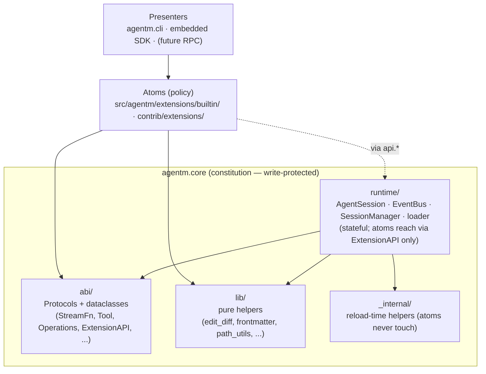
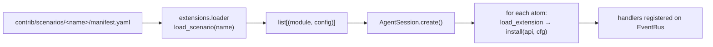

# AgentM

A pluggable agent framework in Python. The SDK is a **mechanism**; every policy
is a port; every port has a default; every default is a replaceable extension.

See `.claude/designs/pluggable-architecture.md` for the boundary contract.

---

## Architecture

Three layers, dependency arrows downward only.



`agentm.core` imports with zero side effects: `abi/` and `lib/` are pure;
`runtime/` *contains* stateful classes but performs no I/O at module import.
The split inside `core/` is a **visibility** boundary; none of `core/` is
agent-modifiable. The validator rejects any atom that imports `core.runtime.*`
or `core._internal.*` directly.

---

## Five pluggability axes

Each axis is a `typing.Protocol` in `core.abi`. The default scenario manifest
enumerates the working set; atoms register replacements via the corresponding
`api.register_*` hook.

| # | Axis                | Protocol / Port             | Default impl                                          |
|---|---------------------|-----------------------------|-------------------------------------------------------|
| 1 | LLM stream          | `StreamFn`                  | `extensions.builtin.llm_anthropic` (also `llm_openai`)|
| 2 | Tool environment    | `Tool` + `*Operations`      | `LocalFileOperations`, `LocalBashOperations` (via `api.get_operations()`) |
| 3 | Session state       | `SessionManager`            | `InMemorySessionManager`                              |
| 4 | Project context     | `ResourceLoader`            | `DefaultResourceLoader`                               |
| 5 | Policy / cross-cut  | `EventBus` + `ExtensionAPI` | bus + per-extension install hook                      |

Every signal &mdash; install, LLM request, tool call, mutation, turn summary
&mdash; flows through the same `EventBus`. The `observability` builtin
subscribes and writes OTel-flavored JSONL to
`<cwd>/.agentm/observability/<trace_id>.jsonl`.

---

## Atom = one file

Each atom is one Python file exporting a manifest and an install hook:

```python
from agentm.core.abi.extension import ExtensionAPI, ExtensionManifest

MANIFEST = ExtensionManifest(name="my_atom", version="0.1.0", ...)

def install(api: ExtensionAPI, config: dict) -> None:
    api.bus.subscribe(SomeEvent, handler)
```

The `extensions.validate` checker enforces the §11 contract: no atom-to-atom
imports, no `core.runtime.*` import, no `core._internal` import. Allowlist is
`core.abi` + `core.lib` + the public `extensions` surface. Stateful subsystems
are reached through ExtensionAPI services (`api.get_operations()`,
`api.skills`, `api.prompt_templates`, `api.catalog`, `api.compaction`).

---

## Scenario = YAML recipe

A scenario is a composition of atoms expressed as data, not code. There is no
privileged path between built-in and third-party scenarios.



Loader resolves `<cwd>/contrib/scenarios/<name>/manifest.yaml`. Builtin atoms
and flat-file contrib atoms (`contrib/extensions/<name>.py`) auto-discover;
nested contrib packages mount explicitly via the manifest or
`--extension <dotted.path>`. Shipped scenarios: `general_purpose` (default),
`agent_env`, `format_fix`, `mcp_demo`, `rca`, `rca_hfsm`.

---

## Quick start

```bash
uv sync
export ANTHROPIC_API_KEY="..."
uv run agentm "list files in src/"                  # default = general_purpose
uv run agentm --scenario rca "diagnose this trace"  # opt-in scenario
```

Programmatic use:

```python
from agentm.core.abi.session_config import AgentSessionConfig
from agentm.core.runtime.session import AgentSession
from agentm.extensions.loader import load_scenario

session = await AgentSession.create(AgentSessionConfig(
    cwd=".",
    extensions=load_scenario("general_purpose"),
    provider=("agentm.extensions.builtin.llm_anthropic", {"model": "claude-sonnet-4-6"}),
))
final_messages = await session.prompt("explain core/abi/loop.py")
await session.shutdown()
```

### Recovery floor

When the autonomy layer is broken (corrupted atom, regressing scenario,
substrate bug), `--no-extensions` drives the kernel with no atoms loaded:

```bash
uv run agentm --no-extensions "explain core/abi/loop.py"
```

Dependency cone is `core/abi` + `core/lib` + `core/runtime` + provider &mdash;
the irreducible base described in
`.claude/designs/self-modifiable-architecture.md`.

---

## Showcase

- **`contrib/scenarios/rca/`** &mdash; root-cause-analysis scenario over
  observability traces, with optional `llmharness` audit overlay. Multiple
  manifest variants (`manifest.harness.*.yaml`) compose the same atoms with
  different audit topologies. See its [README](contrib/scenarios/rca/README.md).
- **`contrib/extensions/llmharness/`** &mdash; cognitive-audit pipeline that
  subscribes to `DecideTurnActionEvent` on the EventBus and event-sources a
  cross-firing audit graph for offline evaluation. See its
  [README](contrib/extensions/llmharness/README.md).

---

## Build & development

```bash
uv sync
uv run agentm "..."
uv run pytest                  # excludes nested workspaces, ui
uv run ruff check src/
uv run mypy src/
```

Python 3.12+, build backend `uv_build`. Entry point `agentm:main`.

---

## Repository layout

```
src/agentm/
├── cli.py · modes/                  # thin presenters
├── core/{abi,lib,runtime,_internal} # constitution — write-protected
├── ai/                              # provider / api registry, OAuth, env keys
└── extensions/{loader,discover,validate}.py
    └── builtin/<atom>.py            # one file per atom (§11 contract)

contrib/
├── extensions/                      # third-party atoms
│   ├── cc/ · changespec_validators/ · live_inspector/ · llmharness/
│   ├── mcp_bridge/ · rcabench_contract/ · tool_catalog/
│   └── operations_agent_env.py · turn_reminder.py     # flat-file atoms
└── scenarios/<name>/manifest.yaml   # composition recipes (loader entry point)

.claude/{designs,plans,tasks}/  ·  .claude/index.yaml
```

See `CLAUDE.md` for design-doc workflow and project conventions.
