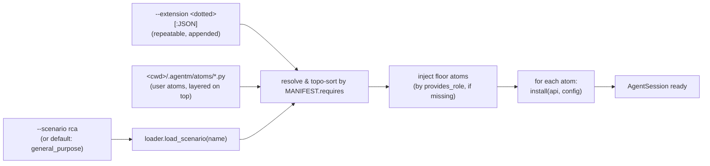

# AgentM

A pluggable agent framework in Python. The SDK is a **mechanism**; every policy
is a port; every port has a default; every default is a replaceable extension.

See `.claude/designs/pluggable-architecture.md` for the boundary contract.

---

## Mental model

An `AgentSession` is built by installing a list of **atoms** (one-file
extensions) onto a substrate. A **scenario** is just a YAML file naming which
atoms to install with which config — there is no privileged "built-in" path
into the substrate.



The substrate (in `agentm.core`) is unreplaceable; atoms reach stateful
subsystems only through `ExtensionAPI` services (`api.bus`,
`api.get_operations()`, `api.skills`, `api.catalog`, ...). A mechanical
validator rejects any atom that imports `core.runtime.*` or `core._internal.*`
directly.

---

## Enabling scenarios

The default scenario is `general_purpose` — no flag needed:

```bash
uv run agentm "list files in src/"
```

Pick another by name (resolves to `contrib/scenarios/<name>/manifest.yaml`):

```bash
uv run agentm --scenario rca "diagnose this trace"
```

A scenario can have **variants** via `<name>:<variant>` shorthand
(resolves to `manifest.<variant>.yaml` in the same directory):

```bash
uv run agentm --scenario rca:harness.sync "..."
```

You **cannot** stack scenarios — only one is loaded. Compose by writing a
new manifest, or by using `--extension` (below).

Bypass scenarios entirely with `--no-extensions` for kernel-floor diagnosis:

```bash
uv run agentm --no-extensions "explain core/abi/loop.py"
```

This loads only the LLM provider — no tools, no skills, no observability.
Useful when a scenario is broken.

---

## Enabling extensions

Four sources feed the install list, in this precedence order:

| Source | When | Notes |
|---|---|---|
| `AgentSessionConfig.extensions` (programmatic) | always wins if non-empty | **hard override** — suppresses scenario, auto-discovery, and `--extension` |
| `--scenario <name>` (or default) | when programmatic list is empty | resolves a manifest; declaration order preserved, then topo-sorted |
| Auto-discovery | only when no scenario AND no programmatic list | scans `extensions/builtin/*.py` + `contrib/extensions/*.py` + `~/.agentm/atoms/*.py` |
| `--extension <dotted>[:JSON]` | always appended (except `--no-extensions` and programmatic override) | repeatable; cannot remove or reorder, only stack |

After merging, the full list is **topologically sorted by `MANIFEST.requires`**
(by atom *name*, not module path), and any missing floor atoms
(`prompt_registry`, `compaction_prompts`, `command_parser`,
`system_prompt_provider`) are injected via `provides_role`.

**User atoms** under `<cwd>/.agentm/atoms/*.py` are auto-layered on every
scenario (not on programmatic override). This is how an agent can install
its own atoms across restarts.

```bash
uv run agentm --scenario rca \
              --extension contrib.extensions.llmharness.adapters.agentm:'{"mode":"sync"}' \
              "..."
```

---

## Atom = one file

```python
from agentm.core.abi.extension import ExtensionAPI, ExtensionManifest

MANIFEST = ExtensionManifest(
    name="my_atom",          # must equal the filename stem
    version="0.1.0",
    requires=("operations_local",),   # by atom name; topo-sorted
    provides_role=(),
)

def install(api: ExtensionAPI, config: dict) -> None:
    api.bus.subscribe(SomeEvent, handler)
    # config came straight from the manifest's per-atom block
```

The `extensions.validate` checker enforces the §11 contract: no atom-to-atom
imports, no `core.runtime.*`, no `core._internal`. The allowlist is
`core.abi` + `core.lib` + the public `extensions` surface. Stateful
subsystems are reached only via `ExtensionAPI` services.

---

## Scenario = YAML recipe

```yaml
# contrib/scenarios/general_purpose/manifest.yaml
name: general_purpose
extensions:
  - module: agentm.extensions.builtin.operations_local
  - module: agentm.extensions.builtin.tool_read
  - module: agentm.extensions.builtin.tool_bash
    config:
      timeout_seconds: 60
  - module: agentm.extensions.builtin.observability
```

Entries are `module:` (dotted path) or `local:` (scenario-private `.py` next
to the manifest). The optional `config:` block is passed verbatim into the
atom's `install(api, config)` call.

Variants live in the same directory as `manifest.<variant>.yaml` and must
declare `name: <scenario>:<variant>` (e.g. `name: rca:harness.sync`).

---

## Five pluggability axes

Each axis is a `typing.Protocol` in `core.abi`. The scenario manifest decides
which atom fills each role; atoms register via `api.register_*` hooks.

| # | Axis                | Protocol / Port             | Default impl                                          |
|---|---------------------|-----------------------------|-------------------------------------------------------|
| 1 | LLM stream          | `StreamFn`                  | `extensions.builtin.llm_anthropic` (also `llm_openai`)|
| 2 | Tool environment    | `Tool` + `*Operations`      | `LocalFileOperations`, `LocalBashOperations` (via `api.get_operations()`) |
| 3 | Session state       | `SessionManager`            | `InMemorySessionManager`                              |
| 4 | Project context     | `ResourceLoader`            | `DefaultResourceLoader`                               |
| 5 | Policy / cross-cut  | `EventBus` + `ExtensionAPI` | bus + per-extension install hook                      |

Every signal — install, LLM request, tool call, mutation, turn summary —
flows through the **same** `EventBus`. The `observability` builtin is a pure
subscriber writing OTel-flavored JSONL to
`<cwd>/.agentm/observability/<trace_id>.jsonl`.

---

## Showcase

- **`contrib/scenarios/rca/`** — root-cause-analysis scenario over
  observability traces, with optional `llmharness` audit overlay. Manifest
  variants (`manifest.harness.*.yaml`) compose the same atom set with
  different audit topologies. See its [README](contrib/scenarios/rca/README.md).
- **`contrib/extensions/llmharness/`** — cognitive-audit pipeline. Mounts
  via `llmharness.adapters.agentm`; subscribes `TurnEndEvent` to spawn
  extractor/auditor children and `DecideTurnActionEvent` to inject
  reminders into the main loop. Loose-coupled — rca scenarios opt in by
  manifest only. See its [README](contrib/extensions/llmharness/README.md).

---

## Quick start

```bash
uv sync
export ANTHROPIC_API_KEY="..."
uv run agentm "list files in src/"
```

Programmatic:

```python
from agentm.core.abi.session_config import AgentSessionConfig
from agentm.core.runtime.session import AgentSession
from agentm.extensions.loader import load_scenario

session = await AgentSession.create(AgentSessionConfig(
    cwd=".",
    extensions=load_scenario("general_purpose"),
    provider=("agentm.extensions.builtin.llm_anthropic",
              {"model": "claude-sonnet-4-6"}),
))
final = await session.prompt("explain core/abi/loop.py")
await session.shutdown()
```

Setting `extensions=[...]` is a **hard override** — scenario, auto-discovery,
and `--extension` are all suppressed. Use it for tests; use scenarios in
production.

---

## Build & development

```bash
uv sync
uv run agentm "..."
uv run pytest                  # excludes nested workspaces, ui
uv run ruff check src/
uv run mypy src/
```

Python 3.12+, build backend `uv_build`. Entry point `agentm:main`. See
`CLAUDE.md` for design-doc workflow and project conventions.
