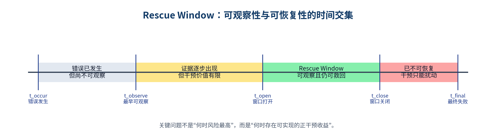
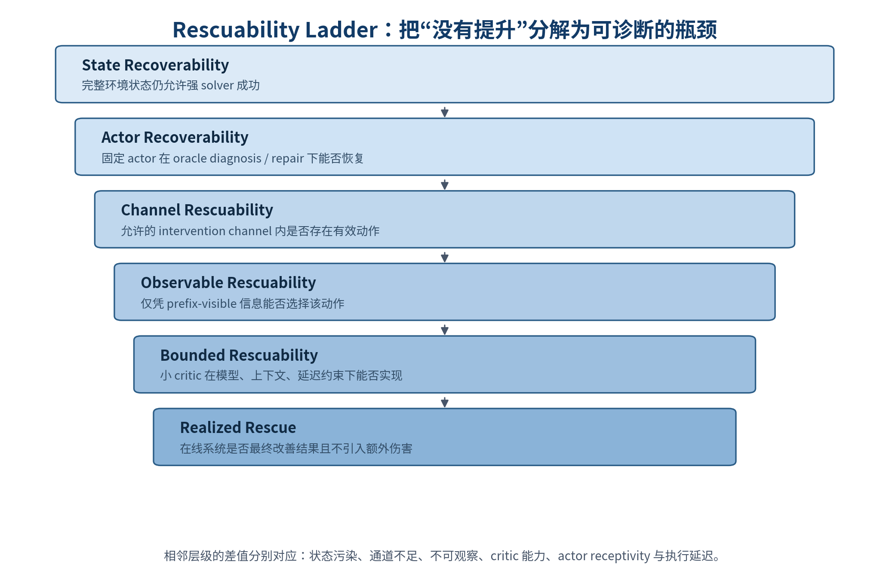
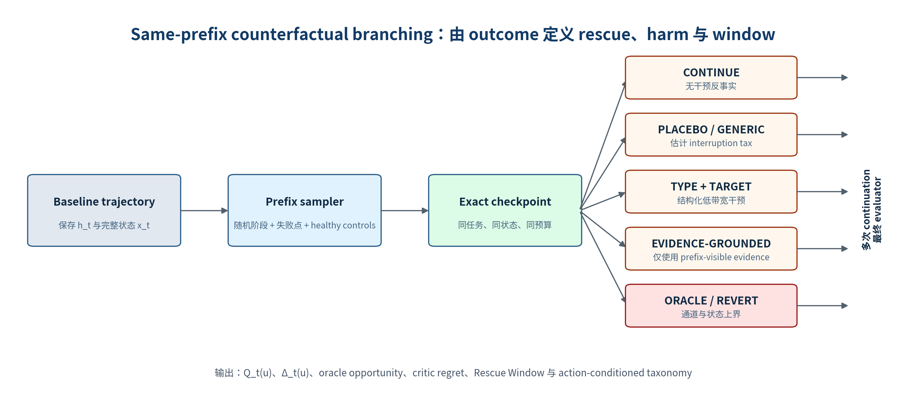

**THE RESCUE WINDOW**

**救援窗口：受限监督下长时程智能体的运行时可救回性**

*Problem Definition, Measurement Protocol, and Research Plan*

<table style="width:99%;">
<colgroup>
<col style="width: 98%" />
</colgroup>
<thead>
<tr>
<th>
<strong>核心主张</strong>

运行时监督的科学对象不应仅是 failure risk，也不应止于 action-conditioned intervention advantage。本文将问题进一步定义为 bounded runtime rescuability：一个只能访问 trajectory prefix、并受到模型规模、上下文、延迟与干预通道约束的弱监督者，能否在救援机会消失之前实现正的同次运行干预收益。
</th>
</tr>
</thead>
<tbody>
</tbody>
</table>

**Research Memo v0.2**

更新日期：2026 年 6 月 24 日

**定位：Problem Definition + Benchmark/Study + Open-source Harness**

# **0. 执行摘要**

本版本在 Runtime Recoverability v0.1 的基础上进行了实质性重构。保留 same-prefix branching、outcome-based labels、Rescue/Harm/Net Rescue 等可操作设计，但不再把“intervention advantage”或“prefix branching”本身作为主要 novelty。到 2026 年 6 月，相关工作已经分别覆盖 online failure auditing、干预的 disruption–recovery trade-off、action-conditioned intervention advantage，以及小 critic 对 coding agent 的轨迹内指导。因此，新论文必须回答一个更严格的问题：在监督者显著弱于 actor 的条件下，理论上存在的救援机会有多少能够被实际实现，以及这些机会随轨迹时间如何产生、收缩和消失。

<table style="width:99%;">
<colgroup>
<col style="width: 98%" />
</colgroup>
<thead>
<tr>
<th>
<strong>推荐论文形态</strong>

以问题定义和系统测量为核心：定义 Bounded Runtime Rescuability；提出 Rescue Window 和 Rescuability Ladder；发布支持完整环境 checkpoint 与 counterfactual branching 的 benchmark/harness；用弱 critic 作为 realizability baseline，而不是将端到端 uplift 作为唯一成败标准。
</th>
</tr>
</thead>
<tbody>
</tbody>
</table>

| **维度** | **旧版本倾向** | **更新版本** |
|----|----|----|
| **核心对象** | failure prediction 或一般 recoverability | bounded runtime rescuability：弱监督者能否实现救援机会 |
| **主要结构** | 单个 prefix 的 action value | 沿时间展开的 Rescue Window + 分层上界 |
| **方法角色** | 小 critic 是主方法 | 小 critic 是 bounded realizability baseline |
| **主实验** | Homogeneous action 先行 | Oracle rescue mapping 与 single-shot branching 先行 |
| **成功标准** | 端到端成功率显著提升 | 测量 opportunity、window、gap、harm，并给出可复用 benchmark |
| **退化路径** | 异常检测或告警 | selective rescue、best-state preservation、channel-limit study |

## **0.1 一句话定位**

<table style="width:99%;">
<colgroup>
<col style="width: 98%" />
</colgroup>
<thead>
<tr>
<th>
<strong>Positioning sentence</strong>

Failure risk describes what happens if the agent continues; intervention advantage describes what an available action could gain; bounded rescuability asks whether a weak, prefix-only overseer can realize that gain before the opportunity disappears.
</th>
</tr>
</thead>
<tbody>
</tbody>
</table>

## **0.2 推荐的完整 paper package**

1\. Problem Definition：给出 bounded runtime rescuability 的形式化定义，明确 actor、状态、可见轨迹、动作通道、预算与监督约束。

2\. Temporal Characterization：提出 Rescue Window，测量救援机会的 opening time、closing time、width、peak value 和 opportunity area。

3\. Diagnostic Decomposition：提出 Rescuability Ladder，把“方法没有提升”分解为状态不可恢复、通道不足、不可观察、critic 能力不足、actor 不采纳或延迟过大。

4\. Benchmark and Harness：发布 exact checkpoint、same-prefix branching、typed intervention DSL、adaptive rollout 和标准化报告工具。

5\. Empirical Study：测量 oracle opportunity 与 weak-critic realization 之间的 gap，并给出选择性干预、伤害和尾部可靠性分析。

# **1. 研究动机：从失败预测转向可实现的同次运行救援**

Long-horizon agent 的可靠性问题来自反馈延迟、错误传播和恢复成本。一个早期的需求误解、架构偏差或错误假设，可能在相当长的轨迹中保持局部合理，却逐步污染后续实现、测试解释和最终交付。最终 evaluator 能确认任务失败，但此时多数计算与环境修改已经发生。

现有研究通常回答三个问题：轨迹是否会失败、关键错误发生在哪里、最终结果如何评价。部署系统还需要回答第四个问题：在当前时刻介入是否仍然有用。更进一步，当监督模型远弱于 actor 时，即使存在理论上的有效动作，监督者也未必能够及时识别、表达并让 actor 执行它。

## **1.1 需要分离的五个时间点**

- t_occur：决定性错误或偏离首次发生；

- t_observe：当前 prefix 中首次出现足够证据，使错误能够被可靠观察；

- t_open：至少一种允许的干预开始具有显著正收益；

- t_close：之后任何允许干预都无法产生足够正收益；

- t_final：最终 evaluator 返回失败或低分。

*图 1. Rescue Window 是可观察性与可恢复性的时间交集；风险最高的时刻未必是最佳干预时刻。*

## **1.2 为什么 anomaly detection 不是主问题**

异常检测可以提供廉价的 observability signal，例如循环、预算消耗、工具失败、信息增量停滞或状态回退。但异常只说明轨迹偏离某种统计或行为常态，不说明当前状态是否仍可恢复、哪种动作有正收益、以及干预是否会破坏原本正确的轨迹。因此，异常检测适合作为 baseline、特征层或低成本 gate，不应承担论文的核心问题定义。

# **2. 2026 年相关工作与 novelty 边界**

截至 2026 年 6 月 24 日，以下相邻工作已经占据了若干最直接的 claim。论文需要主动承认这些重叠，并将 novelty 放在受限监督、时间窗口和上界分解上。

| **工作** | **已覆盖内容** | **对本项目的约束** | **本项目的延伸** |
|----|----|----|----|
| **AgentForesight \[1\]** | prefix-only online auditing；continue/alarm；earliest decisive error | 不能把“在线提前发现错误”作为主要 novelty | 从 detection 进入可测量的 same-run rescue，并分析窗口与实现约束 |
| **The Intervention Paradox \[2\]** | prediction accuracy 不保证有效 prevention；recovery–disruption trade-off | 不能只报告 AUROC 或高风险触发 | 把 harm、abstention、placebo 和 selective utility 纳入主指标 |
| **Calibration Is Not Control \[3\]** | intervention advantage；same-prefix branching；action-conditioned control | 不能把 advantage 或 branching 单独作为 novelty | 研究 advantage 的时间结构、弱监督 realizability 与分层上界 |
| **Steer, Don't Solve \[4\]** | 小 critic 对 code agent 提供轨迹内反馈；concise guidance | 不能声称“小 critic 在线指导 coding agent”是首次 | 把小 critic 降为 bounded router，并测量其捕获 oracle opportunity 的比例 |
| **LongCLI-Bench \[5\]** | 长时程 CLI 编程任务、partial score、失败阶段分析 | 需要比单一 end-to-end pass 更细粒度 | 用其作为可 checkpoint、可测 progress 的受控环境 |
| **ContinuityBench \[6\]** | 从相同 live interrupted state 恢复；handoff fidelity 非单调 | 完整状态恢复与上下文注入已有先例 | 比较 intervention content、state snapshot 和 weak overseer 的可实现救援 |

## **2.1 明确不主张什么**

- 不主张首次提出 intervention advantage 或 same-prefix counterfactual branching；

- 不主张首次用小型 critic 指导 coding agent；

- 不主张 failure detection accuracy 能直接转化为成功率提升；

- 不把任意自由文本 advice 视为无条件可执行的 treatment；

- 不将 recoverability 视为 prefix 的内在、与 actor/action/budget 无关的属性。

## **2.2 预期 novelty**

1\. Bounded oversight：把 critic 的参数规模、上下文、延迟、触发预算和允许动作显式纳入问题定义。

2\. Temporal rescue structure：将静态 prefix value 扩展为沿轨迹变化的 Rescue Window。

3\. Opportunity–realizability gap：区分“存在有效干预”与“弱 critic 能找到并及时实现该干预”。

4\. Rescuability Ladder：用嵌套上界定位失败发生在状态、actor、channel、observability、critic 还是在线执行层。

5\. Coding-specific reproducible protocol：完整环境 checkpoint、typed intervention、placebo control、actor receptivity 与 best-state regression 测量。

# **3. 问题定义：Bounded Runtime Rescuability**

## **3.1 基本对象**

设任务为 x，环境为 E，固定主智能体策略为 π_A。时刻 t 的完整可执行环境状态记为 x_t，包括 workspace、文件、进程、依赖、测试状态、预算与随机配置；监督者可见的 trajectory prefix 记为 h_t。二者必须区分：x_t 决定状态是否可恢复，h_t 决定监督者是否能够观察并选择正确动作。

- π_A：固定 actor，不修改模型参数；

- h_t：critic 可访问的 prefix-visible 信息；

- x_t：可重放的完整环境状态；

- B_t：剩余 token、step、time 或 tool budget；

- U：允许的 intervention action set；

- C：受限 critic / overseer；

- R 或 Y：最终连续任务分数或二元成功结果；

- c(u)：中断、延迟、额外计算、上下文污染和预算消耗的干预成本。

## **3.2 Action-conditioned value**

> Q_t(u) = E\[R(τ₁:T) \| x_t, do(u), π_A, B_t\]*\
> 从相同完整状态出发，执行动作 u 后由固定 actor 继续到结束的期望结果。*
>
> Δ_t(u) = Q_t(u) − Q_t(CONTINUE) − c(u)*\
> 相对于无干预继续执行的净干预收益。*

Δ_t(u) 是测量协议的基础，但不是本文唯一的概念贡献。它回答某个已给定动作是否有价值；本文进一步关心允许动作集合中的最优机会、弱监督者的实现能力，以及这种机会的时间结构。

## **3.3 Oracle rescue opportunity 与实际实现值**

> G\*\_t = max\_{u ∈ U} Δ_t(u)*\
> 在当前允许动作集合与 actor 下，理论上可获得的最大单次救援收益。*
>
> G^C_t = Δ_t(C(h_t))*\
> 受限 critic 仅根据可见 prefix 选择动作后实际获得的净收益。*
>
> Gap_t = G\*\_t − G^C_t*\
> Opportunity–Realizability Gap：存在的救援机会与弱 critic 实际实现之间的差距。*

## **3.4 Bounded oversight constraints**

> Compute(C) ≤ M, Context(C) ≤ L, Latency(C) ≤ ℓ, E\[N_int\] ≤ K*\
> M 为模型/推理预算，L 为上下文预算，ℓ 为交付延迟，K 为平均干预次数约束。*

“critic 较小”不能只作为实验细节。它应成为问题定义中的资源约束，使论文研究的是能力受限监督者如何选择、压缩和传递干预，而不是让另一个同等级 solver 重做任务。

## **3.5 Runtime rescuability 的条件性**

一个 prefix 不能被无条件地称为 recoverable。正确表述应显式依赖 actor、动作集合、预算、状态恢复机制与评价阈值：

> Rescuable(h_t ; x_t, π_A, U, B_t, C, ε)*\
> 当 G^C_t \> ε，且相对 CONTINUE 的改善具有足够置信度时，称该 prefix 对 critic C 可救回。*

# **4. Rescue Window 与 Rescuability Ladder**

## **4.1 Oracle 与 bounded Rescue Window**

> W\*\_{γ}(τ) = { t : G\*\_t \> γ }*\
> Oracle Rescue Window：在允许动作集合中至少存在一个净收益超过 γ 的动作。*
>
> W^C\_{γ}(τ) = { t : G^C_t \> γ }*\
> Bounded Rescue Window：受限 critic 实际能够选择并实现正收益的时间集合。*
>
> W^{C,eff}\_{γ}(τ) = { t ∈ W^C\_{γ} : t + ℓ_C ≤ t_close }*\
> 考虑 critic 推理和交付延迟后的有效窗口。*

对每条轨迹至少报告 window existence、opening time、closing time、width、peak rescue value 和 opportunity area。与只对单个触发点分类相比，窗口表示能够区分“太早不可观察”“正好可救”“太晚不可逆”三类状态。

## **4.2 Rescuability Ladder**

*图 2. Rescuability Ladder。若策略类与信息约束嵌套，各层可视为逐步收紧的经验上界。*

| **层级** | **Operational probe** | **层间落差的解释** |
|----|----|----|
| **State Recoverability** | 从 x_t 切换到强 solver，保持剩余预算或给定扩展预算 | 状态已经被不可逆污染，或剩余资源不足 |
| **Actor Recoverability** | 固定 actor + oracle diagnosis / repair / correct checkpoint | actor 缺乏 off-trajectory recovery 能力 |
| **Channel Rescuability** | 固定 actor，在允许 intervention DSL 中枚举或搜索动作 | 自然语言/typed channel 表达能力不足 |
| **Observable Rescuability** | 强 prefix-only supervisor，不访问未来或 hidden evaluator | 正确动作依赖当前不可见信息 |
| **Bounded Rescuability** | 小模型、有限上下文、有限延迟与触发预算 | critic 的识别、路由或压缩能力不足 |
| **Realized Rescue** | 实际在线异步系统 | actor 不采纳、消息过期、重复干预或预算耗尽 |

## **4.3 Opportunity capture**

> η_C = Σ_t \[G^C_t\]\_+ / (Σ_t \[G\*\_t\]\_+ + ε)*\
> Opportunity Capture Ratio：弱 critic 捕获了多少 oracle positive rescue value。*

该指标允许论文在端到端提升较小的情况下仍然给出清晰结论。例如，任务的 oracle rescue opportunity 本身很少，或机会存在但主要被 observability/channel 限制，都与“critic 模型不好”是不同的科学结论。

# **5. 核心研究问题与可证伪假设**

| **RQ** | **研究问题** | **主要证据** |
|----|----|----|
| **RQ1** | 失败轨迹中有多少存在非空 Oracle Rescue Window？ | same-prefix oracle branching；window existence / area |
| **RQ2** | 错误何时可观察，何时不可恢复？二者的 gap 有多大？ | 时间密集 prefix sampling；t_observe、t_open、t_close |
| **RQ3** | 瓶颈位于 state、actor、channel、observability 还是 critic？ | Rescuability Ladder 的层级差值 |
| **RQ4** | 哪类低带宽 intervention 最适合弱 critic？ | content/channel ladder；rescue–harm frontier |
| **RQ5** | 弱 critic 能捕获多少 oracle opportunity，在哪些 coverage 下净收益为正？ | η_C、policy regret、coverage–utility curve |
| **RQ6** | 干预是否主要改善成功率，还是更适合减少 late regression 和无效计算？ | final score、regression regret、best-state retention、wasted compute |
| **RQ7** | critic latency 与 window width 如何共同决定有效性？ | latency-adjusted capture；stale intervention rate |

## **5.1 预期假设**

- H1：continuation failure risk 与 max intervention advantage 相关但不充分，存在同风险不同最优动作的 conflict sets。

- H2：Rescue Window 通常稀疏且具有错误类型依赖；验证遗漏与停滞类错误窗口较宽，架构性或不可逆状态修改窗口较窄。

- H3：对弱 critic 而言，type + target + evidence 的结构化干预优于自由文本 solver-style advice；信息量继续增加可能产生非单调收益。

- H4：低 coverage 的 selective intervention 更可能获得正 net rescue；强制高频干预会产生显著 disruption tax。

- H5：一部分价值来自 best-state preservation，而不是创造新的解题能力；checkpoint/revert 可能比开放式 advice 更稳健。

# **6. Benchmark 与数据单元设计**

## **6.1 Benchmark 选择原则**

主 benchmark 应满足三项条件：一是任务存在足够长的可观测执行轨迹；二是环境可以完整 checkpoint 与重放；三是存在连续或细粒度 partial score，使 branching outcome 不完全依赖稀疏的 binary success。pass@K 明显高于 pass@1 是 latent capability 的信号，但不是 failed-prefix recoverability 的充分条件。

| **层级** | **推荐环境** | **作用** | **注意事项** |
|----|----|----|----|
| **Controlled causal study** | LongCLI-Bench；可重放的 SWE-bench/Terminal 类子集 | 大量 prefix branching、partial progress、timing study | 优先确保 exact state snapshot，而非追求任务数量 |
| **External validity** | NL2Repo-like full repository generation | 验证在真正长轨迹和跨文件状态下是否保持规律 | 成功信号稀疏；只做较小规模 |
| **Transfer / non-coding** | τ-bench、AppWorld 等可选 | 验证定义是否跨 domain 成立 | 不承担主 novelty |

## **6.2 Evaluation unit**

> z = (task, actor, trajectory, h_t, x_t, B_t, u, seed, outcome, trace)*\
> 一个 benchmark instance 是可恢复状态与 intervention branch 的组合，而不是单一文本样本。*

<table>
<colgroup>
<col style="width: 100%" />
</colgroup>
<thead>
<tr>
<th>task_id, repository_id, actor_id, trajectory_id, prefix_id 
visible_prefix: h_t 
state_snapshot_ref: x_t 
remaining_budget: B_t 
intervention: {type, target, evidence, strength, valid_until} 
branch_seed, final_success, normalized_score, final_state_hash 
follow_through, stale, duplicate, recovery_trace, cost</th>
</tr>
</thead>
<tbody>
</tbody>
</table>

## **6.3 Exact checkpoint 的最低要求**

| **状态层** | **必须保存的内容** | **常见失败** |
|----|----|----|
| **Workspace** | 完整文件树、git index/HEAD、未提交修改、权限与 symlink | 仅保存对话，恢复后文件状态不同 |
| **Runtime** | 进程、端口、数据库、临时文件、容器/服务状态 | 测试或工具副作用无法复现 |
| **Environment** | 依赖版本、环境变量、working directory、缓存 | branch 条件之间存在隐性差异 |
| **Agent context** | system/task prompt、可见 history、summary、memory | actor 接收到的上下文不一致 |
| **Budget/clock** | 剩余步数、token、时间、工具配额、interruption count | 干预分支获得额外资源造成不公平 |
| **Randomness** | branch seed、temperature、tool nondeterminism metadata | 无法估计 continuation variance |

## **6.4 Prefix sampling**

Prefix 不应只来自 critic 触发点，否则会把 detector bias 混入问题定义。建议采用分层采样并在分析中保留采样权重：

- Relative progress：例如 20%、40%、60%、80% 的 eligible step；

- Event-based：首次测试失败、需求覆盖下降、连续无进展、重复工具失败、pre-final；

- Failure trajectories：增加潜在可救失败，但不得单独代表总体分布；

- Success trajectories：测量 healthy、harm-sensitive 与 disruption tax；

- Random controls：用于估计真实前缀分布和避免 case cherry-picking。

## **6.5 Branching protocol**

*图 3. Same-prefix branching 是测量工具：所有分支共享任务、完整状态、预算和 actor，只改变 intervention treatment。*

# **7. 干预动作空间与可识别的 treatment**

## **7.1 Typed intervention contract**

弱 critic 不应承担重做主任务的 solver 角色。更合理的设定是让它选择少量低带宽纠偏原语，并提供可追溯 target 与 evidence。

<table>
<colgroup>
<col style="width: 100%" />
</colgroup>
<thead>
<tr>
<th>action: CONTINUE | VERIFY | CHECKPOINT | REVERT_TO_BEST | REPLAN_SCOPE | FINAL_AUDIT 
target: requirement_id | assumption_id | file | API | test | plan_node 
evidence: trajectory_event_ids[] 
strength: advisory | blocking 
valid_until: state_hash | step_ttl</th>
</tr>
</thead>
<tbody>
</tbody>
</table>

| **动作** | **含义** | **适合的小 critic 能力** | **主要风险** |
|----|----|----|----|
| **CONTINUE / ABSTAIN** | 不介入 | 校准 abstention 与覆盖率 | 错过窗口 |
| **VERIFY** | 要求验证具体需求、假设、API 或测试解释 | 路由与 target selection | target 错误或过度检查 |
| **CHECKPOINT** | 保存当前最佳状态或标记可回退节点 | 识别进展峰值与风险上升 | 额外存储和状态管理 |
| **REVERT_TO_BEST** | 回退到已验证的较优 checkpoint | 识别 late regression | 误回退、丢失有效探索 |
| **REPLAN_SCOPE** | 限制在指定 scope 内重新规划 | 识别方向性失败而不提供完整解法 | 强干预、上下文扰动 |
| **FINAL_AUDIT** | 提交前按需求和测试清单核验 | 发现 premature completion | 无法修复早期架构问题 |

## **7.2 Content ladder：控制信息量与 interruption tax**

| **条件** | **提供内容** | **回答的问题** |
|----|----|----|
| **CONTINUE** | 无插入 | 自然 continuation 基线 |
| **TOKEN-MATCHED PLACEBO** | 相同长度但不含负面或任务信息 | 纯中断和上下文长度的伤害 |
| **GENERIC ALERT** | “可能存在问题，请检查” | 一般告警本身是否有价值 |
| **TYPE ONLY** | 只给出 VERIFY / REPLAN 等动作类型 | 动作原语是否足够 |
| **TYPE + TARGET** | 动作类型与具体检查对象 | target selection 的边际价值 |
| **EVIDENCE-GROUNDED** | 再附 prefix-visible evidence | 可解释证据是否提高采纳和恢复 |
| **ORACLE DIAGNOSIS / REPAIR** | 允许更强但单独标注的上界 | channel 与 actor recovery 的上限 |

## **7.3 为什么 Homogeneous Action Study 只做 stress test**

在每个 gate 重复发送同一种动作同时改变了 action type、frequency、上下文污染和预算消耗，因果解释较弱。它可以用于测量“强制高频使用某种 action 的天然 rescue–harm profile”，但不应作为首个主实验。正确顺序是先做 single-shot oracle mapping，再做重复/同质策略的 deployment stress test。

# **8. 分阶段实验方案**

## **E0. Infrastructure and replay validation**

- 选择 6–10 个可重放 coding tasks，每个任务运行 2–3 个 baseline seeds；

- 验证 checkpoint/resume 后的 CONTINUE 分支与原 continuation 在分布上可比；

- 检查 evaluator、partial score、预算继承和 state hash；

- 用 20–30 个 prefix 估计 branching 成本、方差和故障率。

## **E1. Oracle Rescue Landscape（主实验一）**

目标是先回答“救援机会是否存在”，而不是先训练小 critic。对每个 prefix 运行 CONTINUE、PLACEBO、GENERIC、oracle-targeted VERIFY/REPLAN、REVERT 或 oracle repair。输出 action-conditioned value、oracle opportunity 和初步 taxonomy。

| **结果模式** | **含义** | **后续方向** |
|----|----|----|
| **所有动作≈CONTINUE** | 当前 prefix 无 channel-level rescue opportunity | 更早采样、换任务，或研究不可恢复性 |
| **Oracle diagnosis 有效，generic 无效** | 需要 localization/target，不是单纯告警 | 训练 router/target selector |
| **仅 oracle repair/revert 有效** | 自然语言通道不足或 actor 不会恢复 | 转向 checkpoint/revert 或 state preservation |
| **Placebo 伤害明显** | 中断本身 disruption tax 高 | 更低 coverage、异步缓存或 non-blocking gate |
| **成功轨迹多被强干预破坏** | abstention 是主能力 | selective policy 与 harm-aware objective |

## **E2. Temporal Rescue Window Mapping（主实验二）**

在一部分轨迹上沿时间密集抽取 5–8 个 prefix，并对最有信息量的 3–4 个 action 进行 branching。估计 t_open、t_close、window width、peak value 和 opportunity area，按错误类型、任务阶段、actor 强度和剩余预算分组。

## **E3. Channel and Content Ladder（主实验三）**

固定 timing 与 target，逐级增加信息：placebo → generic → type → type+target → evidence → oracle repair。该实验识别最小有效信息量，并检测“更详细反馈反而产生 backseat-driving”的非单调性。

## **E4. Bounded Critic Realizability**

小 critic 的任务被收缩为三个决策：是否 abstain、选择哪种 typed action、选择什么 target。对比 zero-shot、SFT、heuristic 和 outcome-conditioned ranking baseline。训练数据优先使用同一 prefix 下真实 branch outcome，而不是只蒸馏 teacher 文本。

> L_rank = −log σ(f_θ(h_t, u⁺) − f_θ(h_t, u⁻))*\
> u⁺ 与 u⁻ 由真实 downstream branch outcome 排序，而不是由 teacher 是否“听起来合理”决定。*

## **E5. End-to-End Online Validation**

最后在独立任务/仓库上运行完整在线系统。该实验验证 branching 估计是否能预测真实部署收益，但不承担论文全部 novelty。主要比较 Main Agent、Periodic Self-Reflection、Generic Risk Trigger、Typed Bounded Critic，以及可选的 Checkpoint/Revert policy。

## **E6. Homogeneous / Repeated Intervention Stress Test**

只在 E1–E4 后进行。用于测量重复干预、干预级联、duplicate alert、预算耗尽和 stale feedback，而不是用于定义 recoverability。

# **9. 指标、估计与统计设计**

## **9.1 主指标**

| **类别** | **指标** | **解释** |
|----|----|----|
| **Opportunity** | P(W\*≠∅ \| baseline failure) | 失败中存在任何可救窗口的比例 |
| **Temporal** | t_open / t_close / width / peak / area | 救援机会的时间结构 |
| **Realizability** | η_C、Gap_t、policy regret | 弱 critic 实现 oracle opportunity 的程度 |
| **Selective control** | Coverage–Utility Curve | 只干预最高置信 prefix 时的净收益 |
| **Outcome** | Task success、normalized score、test pass | 最终任务结果 |
| **Rescue/Harm** | Rescue Rate、Harm Rate、Net Rescue | 正向救回与误干预伤害 |
| **Behavior** | Follow-through、recovery、duplicate、stale | critic 消息是否被理解和执行 |
| **State preservation** | Regression Regret、Best-State Retention | 是否防止已经取得的进展被后续破坏 |
| **Efficiency** | wasted steps/tokens、latency、critic cost | 是否减少无效计算并满足实时约束 |

## **9.2 Rescue、Harm 与 regression**

> Rescue = P(Y_u = 1 \| Y_continue = 0)*\
> 同一 prefix 的无干预分支失败，而干预分支成功。*
>
> Harm = P(Y_u = 0 \| Y_continue = 1)*\
> 同一 prefix 的无干预分支成功，而干预分支失败。*
>
> RegressionRegret = max\_{j≤T} Score(x_j) − Score(x_T)*\
> 衡量 agent 是否曾达到更好状态却在后续执行中退化。*

## **9.3 不建议用 K=3/5 直接生成硬标签**

K 很小时，1/5 与 4/5 的成功率估计仍具有很宽的不确定区间。Beta smoothing 只能正则化点估计，不能替代样本量。建议主结果保留连续 posterior 或置信区间，并对接近决策边界的 prefix 自适应增加 rollout。

- 所有 prefix 先运行 K=3 作为筛选；

- 当最优动作与 CONTINUE 的后验差异不确定时，增加到 K=8–20；

- 优先使用 normalized partial score，binary success 作为高层结果；

- 报告 P(Δ_t(u) \> ε \| data)，而不是只报告 recoverable/irrecoverable 硬标签；

- 所有同源 prefix 与 branches 视为同一 task/trajectory cluster。

## **9.4 统计模型与 split**

- 按 repository 或原始 trajectory 划分 train/validation/test，禁止同源 prefix 跨 split；

- 对连续 score 使用 task/trajectory random effects 的分层模型，或 task-level clustered bootstrap；

- 对 binary success 使用 paired task-level bootstrap、McNemar 类配对分析或 Bayesian hierarchical logistic model；

- 主要 endpoint 预先指定：oracle opportunity prevalence、window width、η_C、selective net rescue；

- action × timing × error type 的探索性分析进行多重比较控制。

## **9.5 推荐规模**

| **阶段** | **规模** | **目的** |
|----|----|----|
| **Replay pilot** | 20–30 prefixes；4–6 conditions；K=2–3 | 验证 state equivalence、评分与成本 |
| **Oracle mapping pilot** | 50–80 prefixes；5–7 conditions；adaptive K | 判断机会是否存在及 channel 上界 |
| **Main causal study** | 150–300 prefix clusters；3–5 core conditions | 估计 window、ladder 与错误类型规律 |
| **Weak critic study** | 独立 150+ prefixes；至少两个 critic budget | 测量 η_C、policy regret 与 latency trade-off |
| **End-to-end validation** | 30–60 tasks × 3–5 seeds | 验证部署效应和 lower-tail reliability |

# **10. Outcome-based taxonomy**

核心标签必须来自 branching outcome；人工标注只用于解释 error type、evidence visibility、actor response 和 failure mechanism。建议避免把“是否应该干预”交给标注者直接判断。

| **标签** | **建议定义** | **解释** |
|----|----|----|
| **High continuation risk** | Q_t(CONTINUE) 低 | 继续执行大概率低分，但不代表可救 |
| **Oracle-actionable** | G\*\_t \> ε | 至少存在一个允许动作有正净收益 |
| **Bounded-actionable** | G^C_t \> ε | 受限 critic 能实际实现正收益 |
| **Harm-sensitive** | min_u Δ_t(u) \< −ε，且 CONTINUE 较好 | 某些干预会破坏健康轨迹 |
| **Channel-limited** | state/actor oracle 可恢复，但 max\_{u∈U} Δ_t(u)≈0 | 动作通道不够强 |
| **Observability-limited** | oracle with full state 有效，prefix-only supervisor 无效 | 当前证据不足 |
| **Critic-limited** | strong prefix-only supervisor 有效，小 critic 无效 | 能力或压缩不足 |
| **Latency-limited** | 即时动作有效，延迟交付后无效 | 窗口短于 critic 响应时间 |
| **Irrecoverable under scope** | 所有允许上界动作均无效 | 在当前 actor、预算、动作集下不可救 |

# **11. 结果解释与可发表的退化路径**

## **11.1 关键结果矩阵**

| **Oracle opportunity** | **Weak critic** | **可形成的 paper claim** |
|----|----|----|
| **高** | 高 | 方法 + benchmark：弱 critic 能稳定捕获救援窗口 |
| **高** | 低 | bounded oversight study：主要贡献是 opportunity–realizability gap 与瓶颈分解 |
| **低，但 revert/checkpoint 高** | 任意 | best-state preservation：弱监督更适合防止回退而非生成修复建议 |
| **低且所有 channel 均低** | 任意 | recoverability limit study：大量失败在可观察时已不可救 |
| **只在低 coverage 为正** | 中 | selective rescue：高精度 abstention policy 与 coverage–utility frontier |
| **平均结果不变但 harm 降低** | 中 | safe intervention routing：减少错误干预和 lower-tail failure |

## **11.2 Best-state preservation 作为优先 fallback**

若开放式 advice 的 oracle 上界都较弱，应把问题退化为“不让 agent 丢掉已经取得的进展”。小 critic 只需识别状态分数或验证证据何时达到局部峰值，并触发 CHECKPOINT、STOP 或 REVERT_TO_BEST。该方向对 critic 的任务理解要求更低，同时可通过 Regression Regret 和 Best-State Retention 清晰测量。

## **11.3 负结果如何成为 insight**

- 发现 Rescue Window 极窄：说明低延迟或事件触发比更强模型更关键；

- 发现错误在不可恢复后才可观察：说明 prefix-only runtime oversight 存在结构性上限；

- 发现 channel 上界低：说明自然语言 advice 不是合适控制接口；

- 发现 actor 不采纳正确反馈：说明应研究 receptivity、protocol 或状态级控制；

- 发现强 critic 有效而小 critic 无效：形成弱监督 phase diagram 与 distillation 研究；

- 发现只在少量错误类型上有效：形成 error-conditioned intervention policy，而不是通用 critic。

# **12. 建议的论文贡献写法**

1\. Problem Definition：定义 bounded runtime rescuability，区分 continuation risk、oracle rescue opportunity、observable opportunity 和 weak-critic realization。

2\. Temporal Formulation：提出 Rescue Window，并给出 opening、closing、width、area 与 latency-adjusted window 的操作化测量。

3\. Diagnostic Framework：提出 Rescuability Ladder 与 opportunity–realizability gap，用于定位 state、channel、observability、critic 和 actor-response 瓶颈。

4\. Benchmark Protocol：提出带完整环境 snapshot、same-prefix branching、typed intervention、placebo control 和 adaptive rollout 的可复用协议。

5\. Empirical Study：在 long-horizon coding tasks 上系统测量 rescue landscape、selective utility、harm 与 best-state regression，并提供受限 critic baselines。

6\. Open-source Tooling：发布 branch runner、state snapshot adapter、intervention DSL、outcome aggregator 和标准化报告。

## **12.1 不把什么写成主要贡献**

“我们训练了一个小 critic，并将成功率提升了若干百分点”只适合作为 proof-of-concept；除非 uplift 足够稳定、跨 actor 和 benchmark 复现，否则不应承担论文全部贡献。相反，论文应首先证明问题可测量、有结构，并且现有 risk-based evaluation 系统性高估了可行动的救援机会。

## **12.2 候选标题**

- The Rescue Window: Runtime Rescuability of Long-Horizon Agents under Bounded Oversight

- When Can a Weak Critic Rescue a Strong Agent? A Counterfactual Study of Long-Horizon Coding

- Beyond Failure Prediction: Measuring Actionable Rescue in Long-Horizon Agent Trajectories

- CodeRescueBench: Mapping Recoverable Prefixes under Weak Runtime Oversight

## **12.3 Draft abstract**

<table style="width:99%;">
<colgroup>
<col style="width: 98%" />
</colgroup>
<thead>
<tr>
<th>
<strong>Abstract draft</strong>

Runtime oversight for long-horizon agents is often evaluated as failure prediction, yet a high-risk trajectory may already be irrecoverable, while an available intervention may also disrupt a trajectory that would otherwise succeed. Recent work has introduced action-conditioned intervention value and same-prefix branching, but it remains unclear when a substantially weaker, prefix-only overseer can realize such value before it disappears. We define bounded runtime rescuability: whether a weak overseer, constrained by model capacity, context, latency, intervention bandwidth, and trigger budget, can causally improve the same-run outcome of an unfolding trajectory. We introduce the Rescue Window, the temporal region in which a trajectory is both observable and recoverable, and a Rescuability Ladder that decomposes state, actor, channel, observability, critic-capacity, and realized-recovery limits. We propose a replayable counterfactual benchmark protocol based on exact environment checkpoints, typed interventions, adaptive branching, and outcome-based labels. Our study maps oracle rescue opportunities, the opportunity–realizability gap, selective utility, harm, and regression prevention in long-horizon coding agents. The goal is not to assume that a small critic is a strong solver, but to characterize precisely when bounded oversight can—and cannot—produce positive control value.
</th>
</tr>
</thead>
<tbody>
</tbody>
</table>

# **13. 实现架构与开源工具**

## **13.1 RescueHarness 组件**

| **组件** | **职责** | **最小接口** |
|----|----|----|
| **Trace Recorder** | append-only 记录 actor、tool、state 与 evaluator events | emit(event), get_prefix(t) |
| **Snapshot Adapter** | 完整保存与恢复环境状态 | snapshot(), restore(ref), state_hash() |
| **Prefix Sampler** | 按阶段、事件和随机策略选择 checkpoints | sample(trace, policy) |
| **Branch Runner** | 从相同状态执行不同 treatment 与 seeds | run(prefix, intervention, seed) |
| **Intervention DSL** | 验证 action schema、target、evidence 与 TTL | validate(), serialize(), inject() |
| **Outcome Aggregator** | 估计 Q、Δ、posterior、window 与 ladder gap | aggregate(branches) |
| **Report Generator** | 生成 rescue/harm、coverage curve 和 case cards | build_report(dataset) |

## **13.2 异步在线细节**

- Critic 审计起点必须记录 state hash 和 trajectory event ID；

- 反馈返回时若 state hash 已显著变化，使用 TTL 或 validity predicate 丢弃 stale advice；

- 重复命中同一 target 时进行 deduplication 与 escalation，而不是重复插入相同文本；

- 所有 intervention 记录实际 delivery latency、actor acknowledgement 和 follow-through；

- 异步 critic 不能获得 actor 在审计开始之后生成的未来信息，除非重新触发一次审计。

# **14. 研究推进计划与 Go/No-Go 判据**

## **14.1 四阶段计划**

| **阶段** | **周期建议** | **交付物** | **决策** |
|----|----|----|----|
| **P0 Replay** | 1–2 周 | checkpoint/resume、state equivalence report、20–30 prefixes | 环境不能稳定重放则先换 benchmark |
| **P1 Oracle mapping** | 2–4 周 | 50–80 prefixes、action/content ladder、初始 window | 判断主要瓶颈是 opportunity 还是 realizability |
| **P2 Main benchmark** | 4–8 周 | 150–300 clusters、window/ladder dataset、tool release | 形成 problem-definition paper 主体 |
| **P3 Critic + online** | 4–8 周 | weak critic baselines、selective policy、end-to-end validation | 决定是否增加 method claim |

## **14.2 暂定判据**

以下阈值仅用于项目管理，不应在未做 pilot 前写入论文：

- 若 oracle-actionable prefix 比例低于约 5%，优先检查任务选择、prefix timing 和 action channel，而不是训练 critic；

- 若 oracle diagnosis/replan 提升接近零，但 revert/checkpoint 明显有效，转向 best-state preservation；

- 若 strong prefix-only supervisor 有效而小 critic 的 opportunity capture 长期低于约 20%，主论文定位为 bounded oversight limit study；

- 若小 critic 在 10%–30% coverage 下稳定获得正 utility 且 harm 可控，发展 selective intervention method；

- 若端到端 uplift 小但 window、ladder 和 gap 具有稳定结构，仍继续 problem-definition/benchmark 路线。

## **14.3 第一轮最小 pilot**

1\. 选择 8 个中等难度且可 checkpoint 的 coding tasks，每个任务运行 2 个 baseline seeds。

2\. 从每条轨迹采样 4 个 prefix：随机阶段、首次显式失败、停滞点、pre-final；成功轨迹保留 healthy controls。

3\. 每个 prefix 运行 CONTINUE、PLACEBO、GENERIC、oracle-targeted VERIFY、REPLAN_SCOPE、REVERT/repair upper bound，各 K=3。

4\. 先分析 Q、Δ、disruption tax、oracle opportunity 和 timing；只在确认存在 headroom 后训练小 critic。

5\. 根据结果选择主线：typed router、selective abstention、best-state preservation，或 benchmark/limit study。

# **15. 建议论文结构**

| **Section** | **核心内容** |
|----|----|
| **1 Introduction** | Delayed feedback；risk 不等于 control；弱监督者为何需要单独定义 |
| **2 Related Work** | online auditing、intervention value、small critics、recovery/checkpoint、long-horizon benchmarks |
| **3 Bounded Runtime Rescuability** | 对象、约束、Q/Δ、oracle opportunity、realized value 与 gap |
| **4 Rescue Window and Ladder** | 时间定义、窗口指标、分层上界与可证伪假设 |
| **5 Benchmark Protocol** | exact state、prefix sampling、typed actions、placebo、adaptive branching、leakage control |
| **6 Oracle Rescue Landscape** | 机会 prevalence、timing、channel/content ladder、error type |
| **7 Bounded Critic Realizability** | router baselines、coverage–utility、latency、policy regret |
| **8 End-to-End Validation** | task outcome、rescue/harm、lower-tail reliability、best-state preservation |
| **9 Analysis and Limitations** | negative results、scope dependence、stochasticity、cost、external validity |
| **10 Conclusion** | 何时弱监督有效，何时结构上不可能有效 |

# **参考文献与直接相关材料**

\[1\] Boxuan Zhang, Jianing Zhu, Zeru Shi, Dongfang Liu, Ruixiang Tang. *AgentForesight: Online Auditing for Early Failure Prediction in Multi-Agent Systems*. arXiv:2605.08715, 2026 [<u>链接</u>](https://arxiv.org/abs/2605.08715)

\[2\] Rakshith Vasudev, Melisa Russak, Dan Bikel, Waseem Alshikh. *The Intervention Paradox: Accurate Failure Prediction in Agents Does Not Imply Effective Failure Prevention*. arXiv:2602.03338, 2026 [<u>链接</u>](https://arxiv.org/abs/2602.03338)

\[3\] Chubin Zhang, Zhenglin Wan, Xingrui Yu, et al.. *Calibration Is Not Control: Why LLM-Agent Oversight Needs Intervention*. arXiv:2606.21399, 2026 [<u>链接</u>](https://arxiv.org/abs/2606.21399)

\[4\] Shubham Gandhi, Yiqing Xie, Atharva Naik, Ruichen Zhu, Carolyn Rose. *Steer, Don't Solve: Training Small Critic Models for Large Code Agents*. arXiv:2606.21811, 2026 [<u>链接</u>](https://arxiv.org/abs/2606.21811)

\[5\] Yukang Feng, Jianwen Sun, Zelai Yang, et al.. *LongCLI-Bench: A Preliminary Benchmark and Study for Long-horizon Agentic Programming in Command-Line Interfaces*. arXiv:2602.14337, 2026 [<u>链接</u>](https://arxiv.org/abs/2602.14337)

\[6\] Aryan Gulati. *ContinuityBench: A Framework and Taxonomy for Evaluating Agent Recovery from Interrupted State*. CTB @ ICML 2026 / OpenReview, 2026 [<u>链接</u>](https://openreview.net/forum?id=3N3BzvoLbG)

\[7\] Shraddha Barke, Arnav Goyal, Alind Khare, et al.. *AgentRx: Diagnosing AI Agent Failures from Execution Trajectories*. arXiv:2602.02475, 2026 [<u>链接</u>](https://arxiv.org/abs/2602.02475)
