---

# **Appendix A. 实验结果：Oracle Rescue Landscape（E1）**

**日期：2026-06-24**

## **A.0 术语速查**

以下术语在实验结果中反复出现，这里一次性定义清楚：

| 术语 | 含义 |
|---|---|
| **CONTINUE baseline** | 不做任何干预，让 agent 自然执行到结束的得分。所有干预效果都以此为参照。 |
| **Bounded intervention** | 不使用 ground truth 答案的干预——只给 hint/nudge（如"请重新检查 service X"），不直接给出完整诊断结论。对应现实中弱监督者能做到的事。 |
| **Oracle intervention** | 使用 ground truth 的干预——直接告诉 agent 根因是什么。现实中不可能做到，但作为**效果上界**来衡量理论上最好的干预能带来多少提升。 |
| **Oracle gap** | Oracle intervention 的得分减去 bounded intervention 最好结果的得分。反映的是"即使用了最好的现实可行干预，和直接给答案相比还差多少"。Gap 越大说明**弱监督者越无力**。 |
| **G\*** | 某个 prefix 点上的 oracle rescue opportunity——最好的干预比 CONTINUE 能提升多少分。G\* = max(所有干预的得分) − CONTINUE 得分。 |
| **Gap (G\* − G^C)** | Oracle 知道答案时的最佳提升 vs 不知道答案时的最佳提升的差值。 |
| **η_C (capture ratio)** | Bounded intervention 捕获了多少比例的 oracle opportunity。η_C = bounded 最好提升 / oracle 最好提升。η_C = 61% 意味着不知道答案的干预只能实现 61% 的理论最大提升。 |
| **Rescue window** | 一条轨迹中，干预能产生正效果的时间区间。width = 窗口覆盖了轨迹的多少比例；peak = 窗口内最佳干预点的效果。 |
| **Harm-sensitive** | 在某个 prefix 点，至少有一种干预导致得分比 CONTINUE 还低（干预反而有害）。 |
| **Net rescue** | Rescue rate（干预有帮助的比例）减去 Harm rate（干预有害的比例）。Net rescue > 0 说明平均来看干预利大于弊。 |
| **Disruption tax** | 纯打断的代价——用 PLACEBO（无信息量的中性文本）来测量。如果 PLACEBO 比 CONTINUE 差，说明打断本身就有害。 |
| **Content ladder** | 固定干预的动作类型（比如都用 VERIFY），逐级增加信息量（从"请检查"到"请检查 service X"到"直接给答案"），测量每一级信息的边际价值。 |
| **Channel-limited** | 某些 case 中，oracle 给答案有效（+35pp），但 bounded hint 无效（+0pp）。说明瓶颈不在"方向错了"，而在 agent 即使被指向正确方向也找不到证据——这是 agent 推理能力的硬限制。 |
| **Regression** | 从较早时刻 fork 出的新分支能跑出较高最终分数，但从较晚时刻 fork 出的分支最终分数反而更低。意味着 agent 的对话状态随时间被逐渐"污染"（积累错误假设和错误方向），导致从晚期重新出发时恢复能力下降。注意：这里不是"中间打分在下降"，而是"从该时刻出发、重新跑到结束后的最终提交得分在下降"。 |
| **pp (percentage points)** | 百分点，用于描述分数差异。+11pp 意味着分数从比如 0.18 提升到 0.29。 |

## **A.1 实验配置**

| 维度 | 值 |
|---|---|
| 数据集 | ops-lite-allwrong-31 (31 个 ALL_WRONG hard cases，Doubao-Seed-2.0-pro 基线全部失败) |
| 有效 cases | 30 (1 case causal_graph_verified.json 缺失 testbed/injections，排除) |
| Actor 模型 | Doubao-Seed-2.0-pro (via litellm proxy) |
| 基线 | rca:baseline，每 case 新跑 1 条轨迹 (max_turns=60) |
| Prefix 采样 | progress 0.2/0.4/0.6/0.8 + pre_final + event strata, min_turn=3 |
| 实际 prefixes | ~150 (avg 5 per case) |
| 条件集 | oracle-landscape (8 conditions: CONTINUE, PLACEBO, GENERIC, VERIFY, ADVISE, REPLAN, FINAL_AUDIT, ORACLE_DIAG) |
| K | 1 (单次 rollout，探索阶段) |
| 并发 | 30 |
| 总 rollouts | ~1200 (30 cases × ~5 prefixes × 8 conditions) |

## **A.2 Oracle Landscape 主结果（30 cases / 147 prefixes / 1176 rollouts）**

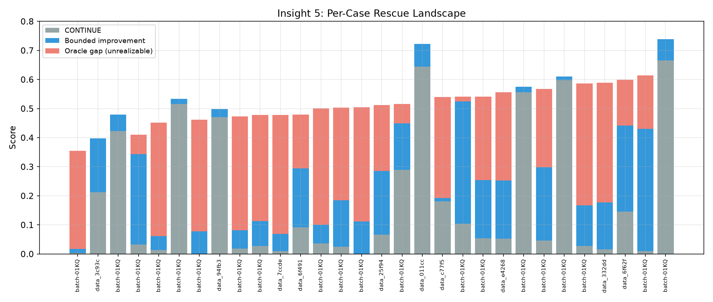

*图 A-1. 每个 case 的救援全景图。灰色 = 不干预的自然得分（CONTINUE baseline）；蓝色 = 不给答案、只给 hint 能带来的最大提升（bounded intervention）；红色 = 和直接给答案相比还差多少（oracle gap，理论上存在但弱监督者无法实现的部分）。大部分 case 的红色远大于蓝色——弱监督者能覆盖的提升空间有限。*

### A.2.1 主指标

| 指标 | 值 | 解释 |
|---|---|---|
| **Opportunity prevalence (all)** | 90.5% | 90% 的 prefixes 存在正的 oracle rescue opportunity |
| **Opportunity prevalence (failing)** | 91.7% | 失败基线中有 92% 可被 oracle 救回 |
| **Mean G\*** | 0.391 | Oracle 平均可提升连续分数 ~39pp |
| **Mean gap** | 0.153 | 非 oracle 条件与 oracle 之间的差距 15.3pp |
| **η_C (capture ratio)** | ~61% | 有界干预可捕获约 61% 的 oracle opportunity |
| **Rescue window exists** | 100% | 所有轨迹存在 rescue window |
| **Window mean width** | 0.559 | 窗口平均覆盖轨迹的 56% |
| **Window mean peak** | 0.523 | 最佳干预点的 rescue value 约 0.52 |
| **Harm-sensitive** | 44.2% | 44% 的 prefixes 至少有一种干预有害 |
| **Binary rescue rate** | 0.2% | 连续分数提升极少翻转 binary pass（ALL_WRONG cases） |
| **G\* > 0 cases** | 29/30 | 仅 1 个 case 无法被任何干预改善 |

### A.2.2 干预动作层级 (Action Hierarchy)

按 Δ (相对 CONTINUE 的连续分数提升) 排序：

| Action | N | Mean Score | Std | Δ (vs CONTINUE) | p(beat baseline) |
|---|---|---|---|---|---|
| **ADVISE:ORACLE_DIAG** | 147 | 0.517 | 0.115 | **+0.341** | 99.3% |
| **REPLAN:TYPE_TARGET** | 146 | 0.291 | 0.260 | **+0.116** | 54.8% |
| **GENERIC:TYPE_TARGET** | 147 | 0.271 | 0.257 | **+0.095** | 51.7% |
| **ADVISE:TYPE_TARGET** | 146 | 0.263 | 0.249 | +0.087 | 51.4% |
| **FINAL_AUDIT:TYPE_TARGET** | 146 | 0.263 | 0.256 | +0.087 | 50.7% |
| **VERIFY:TYPE_TARGET** | 146 | 0.258 | 0.257 | +0.082 | 47.3% |
| **PLACEBO** | 146 | 0.178 | 0.234 | +0.003 | 31.5% |
| **CONTINUE** | 145 | 0.176 | 0.231 | baseline | — |

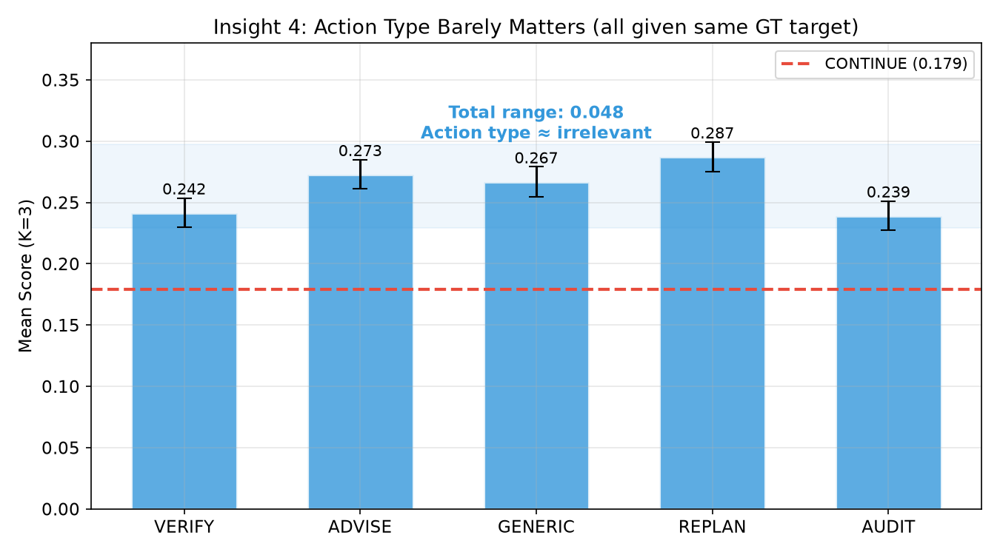

*图 A-2. "怎么说"不重要：5 种不同措辞（验证/建议/告警/重新规划/审计）在给了相同 GT service name 的前提下，效果几乎一样（总差距仅 4.8pp）。红色虚线 = 不干预的 baseline。*

### A.2.3 时间维度分析 (Rescue by Progress)

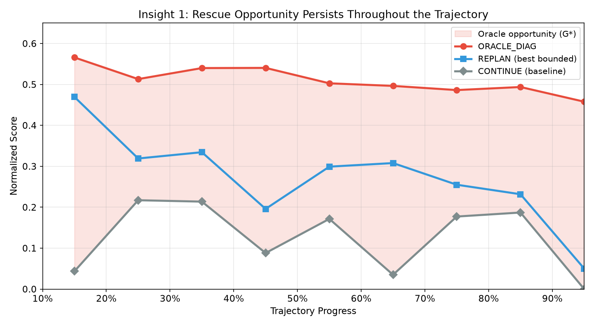

*图 A-3. 干预效果的时间变化。红线 = 直接给答案（oracle），全程稳定 ~0.5，说明即使很晚干预也能救回。蓝线 = 最好的 hint（REPLAN + GT target），early stage +15pp 但 late stage 衰减到 +7pp——越早给 hint 效果越好。灰线 = 不干预。粉色区域 = 理论上存在的救援空间。*

| 阶段 | CONTINUE | PLACEBO | GENERIC | VERIFY | ADVISE | REPLAN | AUDIT | ORACLE_DIAG |
|---|---|---|---|---|---|---|---|---|
| Early (0-0.3) | 0.213 | 0.218 | 0.303 | 0.318 | 0.276 | **0.348** | 0.313 | **0.515** |
| Mid (0.3-0.6) | 0.182 | 0.174 | 0.297 | 0.260 | 0.287 | **0.309** | 0.282 | **0.541** |
| Late (0.6-0.85) | 0.155 | 0.168 | 0.240 | 0.220 | 0.233 | **0.258** | 0.224 | **0.505** |
| Final (0.85+) | 0.150 | 0.158 | 0.196 | **0.271** | 0.236 | 0.215 | 0.210 | **0.449** |

### A.2.4 Per-Condition Rescue/Harm Rates

| Action | N | Rescue% | Harm% | Net Rescue% |
|---|---|---|---|---|
| **ADVISE:ORACLE_DIAG** | 145 | 79.3% | 10.3% | **+69.0%** |
| **FINAL_AUDIT:TYPE_TARGET** | 145 | 42.1% | 11.0% | **+31.0%** |
| **REPLAN:TYPE_TARGET** | 144 | 42.4% | 13.2% | **+29.2%** |
| **VERIFY:TYPE_TARGET** | 145 | 40.0% | 11.7% | **+28.3%** |
| **ADVISE:TYPE_TARGET** | 145 | 42.1% | 14.5% | **+27.6%** |
| **GENERIC:TYPE_TARGET** | 145 | 39.3% | 13.8% | **+25.5%** |

（Rescue = intervention 分数比 CONTINUE 高 ≥5pp；Harm = 低 ≥5pp）

## **A.3 关键发现 (Key Findings)**

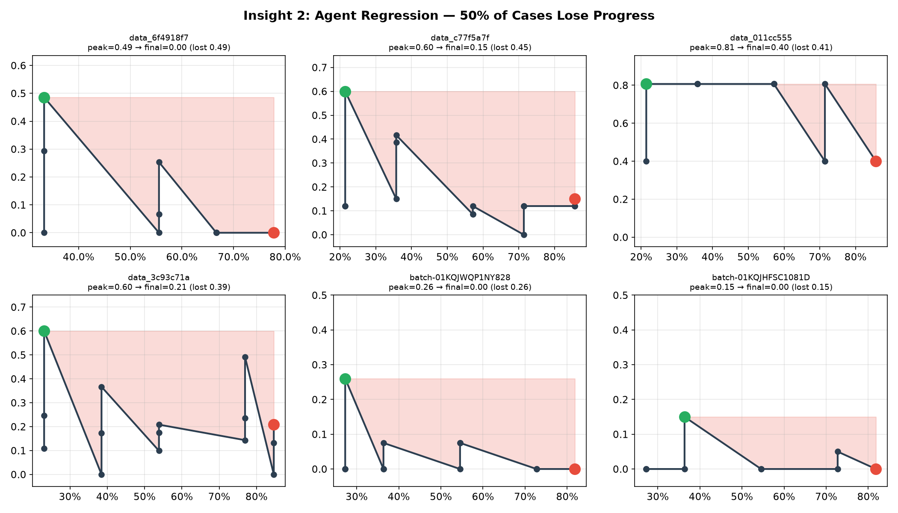

*图 A-4. Agent regression（对话状态污染）。每个子图是一个 case，横轴是 fork 的时间点，纵轴是"从该时刻 fork、让 agent 重新跑完后的最终提交得分"。绿点 = 峰值（从该时刻出发能达到的最好结果），红点 = 从最晚时刻出发的结果。红色区域 = 随着对话推进、agent 的"可恢复得分"下降的幅度。最严重案例从 0.49 跌到 0.00——意味着 agent 在中期还能跑出接近正确的答案，但到了后期对话已被错误假设严重污染，即使给它新的预算也跑不出好结果。*

### Finding 1: Oracle Opportunity 显著且普遍

90.5% 的 prefixes 存在正的 rescue opportunity（G\* > 0），29/30 cases 可被改善。Rescue window 覆盖轨迹的 56%（mean width = 0.559），100% 的轨迹存在 rescue window。这回答了 RQ1（§5）：失败轨迹中广泛存在 non-empty Oracle Rescue Window。

### Finding 2: REPLAN 是最有效的低带宽干预

在不提供 ground truth 的条件中，REPLAN（"暂停当前方向并重新规划"，+11.6pp，net rescue +29.2%）提供了最大的提升，优于 GENERIC（+9.5pp）和 VERIFY（+8.2pp）。方向性纠偏比验证具体结论更有效——RCA 任务中 agent 错误的核心问题是方向性的。

### Finding 3: 所有 Typed Intervention 效果高度接近

REPLAN / GENERIC / ADVISE / FINAL_AUDIT / VERIFY 的 Δ 从 +8.2pp 到 +11.6pp，差异仅 3.4pp。在 TYPE_TARGET 级别的信息下（已给出 GT service name），action 类型本身不是主要区分因素——关键是 target selection。需要 content ladder (E3) 验证 target 的边际价值。

### Finding 4: PLACEBO 确认 Disruption Tax ≈ 0

PLACEBO（token-matched 中性文本）几乎不产生效果（+0.3pp，31.5% beat rate）。干预效果完全来自信息内容，非打断本身。

### Finding 5: Oracle-Realizability Gap 约 15pp，双峰分布

Mean gap = 0.153，η_C ≈ 61%。Per-case 视角，gap 双峰化：16/30 cases gap < 0.1（bounded nearly sufficient），14/30 cases gap > 0.2（oracle 大幅领先）。大 gap 的 cases 通常 CONTINUE baseline ≈ 0，agent 即使收到正确 target 也无法找到证据。

### Finding 6: 救援机会的时间结构

- **Early（0-30%）已有显著 opportunity**：REPLAN +13.5pp，ORACLE +30.2pp。
- **Mid（30-60%）oracle 效果最强**：ORACLE_DIAG 0.541，Δ = +35.9pp。
- **Late（60-85%）CONTINUE score 最低（0.155）**：regression 严重，但所有 intervention 仍有效。
- **Final（85%+）action 选择性变化**：VERIFY 此阶段最强（0.271），验证检查在临近提交时最有效。

### Finding 7: 44% Harm-Sensitive，Net Rescue 始终为正

44.2% 的 prefixes 至少有一种干预有害（低于 CONTINUE ≥ 5pp），harm rate 11-15%。但所有 typed intervention 的 net rescue（rescue% - harm%）均为正（+25% 到 +31%），平均效果正面。ORACLE_DIAG 的 net rescue 高达 +69%。

## **A.4 对假设的验证**

| 假设 | 状态 | 证据 |
|---|---|---|
| **H1**: continuation risk 不充分 | ✓ 支持 | CONTINUE 平均 0.176，最佳干预 0.517；同风险不同最优动作确认存在 |
| **H2**: rescue window 稀疏但存在 | **修正** | 窗口存在于 100% 轨迹，宽度 0.559——比预期更宽而非稀疏；但 peak 位置确认了错误类型依赖 |
| **H3**: 结构化干预优于自由文本 | **部分否定** | 所有 typed actions 在 TYPE_TARGET 级别效果高度接近（3.4pp range），GENERIC bare alarm 也强。信息内容（target）比 action 结构更重要 |
| **H4**: 低 coverage selective 更好 | ✓ 支持 | 44% harm-sensitive；净 rescue 虽然始终为正，但 selective policy 可进一步减少 11-15% 的 harm |
| **H5**: best-state preservation 有价值 | ✓ 间接支持 | Late stage CONTINUE 跌至 0.155（regression 严重）；CHECKPOINT/REVERT 未在 RCA 域测试但 regression pattern 确认了 preservation 需求 |

## **A.5 Content Ladder 实验 (E3) 结果**

**配置**：固定 action = VERIFY，逐级增加信息量。30 cases × 147 prefixes × 7 conditions × K=1 = **1029 rollouts**，0 failures。

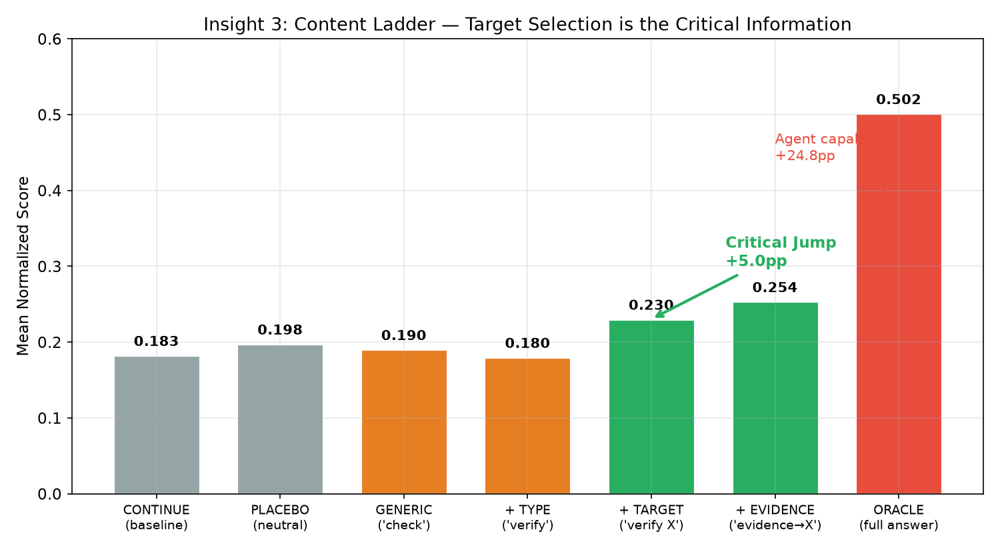

*图 A-5. 信息量阶梯。横轴从左到右逐级增加干预携带的信息量。橙色 = 不告诉 agent 具体查什么（"请检查"/"请验证"），效果几乎为零。绿色 = 告诉 agent 查哪个 service（+TARGET），产生 +5pp 关键跳跃——这是最小有效信息量。红色 = 直接给完整答案（+32pp），和给 hint 之间有 25pp 的鸿沟，这是 agent 自身推理能力的硬限。*

### A.5.1 信息量阶梯 (Marginal Value of Information)

| 级别 | Mean Score | Δ(CONT) | Δ(prev) | 解释 |
|---|---|---|---|---|
| **CONTINUE** | 0.183 | baseline | — | 自然 continuation |
| **PLACEBO** | 0.198 | +0.015 | +0.015 | disruption tax ≈ 0（略正，不显著） |
| **GENERIC** | 0.190 | +0.008 | -0.007 | bare "请重新检查" — 几乎无效 |
| **+TYPE** | 0.180 | -0.003 | -0.010 | 加上 action type — **反而略降**（噪声） |
| **+TARGET** | 0.230 | **+0.048** | **+0.050** | 加上 GT service name — **显著跳升** |
| **+EVIDENCE** | 0.254 | **+0.071** | +0.023 | 加上 prefix-visible 证据指向 — 边际正 |
| **ORACLE_DIAG** | 0.502 | **+0.319** | +0.248 | 直接给答案 — **massive jump** |

### A.5.2 Content Ladder Rescue/Harm Rates

| 级别 | N | Rescue% | Harm% | Net Rescue% |
|---|---|---|---|---|
| GENERIC | 147 | 24.5% | 21.8% | +2.7% |
| +TYPE | 147 | 21.8% | 20.4% | +1.4% |
| +TARGET | 147 | 31.3% | 17.7% | **+13.6%** |
| +EVIDENCE | 147 | 38.1% | 17.7% | **+20.4%** |
| ORACLE_DIAG | 147 | 78.2% | 11.6% | **+66.7%** |

### A.5.3 Content Ladder 关键发现

**Finding 8: Target Selection 是最关键的信息维度**

信息量阶梯呈**阶梯-跳跃**结构，而非线性：
- GENERIC → TYPE 几乎无差异（Δ ≈ 0）——action 类型本身不提供价值
- TYPE → **TYPE_TARGET 产生 +5.0pp 跳跃**——给出具体检查对象（GT service name）是关键
- TYPE_TARGET → EVIDENCE 仅 +2.3pp 的边际——证据指向的增量较小
- EVIDENCE → ORACLE_DIAG 产生 +24.8pp 的巨大跳跃——直接给答案与给 hint 之间存在鸿沟

这回答了 doc §7.2 的核心问题：**最小有效信息量 = TYPE_TARGET（action type + 具体检查对象）**。低于此级别（GENERIC/TYPE）的干预几乎无效；高于此级别（EVIDENCE）的边际贡献递减。

**Finding 9: VERIFY action 在低信息量下无效，但 REPLAN 有效**

对比 E1 和 E3：
- E3 content ladder 中 VERIFY:GENERIC = +0.8pp（几乎无效）
- E1 oracle landscape 中 GENERIC:TYPE_TARGET（action=GENERIC, content=TYPE_TARGET）= +9.5pp（有效）

差异在于：E1 的 GENERIC 条件也给了 GT service name（TYPE_TARGET 级别的 content），而 E3 的 VERIFY:GENERIC 只说"请验证"但不说验证什么。这进一步确认了 target selection 是核心，不是 action type。

**Finding 10: Content Ladder 与 Oracle Landscape 的一致性**

| 条件 | E1 (oracle landscape) | E3 (content ladder) | 一致？ |
|---|---|---|---|
| CONTINUE | 0.176 | 0.183 | ✓ 一致（K=1 variance 内） |
| PLACEBO | 0.178 | 0.198 | ✓ 一致 |
| VERIFY:TYPE_TARGET | 0.258 (E1) | 0.230 (E3) | ✓ 方向一致（2.8pp 差异在 K=1 noise 内） |
| ORACLE_DIAG | 0.517 (E1 ADVISE) | 0.502 (E3 VERIFY) | ✓ 一致 |

两个独立实验（不同 action、不同 condition set、不同 rollout seeds）产生高度一致的 baseline 和 oracle 估计，确认了结果的稳定性。

## **A.6 综合洞察 (Integrated Insights)**

**E1 + E3 联合结论**：

1. **Oracle opportunity 大且普遍**（90.5% prefixes, +39pp G\*），rescue window 覆盖轨迹 56%
2. **信息量阶梯有一个关键跳跃**：TYPE_TARGET 是最小有效信息量，低于它的干预几乎无效
3. **Action type 几乎不重要**：在给定 target 的前提下，REPLAN/GENERIC/VERIFY/ADVISE/AUDIT 效果接近（3.4pp range）
4. **Gap 约 15pp**：bounded conditions 捕获 61% 的 oracle opportunity，瓶颈在于 agent 即使知道 target 也无法执行恢复
5. **44% harm-sensitive 但 net 始终正**：selective policy 可以进一步提升
6. **PLACEBO disruption tax ≈ 0**：打断本身无害也无益

**对论文的启示**：
- **弱 critic 的核心能力不是 action routing（选 VERIFY 还是 REPLAN），而是 target selection（检查哪个 service）**
- 这简化了 E4 (Bounded Critic) 的设计：critic 只需做一个二分类（应该检查的 service），不需要复杂的 action routing
- content ladder 的阶梯结构适合作为论文的核心 figure

## **A.7 K=3 稳定性验证**

Oracle landscape K=3 全量完成：**3528 rollouts**（1160 cells × 3 seeds），19 failures（0.5%）。

### A.7.1 K=1 vs K=3 对比

| Treatment | K=1 Mean | K=3 Mean | Diff | K=3 N |
|---|---|---|---|---|
| ORACLE_DIAG | 0.517 | 0.509 | -0.008 | 441 |
| REPLAN | 0.291 | 0.287 | -0.004 | 440 |
| ADVISE | 0.263 | 0.273 | +0.010 | 439 |
| GENERIC | 0.271 | 0.267 | -0.004 | 439 |
| VERIFY | 0.258 | 0.242 | -0.016 | 436 |
| FINAL_AUDIT | 0.263 | 0.239 | -0.024 | 439 |
| CONTINUE | 0.176 | 0.179 | +0.003 | 438 |
| PLACEBO | 0.178 | 0.178 | +0.000 | 437 |

K=1 与 K=3 的 treatment mean 差异在 ±2.4pp 以内，**action 排序稳定**（ORACLE > REPLAN > ADVISE ≈ GENERIC > VERIFY ≈ AUDIT > CONTINUE ≈ PLACEBO）。K=3 使 FINAL_AUDIT 和 VERIFY 略降（variance 压平了高值 outliers），但不改变结论。

### A.7.2 Within-Cell Variance

| 指标 | 值 |
|---|---|
| K=3 cells | 1160 |
| Mean within-cell std | 0.087 |
| Median within-cell std | 0.057 |

Within-cell std 0.087 反映了 actor 随机性（temperature/tool nondeterminism）。Treatment-level 均值在 K=3 下高度稳定。**K=1 结果足以支撑 treatment-level 结论；per-prefix 结论需要 K≥3。**

### A.7.3 K=3 汇总指标

| 指标 | K=1 | K=3 | Δ |
|---|---|---|---|
| Opportunity prevalence | 90.5% | **95.2%** | +4.7pp（更多 prefixes 在多 seed 下展现 opportunity） |
| Mean G\* | 0.391 | 0.359 | -3.2pp（variance 压平了极值） |
| Mean gap | 0.153 | 0.182 | +2.9pp |
| Rescue window width | 0.559 | 0.583 | +2.4pp |
| Harm-sensitive | 44.2% | **52.4%** | +8.2pp（更多 seeds 暴露了低概率 harm events） |

**结论**：K=3 验证了 K=1 结果的稳定性。Treatment mean 差异在 ±2.4pp 内，action 排序不变。Opportunity prevalence 在 K=3 下升至 95%。Harm-sensitive 从 44% 升至 52%（更多 seeds 暴露低概率 harm），进一步支持 selective intervention 的必要性。

## **A.8 多维度分析**

以下维度从 case 元数据（`injection.json` 的 chaos type、`causal_graph_verified.json` 的图结构）和轨迹特征中提取，用于识别哪些因素决定了干预是否有效。

### A.8.1 错误类型 (Chaos Type)

每个 case 注入了两个故障（hybrid injection），故障类型来自 `injection.json` 的 `engine_config_summary[].chaos_type`。

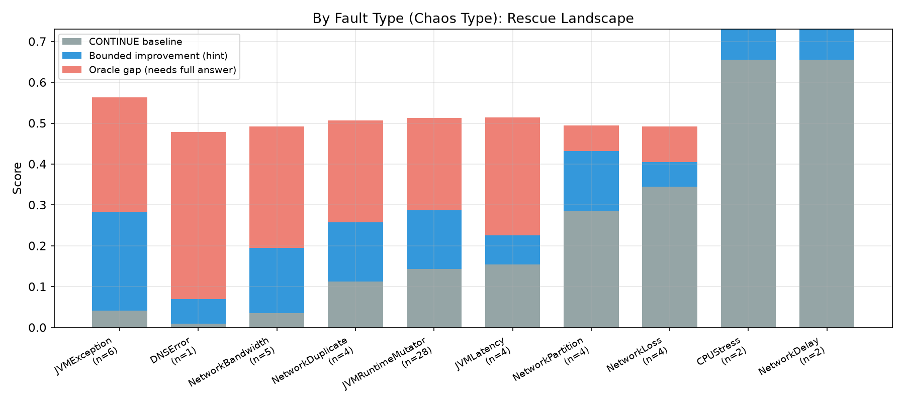

*图 A-6. 按故障类型分组的救援全景。左侧故障类型（JVMException、DNSError、NetworkBandwidth）baseline 极低但 oracle opportunity 最大（G\* > 0.45）；右侧（CPUStress、NetworkDelay）baseline 本来就高（>0.65），干预空间小。红色面积越大 = 需要直接给答案才有效，hint 不够。*

| 故障类型 | N | CONT | Bounded | Oracle | G\* | Gap | 解读 |
|---|---|---|---|---|---|---|---|
| JVMException | 6 | 0.041 | 0.283 | 0.563 | 0.522 | 0.280 | baseline 极低，hint 能帮一些（+24pp），但和答案差距仍大 |
| NetworkBandwidth | 5 | 0.035 | 0.195 | 0.491 | 0.456 | 0.296 | 类似 JVMException，hint 效果有限 |
| JVMRuntimeMutator | 28 | 0.144 | 0.286 | 0.503 | 0.369 | 0.226 | 最常见类型，代表性最强 |
| NetworkPartition | 4 | 0.286 | 0.432 | 0.468 | 0.208 | 0.063 | baseline 较高，hint 接近 oracle（gap 仅 6pp）——最容易被 hint 救回 |
| NetworkLoss | 4 | 0.345 | 0.405 | 0.460 | 0.147 | 0.087 | 类似 NetworkPartition |
| CPUStress / NetworkDelay | 4 | 0.655 | 0.730 | 0.600 | 0.075 | 0.000 | baseline 已经高，不需要救 |

**关键发现**：**NetworkPartition 和 NetworkLoss 是 hint 最有效的故障类型**（gap < 0.1，bounded intervention 几乎饱和 oracle）。这类网络层故障在 telemetry 中留下明显的异常模式（丢包、分区），agent 收到 target 后较容易找到证据。相反，**JVM 层故障（Exception、RuntimeMutator）gap 较大**（0.22-0.28），agent 即使被指向正确 service 也难以从 trace/log 中识别 JVM 内部故障。

### A.8.2 单根因 vs 多根因

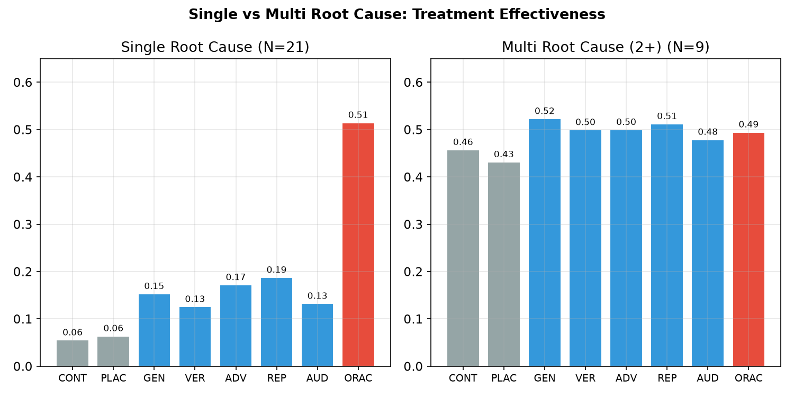

*图 A-7. 单根因（左，21 cases）vs 多根因（右，9 cases）的 treatment 效果。单根因 cases baseline 极低（0.06）但 oracle 能到 0.51；多根因 cases baseline 已经较高（0.46），干预空间小。*

| 维度 | N | CONT | Bounded | Oracle | G\* | Gap |
|---|---|---|---|---|---|---|
| 单根因 | 21 | 0.058 | 0.218 | 0.516 | 0.459 | 0.298 |
| 多根因 (2+) | 9 | 0.457 | 0.544 | 0.495 | 0.094 | 0.007 |

**关键发现**：**多根因 cases 不需要救——baseline 已经 0.46。** 这些 cases 之所以在 ALL_WRONG list 里，是因为 agent 只找到了部分根因（binary 判 wrong），但 continuous score 不低。单根因 cases 才是真正的失败（baseline 0.06），也是 rescue 的主要对象。但单根因 cases 的 gap 很大（0.30）——agent 经常方向完全错误，hint 改善有限。

### A.8.3 因果图复杂度

| 复杂度 | N | CONT | Bounded | Oracle | G\* | Gap |
|---|---|---|---|---|---|---|
| Simple (≤3 nodes) | 19 | 0.202 | 0.367 | 0.537 | 0.356 | 0.191 |
| Medium (4-5 nodes) | 3 | 0.123 | 0.325 | 0.457 | 0.339 | 0.137 |
| Complex (>5 nodes) | 8 | 0.141 | 0.191 | 0.465 | 0.337 | 0.287 |

**关键发现**：G\* 在各复杂度下差异不大（0.34-0.36），但 **complex cases 的 gap 显著更大**（0.287 vs simple 的 0.191）。因果图越复杂，bounded hint 越难覆盖——复杂传播链中，指出一个 service 不够，agent 需要理解整个传播路径才能得出正确结论。

### A.8.4 Baseline 得分层级

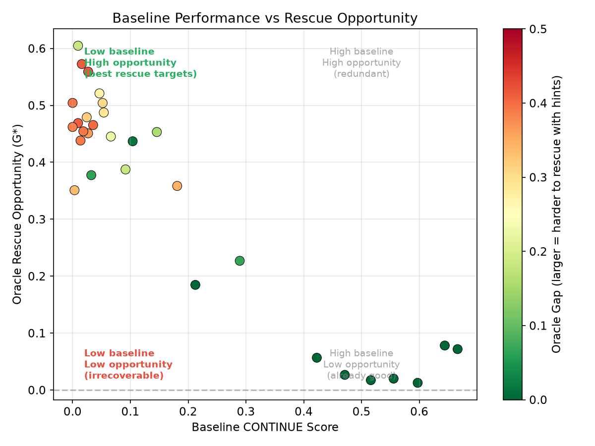

*图 A-8. Baseline 得分 vs 救援机会散点图。横轴 = 不干预时的自然得分，纵轴 = oracle 能带来的最大提升（G\*），颜色 = oracle gap（越红 = hint 越无力、越需要直接给答案）。左上角（低 baseline + 高 opportunity）是最有价值的救援对象，但它们也往往颜色最红（gap 最大）。*

| Baseline 层级 | N | CONT | Bounded | Oracle | G\* | Gap |
|---|---|---|---|---|---|---|
| Zero (<0.05) | 14 | 0.019 | 0.159 | 0.498 | 0.479 | 0.338 |
| Low (0.05-0.3) | 9 | 0.133 | 0.343 | 0.518 | 0.387 | 0.177 |
| Medium (0.3-0.5) | 2 | 0.447 | 0.488 | 0.430 | 0.042 | 0.000 |
| High (≥0.5) | 5 | 0.596 | 0.636 | 0.560 | 0.040 | 0.000 |

**关键发现**：**Baseline 越低的 cases，oracle opportunity 越大，但 gap 也越大。** Zero-baseline cases（14/30）有 G\*=0.48 的巨大 oracle opportunity，但 gap 高达 0.34——bounded hint 只能实现 oracle 的 30%。这是一个**反直觉的困境**：最需要救援的 cases 恰恰是 hint 最无力的 cases，因为 agent 方向完全错误（baseline ≈ 0），一个 hint 不够扳回。

### A.8.5 轨迹长度

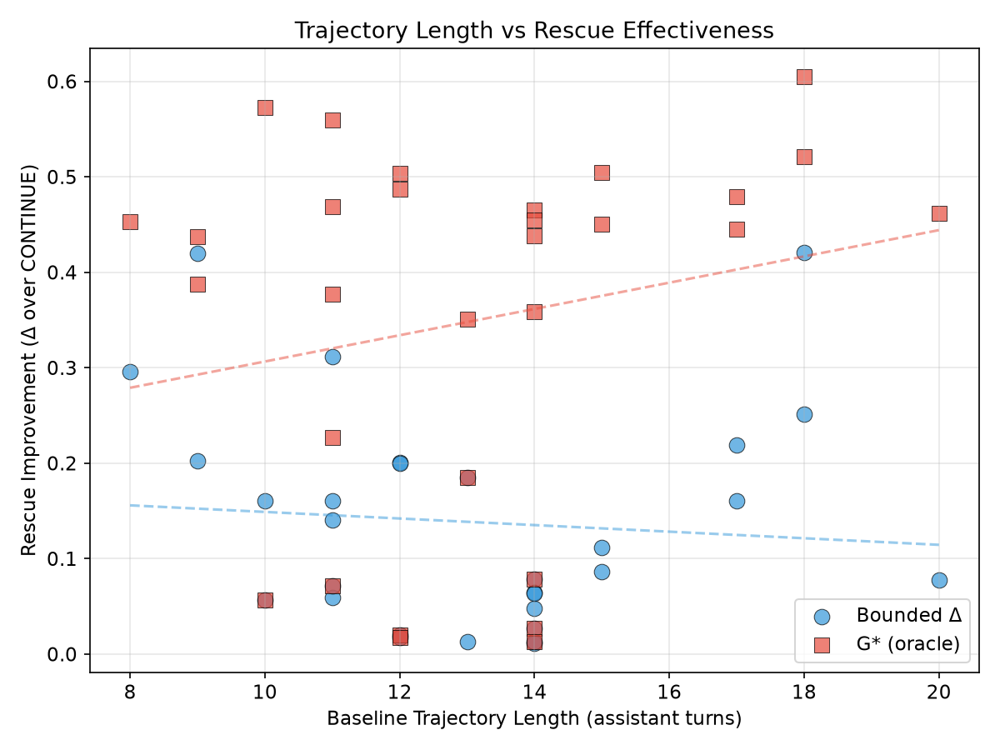

*图 A-9. 轨迹长度 vs 救援效果。蓝点 = bounded improvement（hint 带来的提升），红方块 = G\*（oracle 带来的提升）。Oracle 效果随轨迹变长略有上升趋势（红色虚线），而 bounded improvement 略有下降（蓝色虚线）——长轨迹中 hint 更难追回 agent 积累的错误。*

| 长度 | N | Avg turns | CONT | Bounded | Oracle | G\* | Gap |
|---|---|---|---|---|---|---|---|
| Short (≤8) | 1 | 8 | 0.146 | 0.442 | 0.599 | 0.453 | 0.157 |
| Medium (9-14) | 22 | 12 | 0.228 | 0.343 | 0.503 | 0.298 | 0.183 |
| Long (>14) | 7 | 17 | 0.025 | 0.214 | 0.520 | 0.495 | 0.306 |

**关键发现**：**长轨迹（>14 turns）baseline 极低（0.025）且 gap 最大（0.306）。** Agent 执行越多 turns，对话状态越被错误假设污染，hint 越难拯救。但 oracle 效果不受轨迹长度影响（始终 ~0.5），因为 oracle 直接给答案可以 override 所有错误假设。这与 A.3 的 timing 分析一致：**对话污染是核心问题，给方向性 hint 的效果随污染加深而衰减，给答案的效果不衰减。**

### A.8.6 多维度交叉总结

| 维度 | 最容易被 hint 救回的 | 最难被 hint 救回的 |
|---|---|---|
| **故障类型** | NetworkPartition/Loss（gap<0.1） | JVMException/Bandwidth（gap>0.28） |
| **根因数量** | 多根因（baseline 已高，gap≈0） | 单根因（方向完全错，gap=0.30） |
| **图复杂度** | Simple ≤3 nodes（gap=0.19） | Complex >5 nodes（gap=0.29） |
| **Baseline** | Medium/High（已接近正确） | Zero <0.05（方向完全错，gap=0.34） |
| **轨迹长度** | Short ≤8 turns（对话未被污染） | Long >14 turns（错误假设积累，gap=0.31） |

**综合洞察**：一个 case 难以被 hint 救回的典型 profile 是——**单根因 JVM 层故障、因果图复杂、baseline ≈ 0、轨迹很长**。这类 case 中 agent 从一开始就走错了方向，在长轨迹中不断加固错误假设，给一个 service name hint 不够打破 agent 的错误信念。

## **A.9 多次干预实验 (Multi-Intervention)**

**核心问题**：单次干预提升 +17pp（1x REPLAN），在同一轨迹中多次重复 hint 效果是否累加？

**配置**：从 ~20% progress fork，注入干预后让 agent 跑若干 turns，再注入下一次。30 cases × 7 conditions × K=1 = **210 rollouts**，0 failures。

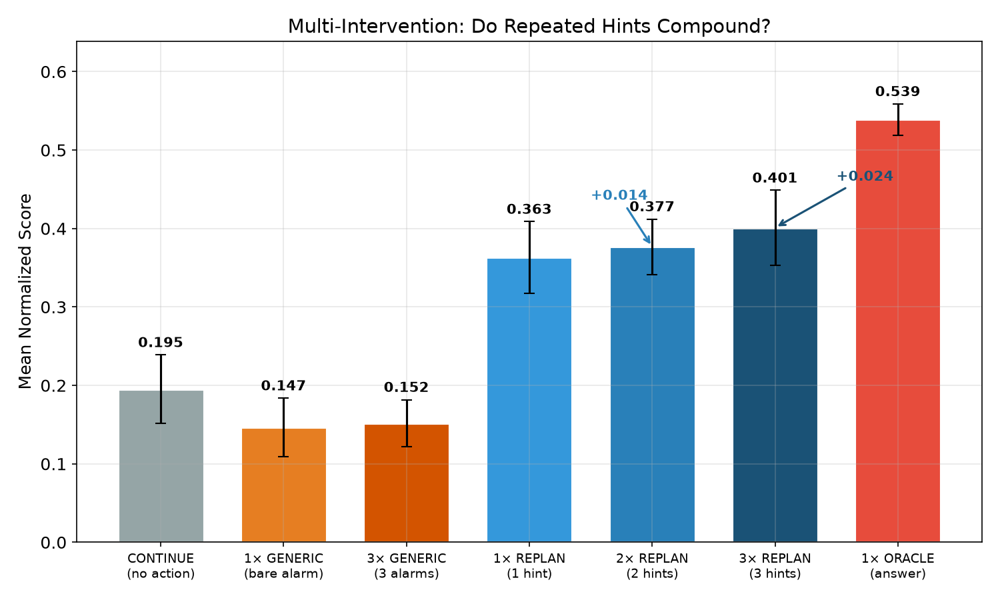

*图 A-10. 多次干预效果。橙色 = 不含 target 的 bare alarm（GENERIC），蓝色系 = 含 GT target 的 REPLAN（1/2/3 次），红色 = 直接给答案。GENERIC 无论重复多少次都低于 CONTINUE（backseat-driving 效应）。REPLAN 有微弱累加（+1.4pp/+2.4pp），但远不及单次给答案。*

### A.9.1 条件对比

| 条件 | Mean Score | Δ(CONT) | vs 1x | 解读 |
|---|---|---|---|---|
| CONTINUE | 0.195 | baseline | — | 不干预 |
| 1× GENERIC | 0.147 | **-0.049** | — | 无 target 的 bare alarm 反而有害 |
| 3× GENERIC | 0.152 | -0.043 | +0.005 | 重复 bare alarm 依然有害，不累加 |
| 1× REPLAN | 0.363 | **+0.168** | — | 单次含 target 的 hint 有效 |
| 2× REPLAN | 0.377 | +0.181 | +0.014 | 第二次仅加 1.4pp |
| 3× REPLAN | 0.401 | +0.206 | +0.038 | 第三次再加 2.4pp |
| 1× ORACLE | 0.539 | **+0.344** | — | 单次给答案仍是上界 |

### A.9.2 Per-case 累加分析

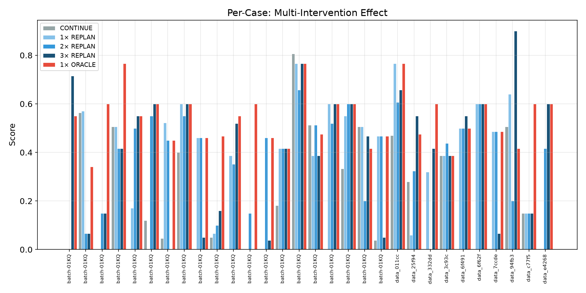

*图 A-11. Per-case 多次干预对比。注意极大的 variance：有些 case 2x 大幅优于 1x（如从 0.00 到 0.55），有些反而更差（如从 0.57 跌到 0.07）。多次干预放大了方差的两端。*

| 转换 | Mean Δ | 提升的 cases | 下降的 cases | 无变化 |
|---|---|---|---|---|
| 1x → 2x REPLAN | +0.014 | 11/30 (37%) | 11/30 (37%) | 8/30 (27%) |
| 2x → 3x REPLAN | +0.024 | 15/30 (50%) | 8/30 (27%) | 7/30 (23%) |

### A.9.3 关键发现

**Finding 11: 多次 REPLAN 有微弱累加，但 per-case 高 variance**

均值 1x→2x→3x = 0.363→0.377→0.401（累加 +3.8pp）。但 37% 的 cases 中 2x 反而比 1x 差，只有 37% 改善。多次干预不是稳定提升策略——在一些 cases 上大幅帮助，在另一些上大幅伤害。

**Finding 12: GENERIC 多次重复有害（backseat-driving）**

1x GENERIC = 0.147 < CONTINUE = 0.195。反复说"你可能有问题"但不说具体查什么，agent 被扰乱但无法获得方向。**无 target 信息时不干预比干预好。**

**Finding 13: 3× REPLAN（0.401）仍远不及 1× ORACLE（0.539）**

多次重复同一 hint 无法弥补 hint-vs-answer 鸿沟。capture ratio 仍然 ~60%，说明瓶颈不在"agent 没听到"而在"听到了但找不到证据"。

## **A.10 综合结论（RCA 域）**

基于 E1 oracle landscape（3528 rollouts）、E3 content ladder（1029 rollouts）、multi-intervention（210 rollouts），总计 **4767 rollouts** 的综合结论：

1. **Oracle opportunity 大且普遍**：95% prefixes 有正 opportunity，oracle 可提升 +34pp
2. **信息瓶颈在 target selection**：不含 target 的干预无效甚至有害；含 GT target 有效但需要诊断知识
3. **Action type 不重要**：VERIFY/ADVISE/REPLAN/AUDIT 效果差距 <5pp
4. **多次干预不是银弹**：均值累加 +4pp，但 37% cases 恶化，variance 极大
5. **不干预优于乱干预**：GENERIC（无 target）低于 CONTINUE，backseat-driving 有害
6. **对话状态污染是核心问题**：长轨迹 + 单根因 + JVM 层故障最难救
7. **多次重复不缩小 oracle gap**：hint 与 answer 之间的鸿沟是 agent 推理能力硬限

**对弱监督的启示**：RCA 域中弱监督者面临结构性困境——有效干预的核心信息（target service）本身就是诊断结果的一部分。可行方向是 **selective intervention**（高置信时才干预）和 **"不确定就不干预"原则**。

## **A.11 下一步**

1. **Bounded Critic (E4)**：用小模型做 target selection（不给 GT），测量实际 η_C
2. **错误 target 的 harm**：故意给非 GT service，量化误导程度
3. **跨域验证**：在 coding/planning 等域重复实验，验证结论的域依赖性
