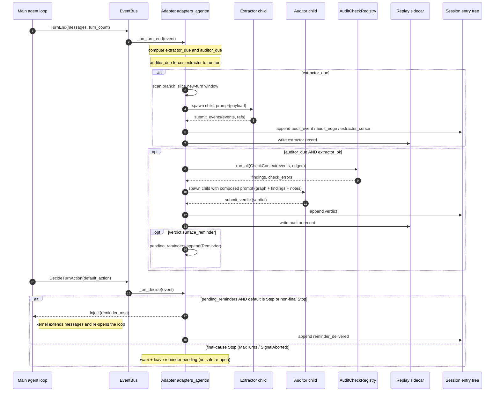
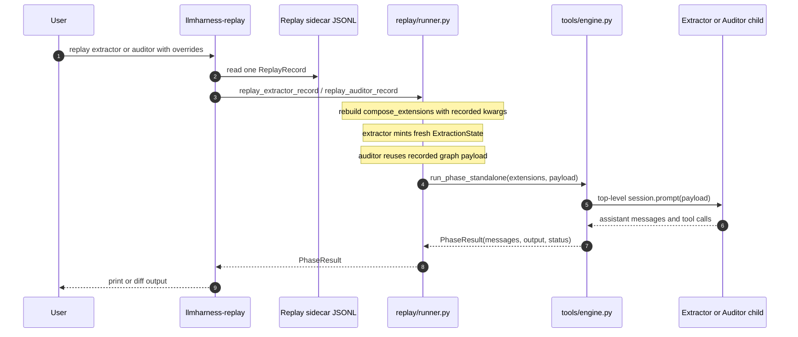
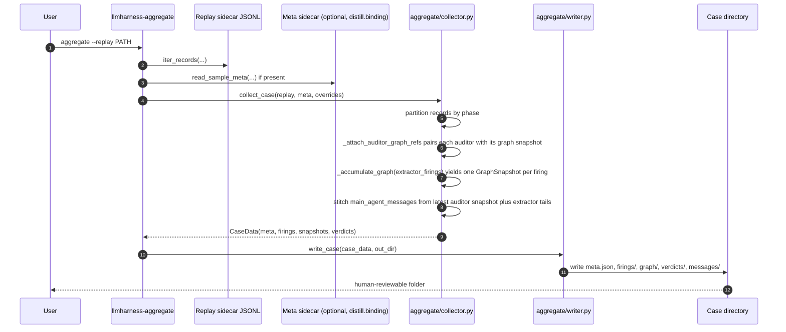

# llmharness

LLM-as-harness for AgentM: a two-phase cognitive audit pipeline
(extractor + auditor) that supervises a main agent, plus an offline
distill workflow that turns recorded sessions into SFT data for
training a small (~4B) model into the same harness role.

## Two product surfaces

1. **Live supervision.** Mount the adapter onto a session; every
   `TurnEnd` triggers an extractor child (graph builder), every k
   turns triggers an auditor child (verdict producer). The auditor's
   verdict, if it says so, is injected as a one-line advisory before
   the next agent turn.

   ```bash
   agentm --extension llmharness.adapters.agentm
   ```

2. **Distill data collection.** Run the live pipeline with reminders
   off + sample-id binding to record clean trajectories, then run
   `llmharness-distill {label, export}` offline to produce
   `extractor.jsonl` + `auditor.jsonl` SFT files.

   ```bash
   LLMHARNESS_DISTILL_SAMPLE_ID=<id> \
   LLMHARNESS_DISTILL_DATASET=<dataset.jsonl> \
     agentm --extension llmharness.adapters.agentm \
            --extension llmharness.distill.binding \
            --scenario rca ...

   llmharness-distill label  --replay-dir <cwd>/.agentm/audit_replay \
                             --dataset    <dataset.jsonl> \
                             --out        ./distill_labels
   llmharness-distill export --labels ./distill_labels \
                             --replay-dir <cwd>/.agentm/audit_replay \
                             --out  ./sft
   ```

## Mounting on a scenario (consumer's view)

### Manifest entries

A scenario opts into llmharness by adding the adapter (and optionally the
sample-id binding) to its manifest. There is **no** name-based detection —
nothing keys off the scenario name containing "harness"; the wiring is
purely manifest-driven.

```yaml
# contrib/scenarios/<your-scenario>/manifest.<variant>.yaml
extensions:
  # ... your scenario's atoms ...

  - module: llmharness.adapters.agentm
    config:
      mode: sync                       # or "async"
      extractor_interval_turns: 5
      audit_interval_turns: 5
      enable_auditor: true             # default true
      enable_reminders: true           # default true; false = opinions-only

  # Optional: write the distill-binding sidecar so offline labeler can join
  # replay records back to a sample id (driven by LLMHARNESS_DISTILL_* env).
  - module: llmharness.distill.binding

  # Optional: enable the prefix-replay flow (mounted only on resumed
  # sessions emitted by `llmharness-replay agent-from-reminder`).
  - module: llmharness.replay.reminder_seed
```

Adapter knobs are documented in
[docs/08-running-modes.md §1](docs/08-running-modes.md#1-decoupling-matrix).
For a concrete reference, see the rca scenario's
`contrib/scenarios/rca/manifest.harness*.yaml` family +
`contrib/scenarios/rca/_VARIANTS.md` for the variant matrix.

### Public API

Importable from the top-level package only — everything else is internal.
Promote a symbol to the top level on demand when an in-tree caller needs
it (see `src/llmharness/__init__.py` for the contract).

| Symbol | Purpose |
|---|---|
| `Event`, `EventKind`, `Edge`, `EdgeKind`, `Finding`, `Phase`, `Verdict`, `Reminder` | Wire-type dataclasses (see [docs/02-schemas.md](docs/02-schemas.md)). |
| `ReplayRecord`, `iter_records`, `write_record` | Replay sidecar format and I/O. |
| `ReminderCandidate`, `OfflineAuditRun`, `run_offline_auditor_over_control`, `write_strict_ab_replay`, `strict_ab_replay_path` | Strict-A/B fork orchestration. Used by the rca eval driver. |

Atom authors who write new audit checks (rare) additionally import
`SERVICE_KEY`, `AuditCheckRegistry`, and `CheckContext` from
`llmharness.audit.registry` — the one documented submodule import,
covered in [docs/04-extending.md §1](docs/04-extending.md).

### Events the adapter subscribes to

The adapter binds three handlers on the main agent's `EventBus`:

| Event | Handler | What it does |
|---|---|---|
| `TurnEndEvent` | `_on_turn_end` | Computes extractor / auditor due. Spawns extractor child (always when due); spawns auditor child (every k turns, only after a successful extractor firing). Persists results to the session entry tree and replay sidecar. |
| `DecideTurnActionEvent` | `_on_decide` | If a verdict surfaced a reminder, returns an `Inject([reminder_msg])` action so the kernel re-opens the loop. |
| `SessionShutdownEvent` | `_on_shutdown` | Drains pending audit work (async mode only) and closes the sidecar. |

No tools are exposed to the main agent — model-visible surface is
unchanged. The only main-agent side effect is the optional reminder
injection, gated on `enable_reminders=true`.

### What the auditor injects

When `Verdict.surface_reminder=true`, the auditor's `reminder_text` is
wrapped by `audit/_reminder_format.py:build_reminder_message` and
injected as a synthetic user message before the next agent turn. Format
is single-sourced so live and offline (prefix-replay) paths stay
byte-identical. Verdicts always persist to the entry tree and sidecar;
`enable_reminders=false` only suppresses delivery.

---

## Sequence diagrams

Three views of how the moving parts fit together. Read these before
diving into `docs/01-architecture.md` if you prefer time-ordered to
component-ordered narration.

### 1. Live supervision per turn

What the adapter does on every `TurnEndEvent` and how a surfaced
reminder makes it back to the main agent.



Notes worth carrying in your head while reading the code:

- The **cursor** lives on the session entry tree (`extractor_cursor`),
  not in the adapter — that's why a `_drain_extractor` returning
  `False` (no_call/empty/error) silently holds the cursor and the next
  firing re-tries the same window.
- In **async mode** the same logic moves into a serial worker
  (`_drain_queue`); the queue guarantees extractor-before-auditor
  ordering, and if the preceding extractor held the cursor the
  auditor for that turn is skipped (`_last_extractor_held_cursor`).
- The reminder path goes through `Inject` rather than a direct
  message append so that the prefix-replay seed atom
  (`replay/reminder_seed.py`) and the live path stay byte-identical.

### 2. Offline replay (A/B a recorded firing)

What `llmharness-replay {extractor,auditor}` actually does. The
sidecar is the contract: anything captured in `compose_kwargs` +
`payload` can be re-run with a different provider/prompt.



The same machinery backs the **strict A/B fork**: the eval driver
runs a no-auditor control session, then feeds each extractor
sidecar line into `replay_auditor_record` to reconstruct what the
auditor *would have* said, picks the first surfaced reminder, and
forks a branch session that seeds it via
`replay/reminder_seed.py`. See
`contrib/scenarios/rca/src/agentm_rca/eval/agent.py` and
`docs/07-prefix-replay.md`.

### 3. Aggregation (one case = one viewable folder)

How `llmharness-aggregate` turns the per-session sidecar into the
shape the web case viewer / training-data export expect.



The graph-pairing step is load-bearing: every auditor firing carries a
`graph_snapshot_ref` pointing at the most recent extractor firing
that strictly precedes it in **both** `ts_ns` and `turn_index` (PR
#159 fix). Without that pairing the viewer mis-attributes verdicts
to the wrong graph version.

## Docs

| File | When to read it |
|---|---|
| [docs/01-architecture.md](docs/01-architecture.md) | Components, static dependency graph, runtime data flow. Read this first. |
| [docs/02-schemas.md](docs/02-schemas.md) | Authoritative shapes: `Event` / `Edge` / `Finding` / `Verdict`, `ReplayRecord`, meta sidecar, SFT JSONL. Use as a reference. |
| [docs/03-distill-recipe.md](docs/03-distill-recipe.md) | End-to-end recipe: from a labeled fault-injection dataset to `sft/{extractor,auditor}.jsonl`. Includes the six design decisions that make the labels safe to learn from. |
| [docs/04-extending.md](docs/04-extending.md) | Registering a new audit check; adapting the distill flow to a non-rca dataset. |
| [docs/05-profiles-and-prompts.md](docs/05-profiles-and-prompts.md) | Pluggable tool profiles + prompt variants for the extractor / auditor children. Read this when running A/B experiments. |
| [docs/06-case-aggregation.md](docs/06-case-aggregation.md) | Per-case directory layout produced by `llmharness-aggregate`. Read this for human review of a run or before exporting trajectories. |
| [docs/07-prefix-replay.md](docs/07-prefix-replay.md) | Iterate on auditor / reminder behaviour without re-running the whole trajectory: branch a session at the verdict-firing turn and replay only the tail. |
| [docs/08-running-modes.md](docs/08-running-modes.md) | How extractor / auditor / reminder injection decouple and recombine, and where to plug an SFT-trained model in (live + offline). Start here if you want to run the pieces separately. |

## CLI entry points

| Script | Purpose |
|---|---|
| `llmharness` | one-shot session demo (see `cli.py`) |
| `llmharness-replay {extractor,auditor}` | replay a recorded phase with a different provider/prompt for A/B |
| `llmharness-replay agent-from-reminder` | branch a main-agent session at the end of turn t and emit a resume command that seeds the recorded auditor reminder (see [docs/07-prefix-replay.md](docs/07-prefix-replay.md)) |
| `llmharness-distill {label,export}` | distill pipeline driver |
| `llmharness-aggregate` | replay sidecar → per-case directories for review + training-data export |

## Schema stability

`src/llmharness/schema.py` is the public contract for downstream
consumers (e.g. rca-autorl). Breaking changes bump the package
version in `pyproject.toml`. The v3 schema break is documented in
that module's docstring.
