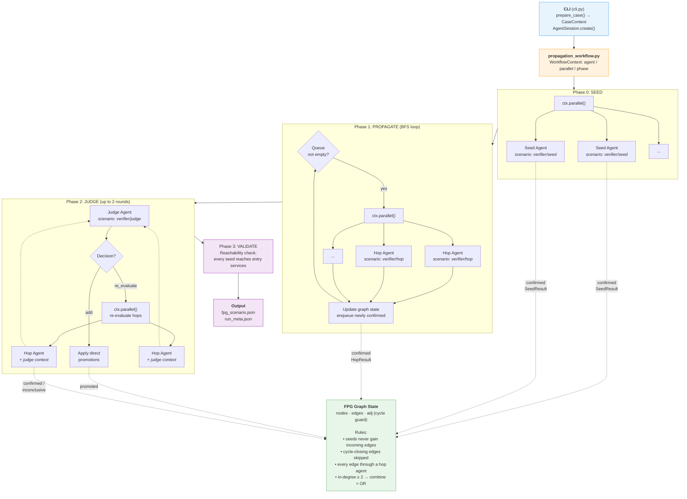
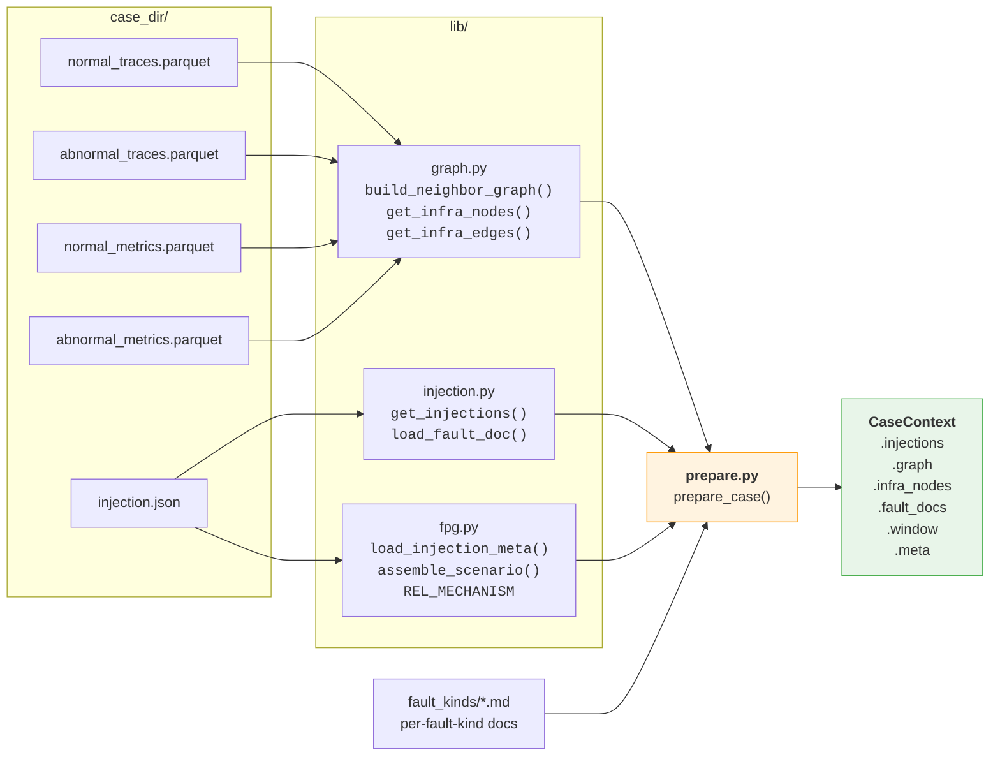
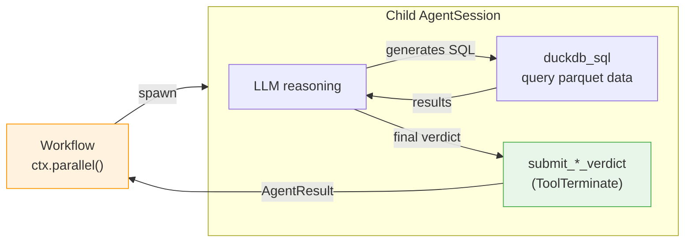
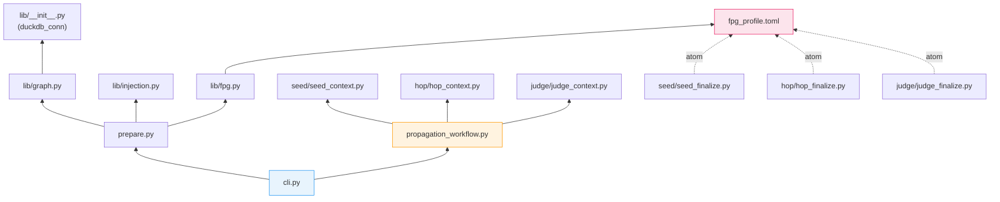

# verifier — fault propagation graph construction

## Task setting

Given a microservice system where one or more faults have been injected
(pod failure, network delay, CPU stress, etc.), determine which services
are **genuinely degraded as a result of the fault propagation**, and
produce the service-level propagation graph (nodes + edges + evidence).

Key clarifications:

- **Service-level, not span-level.** The unit of analysis is a service.
  A service is "propagated to" if it exhibits genuine degradation that
  is causally linked to the upstream fault — not merely because one of
  its span paths has fewer invocations.
- **Independent discovery, not GT matching.** The verifier constructs
  its own propagation graph from observability data. It does NOT try to
  reproduce GT labels. GT is a separate artifact used for comparison
  after the fact; the verifier's job is to find the truth in the data.
- **Edge-level evaluation.** Each directed edge (source → target) with
  a specific relationship type is an independent propagation hypothesis.
  The same target service may be reached from multiple sources via
  different relationships; each is evaluated separately. A rejection
  from one path does not preclude confirmation from another.
- **What counts as "genuinely degraded":**
  - Latency increase, error rate increase, service unavailability
    (zero spans + zero logs = service down, not just "nobody called it")
  - Throughput drop ALONE is not degradation of the service itself —
    unless the system is in cascading failure (>80% load generator
    throughput drop), or the drop is concentrated on a specific fault-
    related call path rather than uniform.
- **What does NOT count:**
  - Fewer incoming requests because callers stopped calling (that's the
    CALLER's problem, not this service's degradation)
  - Sub-noise-floor changes (sub-millisecond absolute differences)
  - Changes matching system-wide load drift

## Architecture

### Workflow-based scheduling

The verifier is a **workflow-orchestrated multi-agent system**. The CLI
(`cli.py`) creates an AgentM `AgentSession`, loads the workflow engine,
and executes `propagation_workflow.py` — a Python workflow script that
uses `ctx.agent()` / `ctx.parallel()` / `ctx.phase()` to spawn and
coordinate child agent sessions. Each child session runs its own
scenario (seed / hop / judge) with its own manifest, system prompt,
tools, and finalize atom.

#### Overall orchestration flow



#### Data preparation



#### Agent session internals



### Agent scenarios

Each agent type has its own subdirectory with a manifest, system prompt,
and finalize atom:

| Agent | Scenario | System prompt | Finalize tool | Verdict |
|-------|----------|---------------|---------------|---------|
| Seed  | `verifier/seed` | `seed/prompts/seed.md` | `submit_seed_verdict` | confirmed / rejected / inconclusive |
| Hop   | `verifier/hop`  | `hop/prompts/hop.md`   | `submit_hop_verdict`  | confirmed / rejected / inconclusive |
| Judge | `verifier/judge`| `judge/prompts/judge.md`| `submit_judge_review` | add / re_evaluate / suggested_remove |

All agents share:
- `duckdb_sql` tool for querying case parquet data
- `operations` (local backend) for file system access
- `observability` + `tool_index` + `turn_reminder` + `retry_policy`
- fpg profile vocabulary (`fpg_profile.toml`) for predicate/mechanism enums

### Module dependency map



Why promotion-only: the hop agents already reason per-edge about error
rate, latency magnitude, fault mechanism, and direction. An LLM judge
re-deciding from rationale text alone reliably *removes genuinely-
degraded* services (it can't tell a real tail-latency spike from
throughput noise without re-querying everything). On the validation set,
judge pruning was strongly net-negative, so only cascade promotion remains.

## Usage

```bash
cd contrib/scenarios

# Single case
uv run python -m verifier.cli run <case_dir> [--model doubao] [--out /tmp/out]

# Batch
uv run python -m verifier.cli batch <dataset_dir> \
    --run-dir /tmp/verifier-run [--parallel 4] [--limit 10]
```

## Output

Each case produces under `<out_dir>/`:

| File | Content |
|------|---------|
| `fpg_scenario.json` | Validated fault-propagation graph (fpg schema). |
| `run_meta.json` | All verdicts with evidence SQL + rationale, hop log, rounds. |

## Debugging a run

### Find sessions

CLI prints `trace_id` on startup. List all child sessions:

```bash
agentm trace index --format ndjson | grep <trace_id>
```

Each child has a `session_id` and `scenario` (verifier/seed, verifier/hop).

### Inspect a specific agent

```bash
# Full conversation trajectory
agentm trace messages --session <session_id> --format text

# Tool calls (SQL queries + results)
agentm trace tools --session <session_id> --format ndjson \
  | jq '{tool: .tool, sql: .args.sql, result: .result.content[0].text}'

# Verdict only
agentm trace tools --session <session_id> --tool submit_hop_verdict --format ndjson \
  | jq '.args | {verdict, predicate, rationale}'
```

### Find a specific edge's session

```bash
TRACE=<trace_id>
for sid in $(agentm trace index --format ndjson | grep "$TRACE" \
  | jq -r 'select(.scenario=="verifier/hop") | .session_id'); do
  from=$(agentm trace messages --session "$sid" --role user --format text 2>&1 \
    | grep -oP 'Confirmed degraded: \*\*\K[^*]+')
  to=$(agentm trace messages --session "$sid" --role user --format text 2>&1 \
    | grep -oP 'Target: \*\*\K[^*]+')
  echo "$sid: $from -> $to"
done
```

### Common misdiagnosis patterns

| Pattern | What goes wrong | Root cause |
|---|---|---|
| Aggregate flat → reject | Agent checks aggregate error/latency, misses per-endpoint degradation on the fault-related call path | Agent doesn't break down by `span_name` before concluding |
| Zero spans → reject | Agent sees 0 abnormal spans, concludes "no degradation" instead of "service unavailable" | Should be inconclusive (zero evidence ≠ evidence of health) |
| Unit confusion | `duration` is nanoseconds; agent divides by 1e3 (→ μs) instead of 1e6 (→ ms), misreads magnitude | Agent didn't DESCRIBE the table or cross-check units |
| Wrong propagation direction | Agent confirms a downstream for a latency fault (latency propagates UP not down) | Agent ignored fault doc's direction guidance |
| Throughput-only rejection applied too broadly | Fault doc says "throughput drop without latency/error = not degradation," agent applies this even when the fault-related endpoint's spans vanished entirely | Rule is for uniform traffic dip, not for a specific dead call path |
