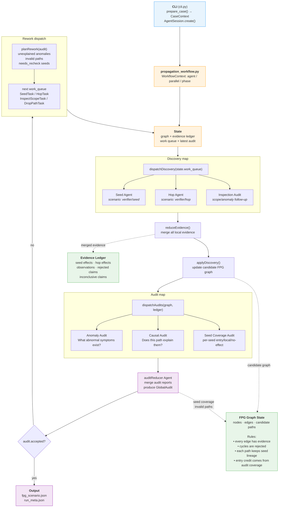
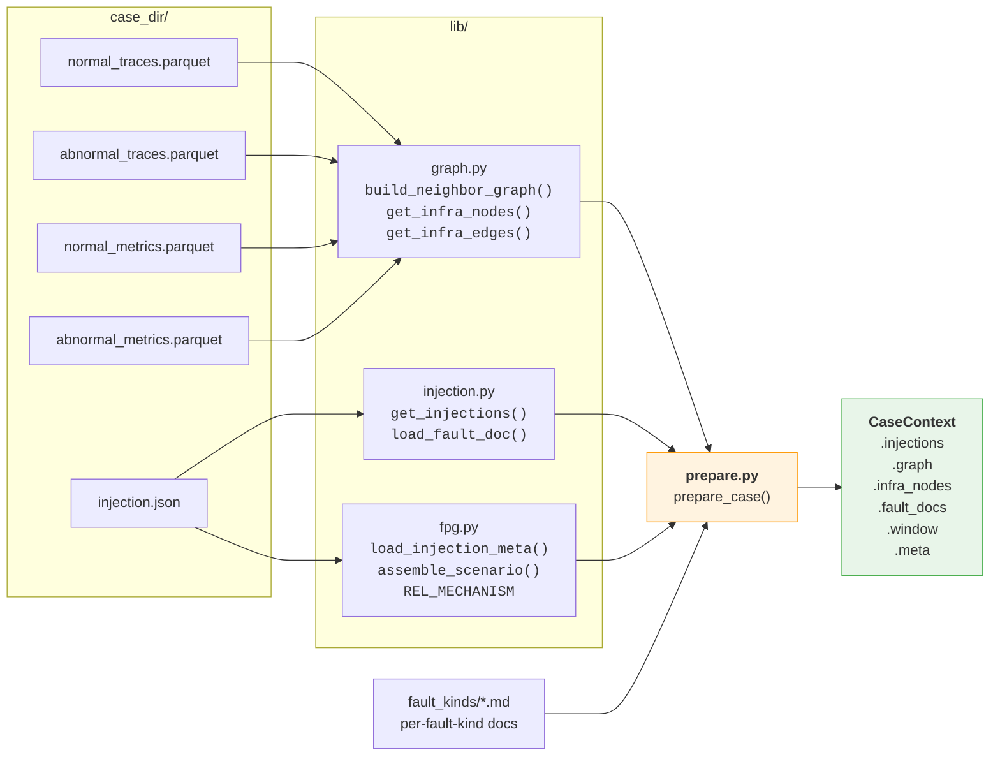
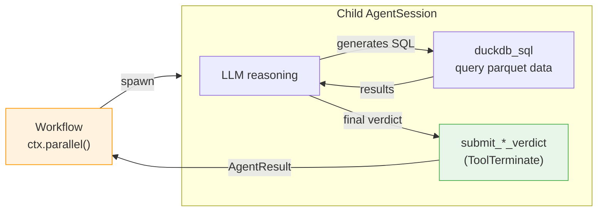
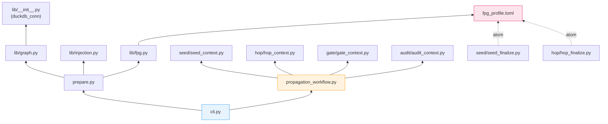
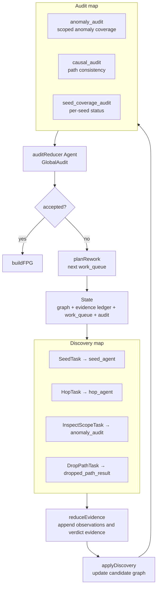

# verifier — fault propagation graph construction

## Task setting

Given a microservice system where one or more faults have been injected
(pod failure, network delay, CPU stress, etc.), determine which services
are **genuinely degraded as a result of the fault propagation**, and
produce the service-level propagation graph (nodes + edges + evidence).

Key clarifications:

- **Service-level, not span-level.** The unit of analysis is a service.
  A service is "propagated to" if it exhibits genuine degradation that
  is causally linked to the upstream fault — not merely because one of
  its span paths has fewer invocations.
- **Independent discovery, not GT matching.** The verifier constructs
  its own propagation graph from observability data. It does NOT try to
  reproduce GT labels. GT is a separate artifact used for comparison
  after the fact; the verifier's job is to find the truth in the data.
- **Edge-level evaluation.** Each directed edge (source → target) with
  a specific relationship type is an independent propagation hypothesis.
  The same target service may be reached from multiple sources via
  different relationships; each is evaluated separately. A rejection
  from one path does not preclude confirmation from another.
- **What counts as "genuinely degraded":**
  - Latency increase, error rate increase, service unavailability
    (zero spans + zero logs = service down, not just "nobody called it")
  - Throughput drop ALONE is not degradation of the service itself —
    unless the system is in cascading failure (>80% load generator
    throughput drop), or the drop is concentrated on a specific fault-
    related call path rather than uniform.
- **What does NOT count:**
  - Fewer incoming requests because callers stopped calling (that's the
    CALLER's problem, not this service's degradation)
  - Sub-noise-floor changes (sub-millisecond absolute differences)
  - Changes matching system-wide load drift

## Architecture

### Workflow-based scheduling

The verifier is a **workflow-orchestrated multi-agent system**. The CLI
(`cli.py`) creates an AgentM `AgentSession`, loads the workflow engine,
and executes `propagation_workflow.py` — a Python workflow script that
uses `ctx.agent()` / `ctx.parallel()` / `ctx.phase()` to spawn and
coordinate child agent sessions. Each child session runs its own
scenario (seed / hop / gate / audit) with its own manifest, system
prompt, tools, and finalize atom.

#### Target orchestration flow



The target architecture is a map-reduce control loop, not a single
linear BFS followed by a single judge. Local discovery remains highly
parallel; global correctness is recovered by parallel audit agents and
an audit reducer. If the audit fails, its output is converted into the
next work queue and the loop continues until the audit accepts or the
case is exhausted.

#### Data preparation



#### Agent session internals



### Agent scenarios

Each agent type has its own subdirectory with a manifest, system prompt,
and finalize atom:

| Agent | Scenario | System prompt | Finalize tool | Verdict |
|-------|----------|---------------|---------------|---------|
| Seed  | `verifier/seed` | `seed/prompts/seed.md` | `submit_seed_verdict` | confirmed / rejected / inconclusive |
| Hop   | `verifier/hop`  | `hop/prompts/hop.md`   | `submit_hop_verdict`  | confirmed / rejected / inconclusive |
| Gate  | `verifier/gate` | `gate/prompts/gate.md` | structured output | accepted / retryable / missing_checks |
| Audit | `verifier/audit`| `audit/prompts/audit.md`| structured output | anomaly / causal / seed coverage / global audit |

All agents share:
- `duckdb_sql` tool for querying case parquet data
- `operations` (local backend) for file system access
- `observability` + `tool_index` + `turn_reminder` + `retry_policy`
- fpg profile vocabulary (`fpg_profile.toml`) for predicate/mechanism enums

### Module dependency map



Current implementation note: the active reducer is `verifier/audit`.
The older `verifier/judge` scenario remains in the tree for historical
compatibility, but the workflow no longer uses its `add` /
`re_evaluate` / `suggested_remove` contract. Earlier validation showed
that pruning nodes from rationale text alone was net-negative: it
removed genuinely degraded services because it could not re-query the
raw evidence behind a hop. The active architecture keeps that lesson:
audit agents check the merged evidence ledger, anomaly coverage, and
causal consistency, then emit concrete rework or path-specific
invalidation.

### Map-reduce audit control model

The verifier should be modeled as a functional map-reduce control loop.
The seed and hop agents are discovery mappers: they maximize recall by
checking many local hypotheses independently. The audit layer is also
parallel: several audit functions inspect different slices of the merged
evidence, and an audit reducer merges their reports into the next control
decision.

The audit reducer is still an LLM agent. The harness does not attempt to
hard-code every possible fault signature. Its job is to control dataflow:
partition work, preserve all evidence in a ledger, give each judge a
bounded question, merge audit reports, and dispatch concrete rework until
the audit accepts.

#### Functional shape

```python
def verify(case: Case) -> FPG:
    state = State(
        graph=Graph.empty(),
        ledger=EvidenceLedger.empty(),
        work_queue=initial_seed_tasks(case),
        audit=None,
        round=0,
    )

    while True:
        state = step(case, state)
        if state.audit.accepted:
            return build_fpg(state.graph, state.ledger, state.audit)
```

One iteration has four phases:

```python
def step(case: Case, state: State) -> State:
    discovery_results = dispatch_discovery(
        case=case,
        graph=state.graph,
        tasks=state.work_queue,
    )

    ledger = reduce_evidence(state.ledger, discovery_results)
    graph = apply_discovery(state.graph, discovery_results)

    audit_reports = dispatch_audits(case, graph, ledger)
    audit = reduce_audit(audit_reports)

    if audit.accepted:
        return replace(state, graph=graph, ledger=ledger, audit=audit)

    return replace(
        state,
        graph=graph,
        ledger=ledger,
        audit=audit,
        work_queue=plan_rework(audit),
        round=state.round + 1,
    )
```

`dispatch_discovery` is a parallel map over the current work queue:

```python
def dispatch_discovery(case: Case, graph: Graph, tasks: list[Task]):
    return par_map(lambda task: run_task(case, graph, task), tasks)


def run_task(case: Case, graph: Graph, task: Task):
    match task:
        case SeedTask(seed, context):
            return seed_agent(case, seed, context)
        case HopTask(edge, context):
            return hop_agent(case, graph, edge, context)
        case InspectScopeTask(scope, context):
            return anomaly_audit(case, graph, scope, context)
        case DropPathTask(path_id, reason):
            return dropped_path_result(path_id, reason)
```

`dispatch_audits` is also a parallel map, but over global audit
questions rather than local propagation hypotheses:

```python
def dispatch_audits(case: Case, graph: Graph, ledger: EvidenceLedger):
    return [
        *par_map(lambda s: anomaly_audit(case, graph, ledger, s),
                 partition_anomaly_scopes(case, ledger)),
        *par_map(lambda p: causal_audit(case, graph, ledger, p),
                 candidate_paths(graph, ledger)),
        *par_map(lambda s: seed_coverage_audit(case, graph, ledger, s),
                 confirmed_seed_ids(graph, ledger)),
    ]
```

The first reduce is mechanical evidence accumulation. The second reduce
is model-based audit synthesis:

```python
def reduce_evidence(ledger: EvidenceLedger, results: list[DiscoveryResult]):
    return reduce(lambda acc, r: acc.merge(extract_evidence(r)), results, ledger)


def reduce_audit(reports: list[AuditReport]) -> GlobalAudit:
    return audit_reducer_agent(reports)
```

#### Formal objects

| Object | Meaning |
|---|---|
| `EvidenceLedger` | Monoidal evidence store accumulated across rounds: seed effects, hop effects, observations, rejected claims, and inconclusive claims. |
| `Task` | A unit of work for the next discovery map: `SeedTask`, `HopTask`, `InspectScopeTask`, or `DropPathTask`. |
| `AuditReport` | One bounded audit output. Examples: anomaly report for an entry scope, causal report for one candidate path, or seed coverage report for one seed. |
| `GlobalAudit` | Audit reducer output: `accepted`, `unexplained_anomalies`, `invalid_causal_paths`, `seed_coverage`, and `rework_requests`. |
| `SeedCoverage` | Per-seed status: `explains_entry`, `local_only`, `benign_or_no_effect`, `needs_recheck`, or `invalid_path`. |

#### Audit responsibilities

The audit layer has multiple parallel functions:

| Audit function | Input partition | Question answered |
|---|---|---|
| `anomaly_audit` | One entry/service/log/metric scope | What meaningful abnormal symptoms exist here, and are any unexplained? |
| `causal_audit` | One candidate path or path family | Does this path causally explain the anomaly it claims to explain? |
| `seed_coverage_audit` | One confirmed seed | Is this seed `explains_entry`, `local_only`, `benign_or_no_effect`, `needs_recheck`, or `invalid_path`? |
| `audit_reducer_agent` | All audit reports | What is the global audit decision and next work queue? |

The audit has two global obligations:

1. **Anomaly coverage.** All meaningful abnormal symptoms must be
   explained, marked benign/noise, or converted into concrete rework.
2. **Causal consistency.** Any explanation path credited to a seed must
   have coherent evidence, endpoint/path alignment, direction, timing,
   and magnitude. A seed does not get entry credit from graph reachability
   alone.

#### Rework dispatch

When the audit fails, it is converted into the next discovery work queue:

```python
def plan_rework(audit: GlobalAudit) -> list[Task]:
    return [
        *map(anomaly_to_task, audit.unexplained_anomalies),
        *map(invalid_path_to_task, audit.invalid_causal_paths),
        *chain.from_iterable(
            seed_coverage_to_tasks(seed, coverage)
            for seed, coverage in audit.seed_coverage.items()
        ),
        *map(rework_request_to_task, audit.rework_requests),
    ]
```

Examples:

```python
def anomaly_to_task(anomaly: Anomaly) -> Task:
    if anomaly.plausible_missed_seed:
        return SeedTask(anomaly.best_seed, anomaly.context)
    if anomaly.plausible_missed_edge:
        return HopTask(anomaly.best_edge, anomaly.context)
    return InspectScopeTask(anomaly.scope, anomaly.context)


def invalid_path_to_task(path: PathAudit) -> Task:
    if path.reason == "wrong_seed_lineage":
        return DropPathTask(path.path_id, path.reason)
    return HopTask(path.weakest_edge, path.context)
```

Loop termination is based on audit resolution, not raw graph reachability:

```python
def audit_pass(audit: GlobalAudit) -> bool:
    return (
        not audit.unexplained_anomalies
        and not audit.invalid_causal_paths
        and all(
            coverage
            in {"explains_entry", "local_only", "benign_or_no_effect"}
            for coverage in audit.seed_coverage.values()
        )
    )
```

Therefore quality should not be:

```python
seed_confirmed(seed) and graph_reaches_entry(seed)
```

It should be:

```python
seed_confirmed(seed) and audit.seed_coverage[seed] == "explains_entry"
```

`local_only` is a resolved outcome. It means the fault took effect, but
the evidence does not support a frontend propagation path.

#### Control-flow diagram



#### Example: local effect that should not get entry credit

Suppose two faults run together:

- `link:ts-user-service->mysql` (`NetworkBandwidth`) produces a local
  datastore signal: `ts-user-service` SQL span p99 increases from about
  1 ms to about 4 ms.
- `ts-admin-user-service` (`JVMLatency`) produces a method delay of about
  1.6 s, and the dashboard endpoint `GET /api/v1/adminuserservice/users`
  also jumps by about 1.6 s.

The candidate graph may contain a topological path:

```text
link:ts-user-service->mysql -> ts-user-service
ts-user-service -> ts-admin-user-service
ts-admin-user-service -> ts-ui-dashboard
```

The causal audit should reject that path as the bandwidth seed's entry
explanation: the local SQL slowdown is real, but its magnitude and shape
do not explain the 1.6 s entry latency, and the entry trace is directly
explained by the JVMLatency seed. The audit reducer should produce:

```python
seed_coverage = {
    "link:ts-user-service->mysql": "local_only",
    "ts-admin-user-service": "explains_entry",
}
```

This preserves the local bandwidth finding while preventing one fault
from borrowing another fault's propagation path.

## Usage

```bash
cd contrib/scenarios

# Single case
uv run python -m verifier.cli run <case_dir> \
    --model doubao --judge-model azure-gpt \
    [--gate-retries 3] [--out /tmp/out]

# Batch
uv run python -m verifier.cli batch <dataset_dir> \
    --run-dir /tmp/verifier-run \
    --model doubao --judge-model azure-gpt \
    [--gate-retries 3] [--parallel 4] [--limit 10]
```

## Output

Each case produces under `<out_dir>/`:

| File | Content |
|------|---------|
| `fpg_scenario.json` | Validated fault-propagation graph (fpg schema). |
| `run_meta.json` | All verdicts with evidence SQL + rationale, hop log, rounds. |

## Debugging a run

### Find sessions

CLI prints `trace_id` on startup. List all child sessions:

```bash
agentm trace index --format ndjson | grep <trace_id>
```

Each child has a `session_id` and `scenario` (verifier/seed, verifier/hop).

### Inspect a specific agent

```bash
# Full conversation trajectory
agentm trace messages --session <session_id> --format text

# Tool calls (SQL queries + results)
agentm trace tools --session <session_id> --format ndjson \
  | jq '{tool: .tool, sql: .args.sql, result: .result.content[0].text}'

# Verdict only
agentm trace tools --session <session_id> --tool submit_hop_verdict --format ndjson \
  | jq '.args | {verdict, predicate, rationale}'
```

### Find a specific edge's session

```bash
TRACE=<trace_id>
for sid in $(agentm trace index --format ndjson | grep "$TRACE" \
  | jq -r 'select(.scenario=="verifier/hop") | .session_id'); do
  from=$(agentm trace messages --session "$sid" --role user --format text 2>&1 \
    | grep -oP 'Confirmed degraded: \*\*\K[^*]+')
  to=$(agentm trace messages --session "$sid" --role user --format text 2>&1 \
    | grep -oP 'Target: \*\*\K[^*]+')
  echo "$sid: $from -> $to"
done
```

### Common misdiagnosis patterns

| Pattern | What goes wrong | Root cause |
|---|---|---|
| Aggregate flat → reject | Agent checks aggregate error/latency, misses per-endpoint degradation on the fault-related call path | Agent doesn't break down by `span_name` before concluding |
| Zero spans → reject | Agent sees 0 abnormal spans, concludes "no degradation" instead of "service unavailable" | Should be inconclusive (zero evidence ≠ evidence of health) |
| Unit confusion | `duration` is nanoseconds; agent divides by 1e3 (→ μs) instead of 1e6 (→ ms), misreads magnitude | Agent didn't DESCRIBE the table or cross-check units |
| Wrong propagation direction | Agent confirms a downstream for a latency fault (latency propagates UP not down) | Agent ignored fault doc's direction guidance |
| Throughput-only rejection applied too broadly | Fault doc says "throughput drop without latency/error = not degradation," agent applies this even when the fault-related endpoint's spans vanished entirely | Rule is for uniform traffic dip, not for a specific dead call path |
