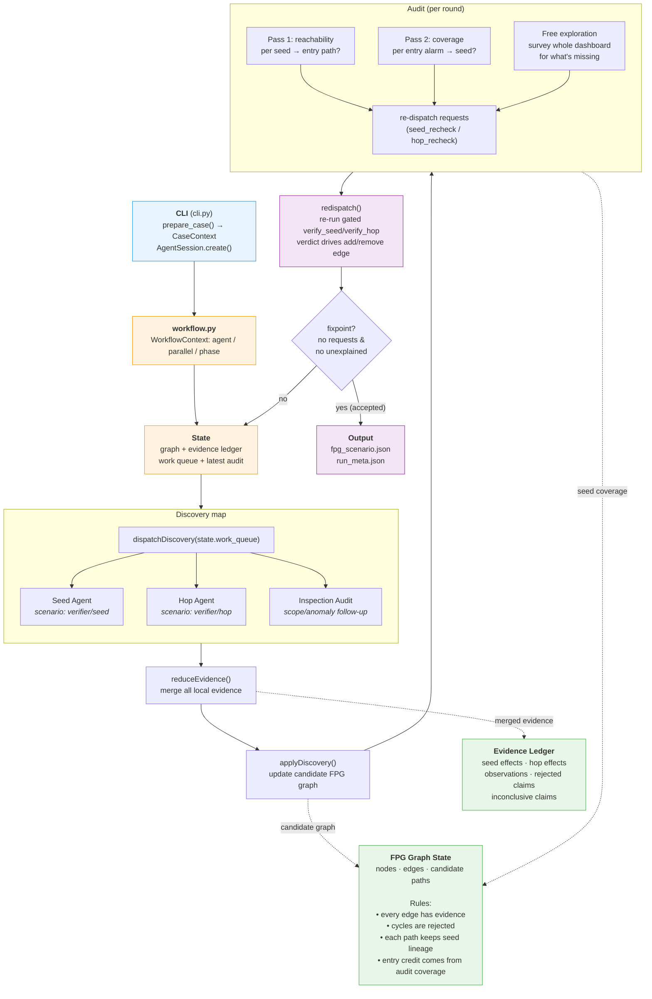
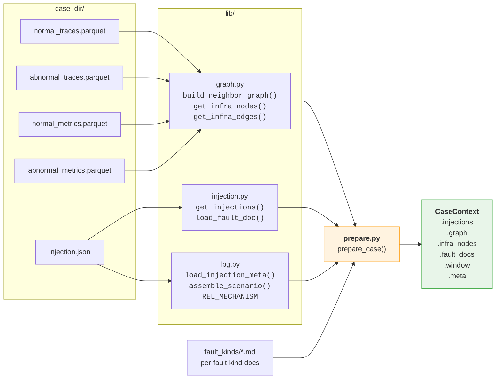
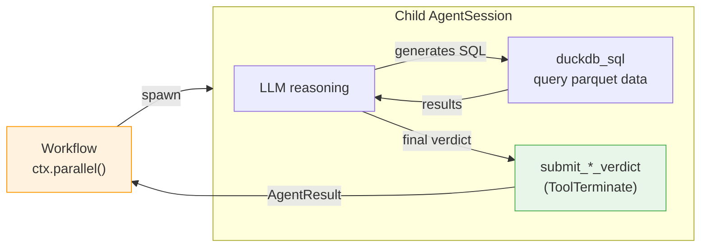
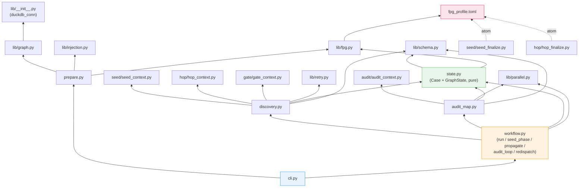

# verifier — fault propagation graph construction

## Task setting

Given a microservice system where one or more faults have been injected
(pod failure, network delay, CPU stress, etc.), determine which services
are **genuinely degraded as a result of the fault propagation**, and
produce the service-level propagation graph (nodes + edges + evidence).

Key clarifications:

- **Service-level, not span-level.** The unit of analysis is a service.
  A service is "propagated to" if it exhibits genuine degradation that
  is causally linked to the upstream fault — not merely because one of
  its span paths has fewer invocations.
- **Independent discovery, not GT matching.** The verifier constructs
  its own propagation graph from observability data. It does NOT try to
  reproduce GT labels. GT is a separate artifact used for comparison
  after the fact; the verifier's job is to find the truth in the data.
- **Edge-level evaluation.** Each directed edge (source → target) with
  a specific relationship type is an independent propagation hypothesis.
  The same target service may be reached from multiple sources via
  different relationships; each is evaluated separately. A rejection
  from one path does not preclude confirmation from another.
- **What counts as "genuinely degraded":**
  - Latency increase, error rate increase, service unavailability
    (zero spans + zero logs = service down, not just "nobody called it")
  - Throughput drop ALONE is not degradation of the service itself —
    unless the system is in cascading failure (>80% load generator
    throughput drop), or the drop is concentrated on a specific fault-
    related call path rather than uniform.
- **What does NOT count:**
  - Fewer incoming requests because callers stopped calling (that's the
    CALLER's problem, not this service's degradation)
  - Sub-noise-floor changes (sub-millisecond absolute differences)
  - Changes matching system-wide load drift

## Architecture

### Workflow-based scheduling

The verifier is a **workflow-orchestrated multi-agent system**. The CLI
(`cli.py`) creates an AgentM `AgentSession`, loads the workflow engine,
and executes `workflow.py` — a Python workflow script that
uses `ctx.agent()` / `ctx.parallel()` / `ctx.phase()` to spawn and
coordinate child agent sessions. Each child session runs its own
scenario (seed / hop / gate / audit) with its own manifest, system
prompt, tools, and finalize atom.

#### Target orchestration flow



Local discovery (seed/hop) maximises recall and is highly parallel.
Global correctness is recovered by the audit, which runs each round as
two targeted passes — Pass 1 (every seed reaches an entry/SLO alarm) and
Pass 2 (every entry alarm is explained by some seed) — followed by a free
exploration sweep over the whole dashboard. The audit never edits the
graph: every gap becomes a re-dispatch request whose gated discovery
verdict drives the actual add/remove. The round's verified changes feed
the next round; the loop accepts at a fixpoint (a round that surfaces no
request and leaves nothing unexplained) or stops at `max_audit_rounds`.

#### Data preparation



#### Agent session internals



### Agent scenarios

Each agent type has its own subdirectory with a manifest, system prompt,
and finalize atom:

| Agent | Scenario | System prompt | Finalize tool | Verdict |
|-------|----------|---------------|---------------|---------|
| Seed  | `verifier/seed` | `seed/prompts/seed.md` | `submit_seed_verdict` | confirmed / rejected / inconclusive |
| Hop   | `verifier/hop`  | `hop/prompts/hop.md`   | `submit_hop_verdict`  | confirmed / rejected / inconclusive |
| Gate  | `verifier/gate` | `gate/prompts/gate.md` | structured output | accepted / retryable / missing_checks |
| Audit | `verifier/audit`| `audit/prompts/audit.md`| structured output | reachability / coverage / explore (each gated, emits re-dispatch) |

All agents share:
- `duckdb_sql` tool for querying case parquet data
- `operations` (local backend) for file system access
- `observability` + `tool_index` + `turn_reminder` + `retry_policy`
- fpg profile vocabulary (`fpg_profile.toml`) for predicate/mechanism enums

### Module dependency map

The code is organized as a **pure core / effectful shell**. The
orchestration core (`workflow.py`) is a handful of small
functions; all mutable graph state and the operations that need no agent
call live in a pure, unit-testable `state.py`; the agent-calling lives in
`discovery.py` and `audit_map.py`.

| Module | Role | Effects |
|---|---|---|
| `workflow.py` | thin core: `run` → `seed_phase` → `propagate` → `audit_loop` (fixpoint) + `redispatch` | orchestration only |
| `state.py` | `Case` (immutable inputs) + `GraphState` (graph/ledger + all pure ops: accept, reachability, candidate paths, verdict-driven `remove_hop_edge`, finalize, output) | none (logs via injected callable) |
| `discovery.py` | `verify_seed` / `verify_hop` / `gate` — agent adapters with gate retries | `ctx.agent` |
| `audit_map.py` | `audit_pass_reachability` / `audit_pass_coverage` / `free_explore` — each gated, emits re-dispatch requests | `ctx.agent` |
| `lib/{schema,fpg,retry,child}.py` | data contracts, fpg serialization, retry-context compaction, child-session lookup | none |



There is no audit reducer and no edge-drop command. The older
`verifier/judge` scenario was removed; earlier validation showed that
pruning nodes from rationale text alone was net-negative — it removed
genuinely degraded services because it could not re-query the raw
evidence behind a hop. The current architecture keeps that lesson by
inverting control: the audit only *judges and proposes*, and every graph
change is routed back through a gated discovery agent that can re-query
the raw evidence.

The accept decision is **deterministic, not an LLM verdict**: the audit
loop accepts at a fixpoint — a full round in which neither pass nor the
free exploration surfaces a re-dispatch request, and no entry anomaly is
left unexplained. Edge *removal* is verdict-driven: to retire an edge the
audit emits a `hop_recheck` for it, and only a rejecting re-verification
(via `remove_hop_edge`) actually removes it. The harness never rewrites
the graph on its own.

### Audit control model

The audit is a fixpoint loop, not a reduce-to-a-verdict. Each round runs
two targeted passes plus a free exploration sweep; none of them edits the
graph — they only emit re-dispatch requests, and a gated discovery agent's
verdict performs the actual change.

#### Per-round shape

```python
def audit_round(case, state):
    # Stage A — targeted passes
    coverage, reach_reqs = pass_reachability(case, state)   # seed -> entry
    unexplained, cov_reqs = pass_coverage(case, state)      # entry alarm -> seed
    redispatch(case, state, reach_reqs + cov_reqs)          # gated verify_* drives graph

    # Stage B — free exploration (last step), feeds back into next round
    explore_reqs = free_explore(case, state)                # survey whole dashboard
    redispatch(case, state, explore_reqs)

    accepted = not (reach_reqs or cov_reqs or explore_reqs or unexplained)
    return accepted, coverage, unexplained
```

`redispatch` re-runs the gated `verify_seed` / `verify_hop` discovery
agents with the audit's context: a confirmed hop adds the edge, a rejected
hop calls `remove_hop_edge` (and prunes orphans). This is the only path by
which the audit changes the graph.

#### Objects

| Object | Meaning |
|---|---|
| `ReworkRequest` | The single re-dispatch currency: `SeedRecheckRequest` or `HopRecheckRequest`, each with a focused `context`. Every pass and the exploration emit these. |
| `SeedReachabilityReport` | Pass 1, per seed: a `SeedCoverageStatus` plus `rework_requests`. |
| `AnomalyCoverageReport` | Pass 2, per entry scope: `meaningful_anomalies` / `explained` / `unexplained` plus `rework_requests`. |
| `ExploreReport` | Free exploration: `findings` plus `rework_requests`. |
| `AuditOutcome` | Harness-computed (not an LLM verdict): `accepted` (the fixpoint), `seed_coverage`, `unexplained_anomalies`, `rounds`. |
| `SeedCoverageStatus` | `explains_entry`, `local_only`, `benign_or_no_effect`, `needs_recheck`, or `invalid_path`. |

#### Two obligations + a completeness net

1. **Reachability (Pass 1).** Every confirmed seed must reach an entry/SLO
   alarm or be classified as resolved-but-non-entry (`local_only` /
   `benign_or_no_effect`). An invalid path emits a `hop_recheck` for its
   weakest edge rather than asserting a drop.
2. **Coverage (Pass 2).** Every meaningful entry anomaly must be explained
   by some seed, or converted into a recheck.
3. **Free exploration.** A target-less agent surveys the whole dashboard
   for what the targeted passes never investigated (degraded services
   absent from the graph, anomalies no seed explains) and proposes
   re-dispatch requests. Each audit agent — including this one — is guarded
   by the same completeness gate as seed/hop discovery.

Quality is therefore not `seed_confirmed(seed) and graph_reaches_entry(seed)`
but `seed_confirmed(seed) and audit.seed_coverage[seed] == "explains_entry"`.
`local_only` is a resolved outcome: the fault took effect, but the evidence
does not support a frontend propagation path.

#### Example: a local effect that should not get entry credit

Two faults run together:

- `link:ts-user-service->mysql` (`NetworkBandwidth`) produces a local
  datastore signal: `ts-user-service` SQL span p99 rises from ~1 ms to
  ~4 ms.
- `ts-admin-user-service` (`JVMLatency`) produces a ~1.6 s method delay,
  and the entry endpoint `GET /api/v1/adminuserservice/users` jumps ~1.6 s.

The candidate graph may contain a topological path
`link:ts-user-service->mysql -> ts-user-service -> ts-admin-user-service
-> ts-ui-dashboard`. Pass 1 reachability should reject the bandwidth seed's
entry path — the local SQL slowdown is real but its magnitude/shape do not
explain the 1.6 s entry latency, which the JVMLatency seed explains
directly — by emitting a `hop_recheck` for the weak edge. If the
re-verification rejects it, the edge is removed, and the seeds settle as:

```python
seed_coverage = {
    "link:ts-user-service->mysql": "local_only",
    "ts-admin-user-service": "explains_entry",
}
```

This preserves the local bandwidth finding while preventing one fault from
borrowing another fault's propagation path.

## Usage

```bash
cd contrib/scenarios

# Single case
uv run python -m verifier.cli run <case_dir> \
    --model doubao --judge-model azure-gpt \
    [--gate-retries 3] [--out /tmp/out]

# Batch
uv run python -m verifier.cli batch <dataset_dir> \
    --run-dir /tmp/verifier-run \
    --model doubao --judge-model azure-gpt \
    [--gate-retries 3] [--parallel 4] [--limit 10]
```

## Output

Each case produces under `<out_dir>/`:

| File | Content |
|------|---------|
| `fpg_scenario.json` | Validated fault-propagation graph (fpg schema). |
| `run_meta.json` | All verdicts with evidence SQL + rationale, hop log, rounds. |

## Debugging a run

### Find sessions

CLI prints `trace_id` on startup. List all child sessions:

```bash
agentm trace index --format ndjson | grep <trace_id>
```

Each child has a `session_id` and `scenario` (verifier/seed, verifier/hop).

### Inspect a specific agent

```bash
# Full conversation trajectory
agentm trace messages --session <session_id> --format text

# Tool calls (SQL queries + results)
agentm trace tools --session <session_id> --format ndjson \
  | jq '{tool: .tool, sql: .args.sql, result: .result.content[0].text}'

# Verdict only
agentm trace tools --session <session_id> --tool submit_hop_verdict --format ndjson \
  | jq '.args | {verdict, predicate, rationale}'
```

### Find a specific edge's session

```bash
TRACE=<trace_id>
for sid in $(agentm trace index --format ndjson | grep "$TRACE" \
  | jq -r 'select(.scenario=="verifier/hop") | .session_id'); do
  from=$(agentm trace messages --session "$sid" --role user --format text 2>&1 \
    | grep -oP 'Confirmed degraded: \*\*\K[^*]+')
  to=$(agentm trace messages --session "$sid" --role user --format text 2>&1 \
    | grep -oP 'Target: \*\*\K[^*]+')
  echo "$sid: $from -> $to"
done
```

### Common misdiagnosis patterns

| Pattern | What goes wrong | Root cause |
|---|---|---|
| Aggregate flat → reject | Agent checks aggregate error/latency, misses per-endpoint degradation on the fault-related call path | Agent doesn't break down by `span_name` before concluding |
| Zero spans → reject | Agent sees 0 abnormal spans, concludes "no degradation" instead of "service unavailable" | Should be inconclusive (zero evidence ≠ evidence of health) |
| Unit confusion | `duration` is nanoseconds; agent divides by 1e3 (→ μs) instead of 1e6 (→ ms), misreads magnitude | Agent didn't DESCRIBE the table or cross-check units |
| Wrong propagation direction | Agent confirms a downstream for a latency fault (latency propagates UP not down) | Agent ignored fault doc's direction guidance |
| Throughput-only rejection applied too broadly | Fault doc says "throughput drop without latency/error = not degradation," agent applies this even when the fault-related endpoint's spans vanished entirely | Rule is for uniform traffic dip, not for a specific dead call path |
