# RCA Scenario Flow

## Sequence Diagram

```mermaid
sequenceDiagram
    participant H as Harness
    participant S as RCAScenario
    participant OL as Orchestrator<br/>SimpleAgentLoop
    participant MW as Middleware Stack
    participant LLM as Orchestrator LLM
    participant San as SanitizerMiddleware
    participant WF as WorkerLoopFactory
    participant WL as Worker<br/>SimpleAgentLoop
    participant WLLM as Worker LLM
    participant Tools as Worker Tools<br/>(query_sql, describe_tables)

    %% ========== Phase 1: Initialization ==========
    rect rgb(240, 248, 255)
        Note over H,Tools: Phase 1 — Initialization
        H->>S: setup(ctx)
        activate S
        S->>S: Create HypothesisStore
        S->>S: Create ServiceProfileStore
        S->>S: Build orchestrator tools<br/>(update/remove_hypothesis,<br/>update/query_service_profile)
        S->>S: Build worker tools<br/>(profile tools)
        S->>S: Build SanitizerMiddleware<br/>(CodeSanitizer + CriticSanitizer)
        S-->>H: ScenarioWiring<br/>{tools, schemas, hooks, middleware}
        deactivate S

        H->>H: Build orchestrator middleware stack:<br/>1. DynamicContextMW<br/>2. SkillMW<br/>3. LoopDetectionMW<br/>4. TrajectoryMW<br/>5. CompressionMW<br/>6. SanitizerMW

        H->>OL: Create SimpleAgentLoop<br/>(model, tools, system_prompt, middleware)
        H->>WF: Create WorkerLoopFactory<br/>(config, tool_registry, answer_schemas)
    end

    %% ========== Phase 2: Round 1 — Scout ==========
    rect rgb(255, 250, 240)
        Note over OL,Tools: Phase 2 — Round 1: Scout Dispatch

        OL->>OL: Drain inbox

        OL->>MW: on_llm_start(messages)
        activate MW
        Note right of MW: DynamicContextMW:<br/>Replace system msg with base prompt<br/>+ inject <current_state><br/>(hypotheses + profiles)<br/>+ assistant prefill<br/>"Based on current state..."
        Note right of MW: SkillMW:<br/>Inject skill list into system msg
        Note right of MW: LoopDetectionMW:<br/>Check think-stall / loops
        Note right of MW: TrajectoryMW:<br/>Record llm_start event
        MW-->>OL: prepared messages
        deactivate MW

        OL->>LLM: ainvoke(messages)
        LLM-->>OL: response (dispatch_agent scout)

        OL->>MW: on_llm_end(response)
        activate MW
        Note right of MW: SanitizerMW:<br/>every_round check
        Note right of MW: TrajectoryMW:<br/>Record tool_call event
        MW-->>OL: response
        deactivate MW

        OL->>MW: on_tool_call("dispatch_agent", {task_type: "scout", ...})
        activate MW
        Note right of MW: SanitizerMW:<br/>tracker.record(dispatch)<br/>CriticSanitizer.check_async("dispatch")
        MW->>WF: create_worker("scout-1", "scout")
        activate WF
        WF->>WF: Build tools (describe_tables, query_sql, vault_read)
        WF->>WF: Load system prompt (scout.j2)
        WF->>WF: Build worker middleware:<br/>BudgetMW + LoopDetectionMW<br/>+ TrajectoryMW + DedupMW<br/>+ ToolResultBudgetMW<br/>+ MicroCompactMW
        WF-->>MW: SimpleAgentLoop (worker)
        deactivate WF

        MW->>H: runtime.spawn("scout-1", loop=worker, input=task)
        H->>WL: stream(task_instruction)
        deactivate MW
    end

    %% ========== Phase 3: Worker Execution ==========
    rect rgb(245, 255, 245)
        Note over WL,Tools: Phase 3 — Worker Execution Loop

        loop Worker ReAct cycle (max 40 steps)
            WL->>WL: Middleware: on_llm_start<br/>(BudgetMW injects urgency if low)
            WL->>WLLM: ainvoke(messages)
            WLLM-->>WL: response (tool calls)
            WL->>WL: Middleware: on_llm_end

            WL->>WL: Middleware chain: on_tool_call
            Note right of WL: DedupMW: check cache<br/>→ cache hit: return cached<br/>→ cache miss: execute
            WL->>Tools: query_sql / describe_tables
            Tools-->>WL: result
            Note right of WL: ToolResultBudgetMW:<br/>truncate if oversized
            Note right of WL: TrajectoryMW:<br/>record tool_result
        end

        WL->>WL: should_terminate → true
        WL->>WL: _synthesize_output(messages)<br/>→ ScoutAnswer { findings }
        WL-->>H: AgentResult(output=ScoutAnswer)
    end

    %% ========== Phase 4: Orchestrator Investigates ==========
    rect rgb(255, 245, 255)
        Note over OL,San: Phase 4 — Rounds 2+: Investigate & Verify

        loop Orchestrator rounds (max 60)
            OL->>MW: on_llm_start(messages)
            Note right of MW: DynamicContextMW injects updated:<br/>- hypothesis list<br/>- service profiles<br/>- round counter "Round: N/60"

            Note right of MW: SanitizerMW.on_llm_start:<br/>Collect async critic results<br/>Inject pending findings as<br/><sanitizer_report> or<br/><finalize_blocked>

            OL->>LLM: ainvoke(messages)
            LLM-->>OL: response

            OL->>MW: on_llm_end(response)
            activate San
            Note right of San: 1. pre_finalize check<br/>(if <decision>finalize</decision>)
            Note right of San: 2. every_round check
            Note right of San: 3. hypothesis_change check<br/>(if hypothesis was updated)
            Note right of San: 4. periodic check<br/>(every N rounds)
            San-->>OL: response (possibly modified)
            deactivate San

            alt Orchestrator calls update_hypothesis
                OL->>MW: on_tool_call("update_hypothesis", ...)
                Note right of MW: SanitizerMW: tracker.record(hypothesis_change)<br/>HypothesisStore.update()
            end

            alt Orchestrator dispatches deep_analyze or verify
                OL->>MW: on_tool_call("dispatch_agent", {task_type: "verify"})
                MW->>WF: create_worker(...)
                WF-->>MW: Worker loop
                MW->>H: runtime.spawn(...)
                H->>WL: stream(task_instruction)
                Note over WL,Tools: Worker executes (same as Phase 3)<br/>Returns DeepAnalyzeAnswer or<br/>VerifyAnswer {findings, verdict}
                WL-->>H: AgentResult
            end

            alt Orchestrator checks task results
                OL->>MW: on_tool_call("check_tasks", ...)
                Note right of MW: SanitizerMW: _try_record_completion<br/>(records SUPPORTED/CONTRADICTED/INCONCLUSIVE)
            end
        end
    end

    %% ========== Phase 5: Finalize ==========
    rect rgb(255, 255, 240)
        Note over OL,San: Phase 5 — Finalize Gate

        OL->>LLM: ainvoke(messages)
        LLM-->>OL: response with <decision>finalize</decision>

        OL->>San: on_llm_end(response)
        activate San

        San->>San: CodeSanitizer.check("pre_finalize")<br/>CriticSanitizer.check("pre_finalize")

        alt BLOCK findings exist
            San->>San: Strip <decision>finalize</decision> from content
            San->>San: Queue <finalize_blocked> message
            San-->>OL: modified response (no finalize tag)
            Note over OL: Loop continues — must address blocks
        else No BLOCK (or degraded to WARN)
            San-->>OL: response passes through
            Note over OL: should_terminate → true
        end
        deactivate San
    end

    %% ========== Phase 6: Output Synthesis ==========
    rect rgb(240, 255, 240)
        Note over OL,LLM: Phase 6 — Output Synthesis

        OL->>OL: _synthesize_output(messages)
        OL->>OL: Build synth_messages:<br/>system = causal_graph.j2<br/>+ conversation history<br/>+ "Produce your final structured report"
        OL->>LLM: model.with_structured_output(CausalGraph)<br/>.ainvoke(synth_messages)
        LLM-->>OL: CausalGraph {nodes, edges,<br/>root_causes, component_to_service}

        OL-->>H: AgentResult(output=CausalGraph)
    end
```



## Middleware Execution Order

### Orchestrator Middleware Stack

```
on_llm_start (before LLM call):
  ┌─ DynamicContextMW ─── replace system msg + inject state + assistant prefill
  ├─ SkillMW ──────────── inject skill catalog into system msg
  ├─ LoopDetectionMW ──── detect think-stall / repeated tool calls
  ├─ TrajectoryMW ─────── record llm_start event
  ├─ CompressionMW ────── summarize old messages if token > threshold
  └─ SanitizerMW ──────── inject pending findings / finalize_blocked

on_llm_end (after LLM response):
  ┌─ DynamicContextMW ─── (pass-through)
  ├─ SkillMW ──────────── (pass-through)
  ├─ LoopDetectionMW ──── (pass-through)
  ├─ TrajectoryMW ─────── record tool_call / llm_end event
  ├─ CompressionMW ────── (pass-through)
  └─ SanitizerMW ──────── pre_finalize / every_round / hypothesis_change / periodic checks

on_tool_call (wraps tool execution):
  SanitizerMW → TrajectoryMW → LoopDetectionMW → actual tool
  (chain built in reverse order, outermost executes first)
```

### Worker Middleware Stack

```
on_llm_start:
  ┌─ BudgetMW ──────────── inject urgency warnings when budget runs low
  ├─ LoopDetectionMW ───── detect think-stall / loops
  ├─ TrajectoryMW ──────── record llm_start
  ├─ DedupMW ───────────── warn about already-cached tool calls
  ├─ ToolResultBudgetMW ── (pass-through)
  └─ MicroCompactMW ────── clear stale tool results

on_tool_call:
  MicroCompactMW → ToolResultBudgetMW → DedupMW → TrajectoryMW → LoopDetectionMW → BudgetMW → actual tool
  (DedupMW returns cached result on hit, ToolResultBudgetMW truncates oversized results)
```

## Sanitizer Check Triggers

| Trigger | When | Checks | Can Block Finalize |
|---------|------|--------|--------------------|
| `pre_finalize` | `<decision>finalize</decision>` detected | CodeSanitizer + CriticSanitizer | Yes (BLOCK severity) |
| `every_round` | Every `on_llm_end` | CodeSanitizer only | No |
| `hypothesis_change` | After `update/remove_hypothesis` tool call | CodeSanitizer only | No |
| `periodic` | Every N rounds (default 5) | CodeSanitizer only | No |
| `dispatch` (async) | After `dispatch_agent` tool call | CriticSanitizer (async) | No (results collected next round) |

### Degradation Rules

- **Budget exhausted**: E-codes and J-codes degrade from BLOCK → WARN
- **Retry limit** (default 3): Same finding blocking same target N times → WARN with `[DEGRADED]` tag
