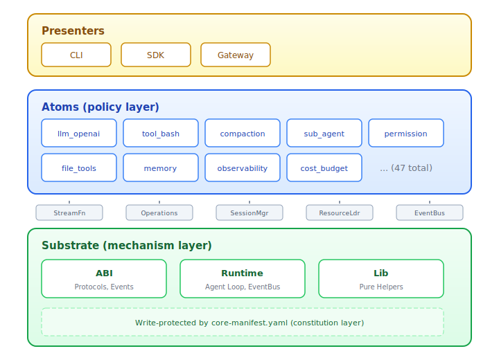
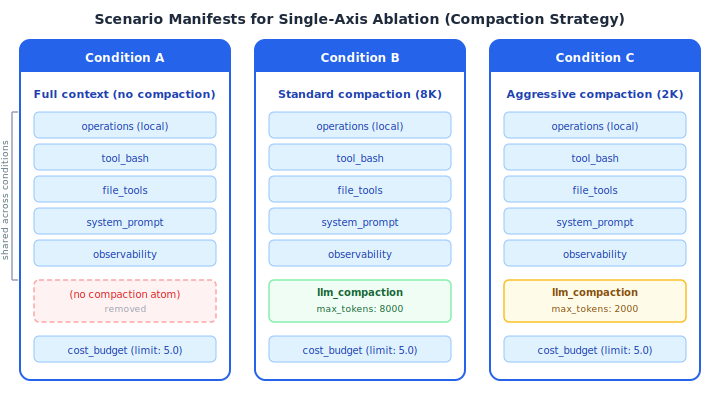

# AgentM: Declarative Scenario Composition for Controlled LLM Agent Experiments

## Abstract

Evaluating how individual design decisions affect LLM agent performance requires varying each decision independently while holding others fixed. We show that existing agent frameworks couple these decisions through shared code paths, so changing one axis risks confounding others. We formalize this as the *axis independence* problem and propose *atom-scenario composition*, an architecture that isolates each decision into a self-contained module and composes modules into experimental conditions through declarative YAML files. Varying a condition reduces to editing a configuration entry (0 lines of code); adding a domain capability requires a single validated file (~100–300 LOC); building a complete domain agent reuses 90% of its modules from a 47-module builtin library. On the Ops-lite root-cause analysis benchmark, adding one configuration entry (a cognitive audit module) improves F1 by 15%, demonstrating that meaningful ablation is achievable through configuration alone. We compare AgentM against 13 existing harnesses spanning orchestration frameworks, coding agents, and research benchmarks, and show that it is the only one providing mechanically enforced module isolation, declarative cross-benchmark reuse, and built-in structured trace capture.

## 1 Introduction

Understanding what makes LLM agents effective requires controlled experiments. A researcher studying whether context compaction helps or hurts root-cause analysis needs to vary the compaction strategy while holding the model, tool set, and orchestration logic fixed. A researcher comparing models needs to swap the LLM provider while keeping everything else identical. The experimental methodology is standard: identify the independent variable, control the confounds, measure the outcome.

The difficulty is practical. In most agent frameworks, the LLM call, tool dispatch, context management, and prompt assembly share state and call each other. Removing the compaction module may change how prompts are assembled; swapping the model provider may alter which tool-calling conventions are used. The experimenter must trace these interactions to verify that a change to one axis does not inadvertently modify another, a verification burden that grows combinatorially with the number of axes.

We call this the *axis independence* problem: given an agent whose behavior is determined by decisions along $k$ axes, can we change a decision on axis $i$ without affecting the implementation of decisions on axes $j \neq i$?

This paper makes three contributions. First, we show that current agent harnesses do not provide axis independence and identify three coupling patterns that cause this (Section 2). Second, we propose *atom-scenario composition*: each policy decision is implemented in an isolated, single-file module (an *atom*), and a declarative YAML file (a *scenario*) specifies which modules to load and how to configure them (Section 3). We characterize the resulting configuration effort spectrum and show how standard experimental designs map onto scenario variation (Sections 4–5). Third, we evaluate the architecture on two benchmarks across three models and two scenario configurations, demonstrating that single-entry configuration changes produce measurable, attributable performance differences (Section 6). Section 7 positions AgentM against 13 existing harnesses and configuration-driven ML frameworks.

## 2 The Coupling Problem

We identify three patterns through which agent frameworks couple policy decisions:

**Shared mutable state.** Tool execution results are often stored in a context object that the prompt assembler, compaction module, and orchestrator all read and write. Removing the compaction module changes the state the prompt assembler sees, even if the prompt logic itself is untouched.

**Direct call dependencies.** The tool dispatcher may call into the LLM provider to format tool schemas, coupling the tool axis to the model axis. Swapping the model provider then requires updating the tool dispatcher, or vice versa.

**Implicit ordering.** Many frameworks process hooks or middleware in a fixed order. Removing a module shifts the execution order of remaining modules, potentially changing their behavior even if their code is unchanged.

These coupling patterns mean that what appears to be a single-axis change (removing one module, swapping one provider) may in fact be a multi-axis change. The resulting experiment is confounded: the measured difference cannot be attributed solely to the intended independent variable.

## 3 Atom-Scenario Composition

### 3.1 Requirements

We derive three requirements from the axis independence condition:

**R1 (Isolation).** Each policy decision must be implemented in a module that does not import, call, or share mutable state with modules implementing other decisions.

**R2 (Typed mediation).** Modules communicate only through a fixed set of typed interfaces (protocols) provided by a shared core. The core's behavior does not change when modules are added or removed.

**R3 (Declarative composition).** The set of active modules and their configurations must be specified externally (not in code), so that each experimental condition is a data artifact that can be inspected, diffed, and version-controlled.

### 3.2 Architecture



*Figure 1. Three-layer architecture. Modules communicate with the core through five typed Protocol interfaces (gray badges). The core is write-protected by a constitution file that prevents modification by the agent or its modules.*

AgentM implements these requirements through a three-layer architecture (Figure 1).

The bottom layer is the **core** (~4K LOC): the agent loop, event bus, and session manager. It exposes five `typing.Protocol` interfaces, each governing one axis of variation. `StreamFn` governs LLM provider selection: any module that implements this protocol can serve as the model backend. `Operations` governs the execution environment: local processes, container sandboxes, or remote machines. `SessionManager` governs state persistence. `ResourceLoader` governs how the agent discovers prompts, skills, and configuration files. `EventBus` governs inter-module coordination. The core executes the loop; it makes no policy decisions.

The middle layer consists of **modules** that implement specific policies. We call each module an *atom* because it is the smallest unit of agent behavior that can be independently added, removed, or replaced. Each atom is a single Python file that declares what it does (through a typed manifest) and how to install it (through an `install` function). A load-time validator enforces that atoms cannot import each other, ensuring that removing one atom never breaks another.

The top layer consists of thin **interfaces** (CLI, SDK, gateway) that consume the same session API. Any capability reachable through one interface but not others is considered a design bug.

### 3.3 Scenario Configuration

To satisfy R3, AgentM uses a YAML configuration file called a *scenario* that specifies an ordered list of atoms with per-atom parameters:

```yaml
name: rca-standard
extensions:
  - module: agentm.extensions.builtin.operations
    config: { backend: local }
  - module: rca.default.duckdb_sql
  - module: agentm.extensions.builtin.llm_compaction
    config: { tool_result_max_tokens: 8000 }
  - module: agentm.extensions.builtin.sub_agent
    config:
      inherit_extensions: [operations, duckdb_sql, observability]
  - module: agentm.extensions.builtin.observability
```

A scenario combined with a model identifier (`--model openai/o3`) fully specifies an experimental condition. Diffing two scenarios shows exactly which axes changed between conditions.

### 3.4 Trace Capture

Every session emits a structured trace containing messages, tool calls (with arguments and results), per-turn token usage, cost, and parent-child session lineage. Traces are stored in ClickHouse or local JSONL and queried through a composable CLI (`agentm trace messages|tools|turns|stats`). Because trace capture is a property of the core rather than an add-on, dependent-variable measurement requires no per-experiment instrumentation.

## 4 Configuration Effort Spectrum

Beyond axis independence, atom-scenario composition provides *low marginal effort*: the cost of adding a new experimental capability scales with the novelty of the capability, not with the complexity of the framework.

We distinguish three effort levels:

**Zero code (configuration only).** Capabilities already implemented as builtin atoms can be activated or varied by editing configuration entries. A working agent with bash access requires 15 lines of YAML. A benchmark evaluation agent with context compaction and file I/O requires 30 lines. Switching from local execution to a containerized sandbox changes one field (`backend: local` to `backend: agent_env`). Adding a $5 spending cap means appending three lines:

```yaml
- module: agentm.extensions.builtin.cost_budget
  config: { limit: 5.0 }
```

No framework code is read, understood, or modified.

**Single-file extension (domain tool).** When an experiment requires a capability that no builtin module provides, such as a domain-specific query tool or a custom termination condition, the researcher writes one Python file (~100–300 LOC) conforming to the atom contract: a manifest declaration and an install function. The file is added to the scenario; the framework discovers and validates it at load time. Examples from the codebase: a permission gate (110 LOC), a spending tracker (165 LOC), a structured-output terminator (190 LOC). The atom contract ensures that the new module cannot break existing modules or the core.

**Scenario with domain modules (complete agent).** A fully custom agent for a new domain composes builtin atoms with a small set of domain-specific atoms. The root-cause analysis agent, for instance, requires 5 domain modules (~2K LOC total) covering SQL query tools, hypothesis tracking, and result finalization; everything else (the agent loop, multi-agent orchestration, observability, context compaction) is reused from the builtin library via a 69-line scenario. From this base configuration, a single-agent ablation variant is specified in 16 lines of YAML that overrides the orchestration settings.

| Effort level | What changes | Lines of code | Lines of YAML | Example |
|---|---|---|---|---|
| Configuration only | Parameter or module toggle | 0 | 1–3 | Compaction budget, cost cap, model swap |
| Single file | New tool or event handler | 100–300 | 3–5 | Permission gate, domain tool, budget tracker |
| Scenario + modules | Complete domain agent | ~2K (5 modules) | 69 | Multi-agent RCA pipeline |
| Ablation variant | Override from base scenario | 0 | 16 | Single-agent vs. multi-agent RCA |

*Table 1. Configuration effort spectrum. The marginal effort to add a capability scales with its novelty, not with framework complexity.*

This spectrum means that the common case in experimental work (varying parameters and toggling capabilities across conditions) requires zero code, while the less common case (adding a genuinely new capability) requires only a single, validated, isolated file.

## 5 Experimental Design via Scenario Variation

We show how three standard experimental designs map onto scenario variation.

### 5.1 Single-Axis Ablation



*Figure 2. Three scenarios for a compaction ablation. Blue entries are shared (controlled); the highlighted entry is the independent variable, absent in Condition A, set to 8K tokens in Condition B, and set to 2K tokens in Condition C.*

To study context compaction (Figure 2), three scenarios share all modules except the compaction entry. Condition A removes it; Conditions B and C configure different token budgets. The diff between any two scenarios is exactly one entry, satisfying axis independence by construction.

### 5.2 Factorial Crossing

A 2x2 design crossing model provider with execution environment:

| | `backend: local` | `backend: agent_env` |
|---|---|---|
| **openai/o3** | Scenario A | Scenario B |
| **anthropic/sonnet** | Scenario C | Scenario D |

Each cell differs from its neighbors in exactly one entry: `backend` along one axis, `--model` along the other. The tool set, prompts, and observability modules are shared across all four cells.

### 5.3 Multi-Agent Capability Restriction

The multi-agent orchestration module controls which capabilities propagate to child sessions via a configuration field called `inherit_extensions`. Restricting workers to query-only tools, or removing all tools, is a configuration change on a single module. The parent-agent scenario is otherwise identical across conditions. This enables studying how tool availability affects multi-agent task decomposition without modifying orchestration logic.

## 6 Experiments

We evaluate three claims: (1) the atom library achieves high reuse across diverse scenarios, (2) scenario-level variation produces measurable differences with minimal configuration effort, and (3) AgentM achieves competitive benchmark performance while supporting controlled ablation.

### 6.1 Module Reuse Across Scenarios

We analyzed 37 scenario configurations across four domains. Each scenario's modules were classified as either builtin (shipped with the framework) or domain-specific (written for the scenario's task).

| Statistic | Value |
|---|---|
| Total scenarios analyzed | 37 |
| Median builtin reuse | 90.0% |
| Mean builtin reuse | 80.9% |
| Scenarios with 100% builtin modules | 19 (51.4%) |
| Scenarios with >= 87.5% builtin | 27 (73.0%) |
| Distinct builtin modules referenced | 37 of 45 available (82.2%) |
| Distinct domain modules across all scenarios | 25 |

*Table 2. Module reuse statistics. The median scenario reuses 90% of its modules from the builtin library, indicating that most experimental configurations require little or no custom code.*

The most frequently reused modules (appearing in 20+ scenarios) are: `operations`, `observability`, `system_prompt`, `tool_bash`, `file_tools`, `tool_result_cap`, `llm_compaction`, `read_history`, and `background_exec`. Only the RCA domain-heavy variants fall below 50% builtin reuse, reflecting that root-cause analysis over observability data requires specialized query and hypothesis tools.

### 6.2 Configuration Effort for Ablation

The Terminal-Bench scenario family demonstrates the effort spectrum for a systematic ablation study. The base scenario (30 lines YAML) provides the minimal tool set. Each variant adds exactly one oversight mechanism:

| Variant | Lines of YAML | Added capability | Domain code |
|---|---|---|---|
| Base (minimal tools) | 30 | Bash + files + compaction | 0 LOC |
| + sandbox execution | 51 | Container isolation | 0 LOC |
| + goal-driven termination | 56 | Auto-derived stopping condition | 0 LOC |
| + cognitive audit | 54 | Periodic reasoning review | 0 LOC |
| + adaptive behavior | 50 | Runtime tool/strategy adjustment | 0 LOC |
| Full stack (all above) | 69 | All oversight mechanisms | 0 LOC |

*Table 3. Terminal-Bench ablation variants. Each row adds one oversight axis through configuration; no custom code is needed for any variant.*

The RCA scenario family follows the same pattern at a higher complexity level. The base orchestrator (69 lines YAML, 5 domain modules totaling ~2K LOC) supports variants ranging from a 16-line single-agent baseline to a 148-line hypothesis-falsification variant with 13 domain modules.

### 6.3 Benchmark Results

AgentM's eval framework supports 9 benchmarks through a unified adapter interface (`agentm eval`). We focus on Ops-lite, a root-cause analysis benchmark over microservice observability data, where we have completed runs across three models and two scenario configurations. Terminal-Bench (sysadmin, sandboxed containers) provides a secondary data point with Doubao achieving 5.0% pass@1 on TB 1.0 (21 tasks) and 16.9% on TB 2.0 (89 tasks) using the 30-line base scenario with zero custom code.

**Ops-lite cross-model and cross-scenario comparison.** We hold the tool set and orchestration logic fixed across all runs and vary two axes independently: model (Doubao, GLM-5.1, DSv4-Pro) and scenario (RCA baseline vs. RCA + cognitive audit).

| Model | Scenario | Cases | F1 | Precision | Recall | Service hit |
|---|---|---|---|---|---|---|
| Doubao | RCA + cognitive audit | 100 | 0.177 | 0.210 | 0.160 | 82.0% |
| Doubao | RCA baseline (no audit) | 100 | 0.154 | 0.204 | 0.131 | 77.8% |
| GLM-5.1 | RCA + cognitive audit | 66 | 0.164 | 0.186 | 0.153 | 74.6% |
| DSv4-Pro | RCA baseline | 500 | 0.301 | — | — | 51.0% |

*Table 4. Ops-lite RCA results. Comparing Doubao rows isolates the scenario axis (one configuration entry changed). Comparing Doubao vs. GLM-5.1 isolates the model axis. DSv4-Pro on 500 cases provides the full-dataset baseline.*

Three observations. First, adding the cognitive audit module improves Doubao's F1 from 0.154 to 0.177 (+15%) and service hit rate from 77.8% to 82.0%. This change corresponds to a single configuration entry with 0 lines of custom code, demonstrating that meaningful ablation results are achievable through configuration alone. Second, the model axis shows that DSv4-Pro achieves substantially higher F1 (0.301) than Doubao (0.177), confirming that model selection remains a primary performance driver, consistent with HarnessBench findings. Third, across both axes, the experimental comparison required no changes to the framework, tool implementations, or trace collection; all four rows use the same core, the same tool modules, and the same observability pipeline.

The eval framework supports 9 benchmarks in total (Terminal-Bench 1.0/2.0, SWE-bench Verified/Pro, Ops-lite, TELBench, GAIA, tau2-bench, rescue-window), all runnable through the same `agentm eval` CLI with scenario-based agent configuration.

## 7 Related Work

Recent work has established the *agent harness*, the infrastructure that turns model calls into bounded, stateful, tool-mediated task execution, as a first-class research object. A 2026 survey (Meng et al., arXiv:2605.29682) formalizes the harness as a six-component system H=(E,T,C,S,L,V) covering execution substrate, tool interface, context control, state persistence, lifecycle hooks, and evaluation feedback. The survey's Harness Completeness Matrix shows that production systems converge on implementing all six components, while research prototypes often implement only two or three. HarnessBench (arXiv:2605.27922, 2026) tested 8 models across 6 harnesses on 106 tasks and found that swapping the harness while holding the model fixed moved performance by up to 24 percentage points, confirming that harness design is an independent variable worthy of controlled study. AgentM is designed to make such controlled study practical by factoring harness components into independently replaceable modules.

We compare AgentM against existing harnesses along three dimensions: axis isolation, configuration effort, and experimental support.

We group the comparison into two tables: Table 5a covers orchestration frameworks and coding harnesses; Table 5b covers research harnesses evaluated in HarnessBench and ClawArena.

**Table 5a. Orchestration frameworks and coding harnesses.**

| Property | LangChain | AutoGen | CrewAI | MetaGPT | OpenHands | SWE-agent | Aider | Cline | AgentM |
|---|---|---|---|---|---|---|---|---|---|
| Isolation | None | Partial | IPC | IPC | None | Minimal | None | None | AST-enforced |
| Swap model | Import | Config | 1 string | Config YAML | Config | Config | CLI flag | Config | Config (0 LOC) |
| Add tool | ~8 LOC | ~8 LOC | ~10 LOC | ~15 LOC | Extend AS | Extend cmds | N/A | N/A | Single file |
| Remove cap. | Trace calls | Check deps | Remove role | Refactor | Code | Code | Code | Code | Config entry |
| Cost budget | Custom | Custom | No | Programmatic | No | No | No | No | Built-in, 3L YAML |
| Trace | Callbacks | Logging | Callbacks | Logging | Custom | Custom | Git | IDE logs | OTel JSONL + CLI |
| Isolation enforced | No | No | No | No | No | No | No | No | Yes |
| Benchmark reuse | Rebuild | Partial | Rebuild | Rebuild | Rebuild | Rebuild | N/A | N/A | Scenario variation |

**Table 5b. Research harnesses (HarnessBench / ClawArena, 2026).**

| Property | NanoBot | Hermes | OpenClaw | PicoClaw | MetaClaw | AgentM |
|---|---|---|---|---|---|---|
| Core size | ~4K LOC | Large | Large (TS) | Small (Go) | Medium | ~4K LOC |
| HarnessBench score | 76.2 | 71.2 | 52.4 | N/A | N/A | N/A |
| Avg turns/task | 7.3 | 22.6 | — | — | — | — |
| Avg tokens/task | 68.7K | 139.7K | — | — | — | — |
| Isolation enforced | No | No | No | No | No | Yes |
| Declarative composition | No | No | No | No | No | Yes |

*Table 5. Framework and harness comparison. Table 5a covers 8 widely-used systems; Table 5b covers 5 harnesses from HarnessBench and ClawArena benchmarks. "Isolation enforced" means the framework mechanically prevents cross-module imports. AgentM has not been evaluated on HarnessBench; its core size (~4K LOC) matches NanoBot, the top-scoring configurable harness.*

**Coding harnesses.** OpenHands (Wang et al., ICLR 2025) and SWE-agent (Yang et al., NeurIPS 2024) are the dominant open-source coding harnesses, achieving 66%+ and 74%+ on SWE-bench Verified respectively. Aider (Gauthier, 2023) and Cline focus on code editing with git-based workflows and IDE integration. All four are optimized for task performance rather than experimental control: their tool sets, context management, and orchestration logic are integrated into monolithic runtimes, so varying a single axis (e.g., disabling file editing while keeping bash access) requires code changes to the harness internals.

**Research harnesses.** HarnessBench (arXiv:2605.27922, 2026) evaluated six harnesses on 106 tasks. NanoBot shares AgentM's philosophy that the core should be small (~4K LOC) and demonstrated that a tight loop (76.2% on 7.3 turns, 68.7K tokens) outperforms heavier scaffolding (Hermes: 71.2% on 22.6 turns, 139.7K tokens). ClawArena (2026) evaluated five additional harnesses spanning enterprise (OpenClaw), minimalist (PicoClaw), and self-evolving (MetaClaw) designs. None of these harnesses provide declarative axis-independent composition. AgentM differs in that its small core is augmented by a modular, declaratively composable atom layer, enabling axis-independent variation. In the harness survey's six-component model H=(E,T,C,S,L,V), AgentM implements all six components, with each factored into one or more replaceable atoms rather than hardcoded into the core.

**Orchestration frameworks.** LangChain (Chase, 2022), AutoGen (Wu et al., 2023), CrewAI (Moura, 2024), and MetaGPT (Hong et al., 2023) provide comprehensive toolkits but do not enforce module isolation mechanically. In all four, one tool module can freely import and call another, creating the coupling patterns described in Section 2. CrewAI achieves role-level isolation through inter-process communication but at the cost of serialization overhead in tight tool-calling loops. MetaGPT's shared `Environment` message bus is conceptually similar to AgentM's event bus but without mechanical isolation enforcement. A 2026 analysis of Claude Code's source found that ~98.4% of a production agent is harness infrastructure, underscoring the importance of harness-level modularity.

**Configuration-driven ML.** Hydra (Yadan, 2019) and DSPy (Khattab et al., 2023) separate configuration from implementation at the training-pipeline and prompt-pipeline levels respectively. AgentM applies the same principle at the agent-harness level. The Natural-Language Agent Harnesses paper (arXiv:2603.25723, 2026) formalizes this direction: "once harnesses are explicit objects, they become a search space" amenable to systematic ablation and optimization. AgentM's scenario manifests are concrete instances of this search space.

**Evaluation infrastructure.** SWE-bench (Jimenez et al., 2024), GAIA (Mialon et al., 2023), Terminal-Bench, and HAL (Kapoor et al., ICLR 2026) provide task suites and leaderboards but not configurable agent infrastructure. HAL's 21,730 rollouts across nine models and nine benchmarks at ~$40K demonstrate the scale of modern agent evaluation; AgentM's built-in trace capture and unified eval CLI (`agentm eval`) reduce the per-experiment overhead of such evaluations. The scenario system adapts one infrastructure to 9 benchmarks through configuration variation: the same builtin modules serve across benchmarks; only domain tools and prompts differ.

## 8 Conclusion

We formalized the axis independence problem for LLM agent experiments and showed that atom-scenario composition satisfies it by construction. Each policy decision lives in an isolated, single-file module; a declarative scenario specifies which modules to load and how to configure them. Across 37 scenarios, the median builtin reuse rate is 90%, confirming that most experimental configurations require little or no custom code. The configuration effort spectrum means that the common case in experimental work (varying parameters, toggling capabilities) requires zero code changes, while adding genuinely new domain capabilities requires only a single validated file. Single-axis ablation, factorial crossing, and multi-agent capability restriction all reduce to configuration edits, with built-in trace capture providing dependent-variable measurement without per-experiment instrumentation.

**Limitations.** The module library reflects the authors' research focus (analysis, evaluation, orchestration) and may lack coverage for embodied or web-interaction domains. The protocol boundary introduces a learning curve relative to monolithic harnesses. The write protection on the core prevents meta-learning approaches that need to modify the agent loop itself. Current benchmark results cover Terminal-Bench and Ops-lite; extending to SWE-bench Verified and GAIA is straightforward (both have adapters in the eval framework) and is planned as future work.
